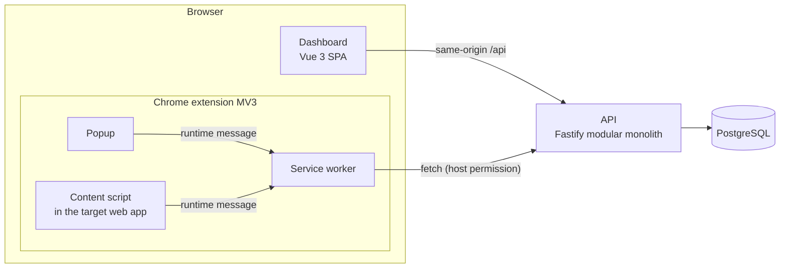

# ContextLayer

ContextLayer is a Digital Adoption Platform. A Chrome extension lets an organization build interactive, step-by-step guides on top of web applications it already uses (a CRM, an ERP, an internal tool) without touching those applications' source code. Employees then follow the guides inside the real application: each step highlights the right element and explains what to do.

The goal is to cut training and onboarding time for business software by teaching people in context instead of in slide decks.

> **Status: Phase 5 (Edit Mode, the guide builder) is complete.** On a registered application where ContextLayer is on, an editor opens Edit Mode from the popup: a side panel where they pick or create a guide, add steps, select the element each step points at by clicking it on the page (the page does not react to that click), review what will be stored, preview a step and save the draft; publishing stays in the dashboard. The extension connection and per-site access arrived in Phase 4, applications, guides and immutable published versions in Phase 3, accounts, workspaces and roles in Phase 2. Playing guides in the page (Phase 6) and analytics (Phase 7) are planned in [docs/roadmap.md](docs/roadmap.md).

## How it fits together



Within the extension, only the service worker talks to the API and holds the extension's tokens; content scripts run inside third-party pages, only on sites the user turned on, and never hold credentials (the dashboard reaches the API through its own origin under `/api`). See [docs/architecture.md](docs/architecture.md) for the full picture.

## Repository layout

```
apps/
  api/          Fastify 5 API (modular monolith), Drizzle ORM, PostgreSQL
  dashboard/    Vue 3 + Vite + Tailwind CSS admin dashboard
  extension/    Chrome Manifest V3 extension (service worker, content script, popup, side panel)
                demo/ holds the Edit Mode demo page (pnpm demo:site)
packages/
  shared/       zod contracts shared by every app (types + runtime validation)
  ui/           shared Vue components and Tailwind theme tokens
  config/       shared TypeScript and ESLint configuration
docs/           product, architecture, risks, data model, API, deployment, roadmap, ADRs
compose.yaml    local PostgreSQL
```

## Tech stack

| Area              | Choice                                                              |
| ----------------- | ------------------------------------------------------------------- |
| Language          | TypeScript 6 (strict) everywhere                                    |
| Monorepo          | pnpm 12 workspaces with a version catalog                           |
| API               | Node.js 22, Fastify 5, zod type provider, pino                      |
| Database          | PostgreSQL 18, Drizzle ORM + Drizzle Kit                            |
| Dashboard         | Vue 3, Vite 8, Tailwind CSS 4                                       |
| Extension         | Chrome Manifest V3, Vue 3 popup, plain Vite builds                  |
| Quality           | ESLint 10 (type-aware), Prettier, Vitest 5, Playwright (+ axe-core) |
| Local environment | Docker Compose; no cloud account or paid service required           |

The main architectural choices are explained in [Architecture Decision Records](docs/adr/README.md).

## Prerequisites

- **Node.js 22 (22.13+) or 24 LTS** (`.nvmrc` pins 22; `nvm use` picks it up).
- **pnpm 12** via **Corepack**, which ships with Node 22 and 24 and installs the exact version pinned in `package.json`. Node 25+ no longer bundles Corepack: run `npm install -g corepack` first, or install pnpm 12 directly (`npm install -g pnpm@12`).
- **Docker** with Compose v2 (Docker Desktop, OrbStack, Colima or Docker Engine).
- **Chrome or Chromium 120+** to load the extension.

## Getting started

```sh
corepack enable          # once per machine: provides pnpm 12.9.1
cp .env.example .env     # local configuration (development defaults only)
pnpm install
docker compose up -d     # PostgreSQL on 127.0.0.1:5432
pnpm db:migrate          # creates the tables in the development database
pnpm dev                 # API, dashboard and extension in watch mode
```

Then:

| What             | Where                                                                          |
| ---------------- | ------------------------------------------------------------------------------ |
| API health check | http://localhost:3000/health (readiness) and http://localhost:3000/health/live |
| Dashboard        | http://localhost:5173 (create an account, a workspace, then Applications)      |
| System status    | http://localhost:5173/status (live API and database status, no sign-in)        |
| Extension build  | `apps/extension/dist` (rebuilt on every change)                                |

### Load the extension in Chrome

1. Run `pnpm dev` (or `pnpm build`) so `apps/extension/dist` exists.
2. Open `chrome://extensions` and turn on **Developer mode**.
3. Click **Load unpacked** and select the `apps/extension/dist` folder.
4. Pin ContextLayer and open its popup: the **API** badge should read **Operational**. Every clone builds the same extension id (`ebdclkadgcmjipockfofmlakcfijojko`, from a committed development key), which the dashboard and the API expect.

### Connect it to a workspace and turn on a site

1. In the popup, click **Connect to ContextLayer**. A dashboard tab opens: sign in if asked, choose a workspace, review what the extension will be able to read, and click **Connect**. The popup then shows your name, the workspace and its applications. **Connected browsers** in the dashboard lists the connection and can revoke it; **Switch workspace** in the popup runs the same flow again and revokes the previous connection.
2. Register the web application you want guides on (dashboard → **Applications**, with its exact origin, for example `http://localhost:8080`) and publish a guide for it.
3. Open that application, open the popup and click **Turn on for this site**. Chrome asks to allow access to that one site; after **Allow**, the popup lists the site's published guides (playing them arrives in Phase 6). **Turn off for this site** stops ContextLayer there and gives the access back.

ContextLayer only runs on sites that are registered in the connected workspace, turned on in this browser and granted by Chrome; there are no install-time grants besides the API.

### Build a guide with Edit Mode

Edit Mode needs an owner, admin or editor of the workspace (members cannot read drafts). To try it on a fictitious application instead of a real one:

1. Run `pnpm demo:site`. It serves `apps/extension/demo/` only, on **http://127.0.0.1:4400** (loopback; `--port <n>` for another port), and never stops other processes; `/strict/` is the same page under a strict Content Security Policy with Trusted Types.
2. In the dashboard, register an application with the origin `http://127.0.0.1:4400`. Open the demo page, open the popup and click **Turn on for this site**.
3. Click **Edit Mode** in the popup. A side panel opens for that tab. Choose a guide or create one, then **Add step**, write its title and instructions, and click **Select element**: hover the page, click the element (the page's "Clicks the page received" counter must not change), review what will be saved, and click **Use this element**. **Preview** shows the step on the element; **Save draft** saves it with the revision it started from.
4. Publish the guide from the dashboard (**open this guide there** in the panel).

What to expect:

- Edit Mode works on pages of the top document whose elements are in the regular DOM. Elements inside iframes or another component's shadow DOM are refused with an explanation (planned for Phase 6), as are pages ContextLayer does not run on (browser pages, files, the Chrome Web Store, sites that are not registered or turned on).
- Text is typed in the side panel only, never in the page. The panel lists every value a target stores; personal data in visible text is redacted heuristically (emails, long numbers), not guaranteed: review it before saving.
- Unsaved changes are kept in the browser session until you save, and offered back when you reopen the guide; they are lost when the browser closes or the extension is updated or reloaded (Chrome clears `storage.session` then). A guide changed elsewhere is never overwritten: Edit Mode explains the conflict and offers to load the latest version.
- A preview needs the element selected on the current page; steps loaded from the server are not looked up on the page until the player exists (Phase 6).
- Reloading the page pauses selection until you click **Continue on this page**. After changing extension code, click the reload icon on the extension card (Developer mode must stay on, or Chrome disables an unpacked extension on reload); enabled sites are re-injected into open tabs automatically.

## Scripts

| Command                 | What it does                                                           |
| ----------------------- | ---------------------------------------------------------------------- |
| `pnpm dev`              | Starts every app in watch mode                                         |
| `pnpm build`            | Builds all packages in dependency order                                |
| `pnpm typecheck`        | Type-checks every package (`tsc` / `vue-tsc`)                          |
| `pnpm lint`             | Type-aware ESLint in every package                                     |
| `pnpm test`             | Unit tests and API integration tests (needs `docker compose up -d`)    |
| `pnpm test:e2e:install` | Downloads Playwright's Chromium (once)                                 |
| `pnpm test:e2e`         | Builds, then runs the Playwright suites (needs `docker compose up -d`) |
| `pnpm format`           | Formats the repository with Prettier (`format:check` to verify only)   |
| `pnpm db:generate`      | Generates a SQL migration from the Drizzle schema                      |
| `pnpm db:migrate`       | Applies pending migrations to the database in `DATABASE_URL`           |
| `pnpm demo:site`        | Serves the Edit Mode demo page on http://127.0.0.1:4400                |

## Testing

- **Unit and component tests** (Vitest): contracts, configuration, password hashing and session tokens, the CSRF guard, the dashboard HTTP client, session store, route guards, forms and workspace switcher, the extension connect page; in the extension, message routing and the sender matrix, the PKCE handoff checks, token refresh (single flight, no loops, late answers), storage placement, site access with a fake Chrome, manifest policy, and Edit Mode: target capture on jsdom pages (generated ids, hashed classes, labels and names, duplicates, special characters, privacy), the picker, the session in the worker (unsolicited, repeated, expired and other-document captures, late answers after Disconnect or a guide switch, worker restart) and the side panel's draft, save, conflict and lost-answer logic, all with controlled promises. They need no running services.
- **API integration tests** (Vitest, `apps/api/test/integration`) run the real API against PostgreSQL:
  - Registration, login, logout, idle and absolute session expiry, revocation, CSRF and rate limits.
  - The workspace role rules; applications, guides and ordered steps, including a forced failure halfway through a step replacement that must leave the previous order intact.
  - Publishing, including racing publishes that must create exactly one version.
  - Extension connections: one-time codes (expiry, single use, replay), PKCE, refresh rotation and reuse detection, revocation, per-route authentication, and published guides by origin with tenant isolation.
  - The database constraints, and tenant-isolation matrices over every route. They use a separate database, `TEST_DATABASE_URL` (default `contextlayer_test`), which they create, migrate and truncate between tests; they refuse to run against a database whose name does not end in `_test`. Run them alone with `pnpm --filter @contextlayer/api test:integration`.
- **End-to-end tests** (Playwright) run against the built artifacts, on their own database: `apps/api/scripts/e2e-server.ts` starts the built API on port 3100 against `E2E_DATABASE_URL` (default `contextlayer_e2e`), which it creates, migrates and empties on every run, and refuses any database whose name does not end in `_e2e`. Playwright starts every server itself (API, dashboard preview on 4173, stand-in customer sites on 4179/4180) and never reuses a running `pnpm dev`. No traces are recorded, because they would contain cookies and tokens.
  - Dashboard:
    - Authentication: register, create the first workspace, sign out, sign back in and find the workspace again; wrong credentials; form validation.
    - Guide authoring: register an application (an invalid origin is explained), write a guide with three steps, publish version 1, edit, publish version 2, and check that version 1 did not change. Another account gets 404 for the same guide.
    - The system status page: real API, a simulated 503, an unreachable API.
    - The extension connect page without the extension installed.
    - An axe audit of every screen.
  - Extension: loads an e2e build (`dist-e2e`, pointing at the e2e servers) in Chromium and checks the stable id; the full connection through the real dashboard (login, workspace choice, approval); refused handoffs from other tabs, subframes, customer sites and with guessed or replayed state; worker restart, extension reload and browser restart; refresh rotation; a lost refresh answer ending the connection; disconnect, revocation from the dashboard and workspace switch; turning a site on from the real toolbar popup, injection into open tabs (top frames only, no duplicates), teardown when access ends, withdrawal through `chrome://extensions`, orphaned scripts after a reload; and that a content script can neither run privileged commands nor read `chrome.storage`; Edit Mode in the real side panel opened from the real popup: three elements captured with real clicks the page never sees, reorder, save, the three v1 descriptors read back from the API, reload and reopen, preview, a positional-only warning, Escape, a strict CSP with Trusted Types without violations, a page forging messages and events, a worker stop and Disconnect during a selection, a tab switch, and an axe audit of the panel. The e2e build pre-grants one stand-in site because Chrome's permission prompt cannot be answered under automation; the prompt itself is a manual check ([ADR 0017](docs/adr/0017-per-application-site-access.md)).
- **CI**: [GitHub Actions](.github/workflows/ci.yml) runs all of the above (format, typecheck, lint, migrations, unit + integration tests, build, e2e) on every pull request and on pushes to `main`, with PostgreSQL as a service container. It needs no secrets.

## Configuration

All configuration comes from environment variables, read from a single `.env` at the repository root. [`.env.example`](.env.example) documents every variable; its values are local development defaults. The API validates its environment at startup and refuses to start with a readable error if something is missing or malformed.

Authentication settings (all optional in development):

| Variable                                                                            | Purpose                                                                                        |
| ----------------------------------------------------------------------------------- | ---------------------------------------------------------------------------------------------- |
| `SESSION_IDLE_MINUTES`, `SESSION_ABSOLUTE_HOURS`                                    | Session idle timeout (30 min) and absolute lifetime (8 h)                                      |
| `DASHBOARD_ORIGIN`                                                                  | Origins allowed to send cookie-authenticated writes (CSRF guard). **Required in production**   |
| `AUTH_RATE_LIMIT_WINDOW_SECONDS`, `LOGIN_RATE_LIMIT_MAX`, `REGISTER_RATE_LIMIT_MAX` | Login attempts per IP + email and registrations per IP, per window                             |
| `TRUST_PROXY`                                                                       | Reverse proxies whose `X-Forwarded-For` is trusted, so rate limits see the real client address |
| `TEST_DATABASE_URL`                                                                 | Database used by the integration tests (its name must end in `_test`)                          |
| `E2E_DATABASE_URL`                                                                  | Database used by the Playwright suites (its name must end in `_e2e`; read from the shell)      |

Extension settings:

| Variable                                                          | Purpose                                                                                                                                  |
| ----------------------------------------------------------------- | ---------------------------------------------------------------------------------------------------------------------------------------- |
| `EXTENSION_API_BASE_URL`, `EXTENSION_DASHBOARD_URL`               | Origins baked into the extension build (https outside localhost)                                                                         |
| `EXTENSION_PUBLIC_KEY`, `EXTENSION_ID`                            | Production key and id (checked against each other). The dashboard and the API read `EXTENSION_ID`; **required by the API in production** |
| `EXTENSION_ACCESS_TOKEN_MINUTES`, `EXTENSION_GRANT_DAYS`          | Access-token lifetime (15 min, at most 60) and connection lifetime (30 days, at most 30)                                                 |
| `EXTENSION_CODE_RATE_LIMIT_MAX`, `EXTENSION_TOKEN_RATE_LIMIT_MAX` | Connection codes and token requests per IP, per window                                                                                   |

The session cookie is `HttpOnly`, `Secure`, `SameSite=Strict` and `Path=/`. It is named `__Host-cl_session` in production and `cl_session` in development, because the `__Host-` prefix is not reliable on `http://localhost`.

## Documentation

- [Product](docs/product.md): problem, users, MVP scope and non-goals.
- [Architecture](docs/architecture.md): components, module boundaries, communication flows, security model.
- [Technical risks](docs/technical-risks.md): Manifest V3, DOM targeting, isolation, security, and their mitigations.
- [Data model](docs/data-model.md): PostgreSQL schema (identity, content and extension tables implemented, analytics planned).
- [API](docs/api.md): module boundaries, conventions, implemented and planned endpoints.
- [Deployment](docs/deployment.md): local setup today, provider-agnostic production options later.
- [Roadmap](docs/roadmap.md): delivery phases and exit criteria.
- [Architecture Decision Records](docs/adr/README.md).

## Troubleshooting

- **`pnpm: command not found`**: run `corepack enable` (or prefix commands with `corepack pnpm`). On Node 25+, install Corepack first with `npm install -g corepack`.
- **Port 5432 already in use**: set `POSTGRES_PORT` in `.env` (for example `5433`) and update the port in `DATABASE_URL` to match.
- **Dashboard shows "Unreachable"**: the API is not running. Start it with `pnpm dev` and check http://localhost:3000/health/live.
- **Dashboard shows "Degraded"**: the API is up but PostgreSQL is not. Run `docker compose up -d` and check `docker compose ps`.
- **Extension changes are not visible**: reload the extension in `chrome://extensions`, then reload the page.
- **E2E tests fail before running**: run `pnpm test:e2e:install` once and make sure PostgreSQL is up. The suites need ports 3100, 4173, 4179 and 4180 free (stop a running `vite preview`).
- **The popup says the connection expired or was revoked**: it was revoked in **Connected browsers**, reached its 30-day end, or a refresh answer was lost after the server rotated the token (by design, see [ADR 0015](docs/adr/0015-authentication-strategy.md)). Click **Connect to ContextLayer** again.
- **"Chrome is blocking ContextLayer's access to its server"**: site access was turned off in `chrome://extensions` → ContextLayer → Site access. Turn it back on.
- **`relation "users" does not exist`**: the development database has not been migrated. Run `pnpm db:migrate`.
- **"Too many attempts" when signing in or registering locally**: the auth rate limits are in memory, so restarting the API resets them. Raise `LOGIN_RATE_LIMIT_MAX` or `REGISTER_RATE_LIMIT_MAX` in `.env` if you hit them often while developing.

## License

[MIT](LICENSE)
