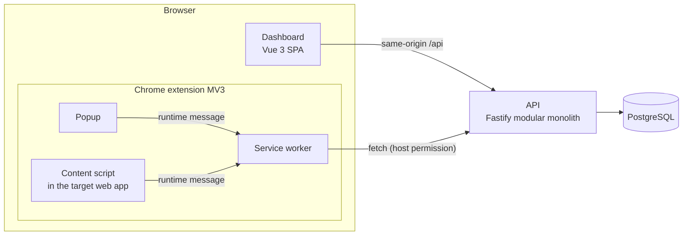

# ContextLayer

ContextLayer is a Digital Adoption Platform. A Chrome extension lets an organization build interactive, step-by-step guides on top of web applications it already uses (a CRM, an ERP, an internal tool) without touching those applications' source code. Employees then follow the guides inside the real application: each step highlights the right element and explains what to do.

The goal is to cut training and onboarding time for business software by teaching people in context instead of in slide decks.

> **Status: Phase 1 (Foundation) is complete.** The architecture, documentation and monorepo scaffolding are in place and verified end to end (API ↔ PostgreSQL, dashboard ↔ API, extension popup ↔ service worker ↔ API, content script ↔ service worker). Product features (accounts, guide builder, guide player, analytics) are planned in [docs/roadmap.md](docs/roadmap.md).

## How it fits together



Within the extension, only the service worker talks to the API; content scripts run inside third-party pages and never hold credentials (the dashboard reaches the API through its own origin under `/api`). See [docs/architecture.md](docs/architecture.md) for the full picture.

## Repository layout

```
apps/
  api/          Fastify 5 API (modular monolith), Drizzle ORM, PostgreSQL
  dashboard/    Vue 3 + Vite + Tailwind CSS admin dashboard
  extension/    Chrome Manifest V3 extension (service worker, content script, popup)
packages/
  shared/       zod contracts shared by every app (types + runtime validation)
  ui/           shared Vue components and Tailwind theme tokens
  config/       shared TypeScript and ESLint configuration
docs/           product, architecture, risks, data model, API, deployment, roadmap, ADRs
compose.yaml    local PostgreSQL
```

## Tech stack

| Area              | Choice                                                              |
| ----------------- | ------------------------------------------------------------------- |
| Language          | TypeScript 6 (strict) everywhere                                    |
| Monorepo          | pnpm 12 workspaces with a version catalog                           |
| API               | Node.js 22, Fastify 5, zod type provider, pino                      |
| Database          | PostgreSQL 18, Drizzle ORM + Drizzle Kit                            |
| Dashboard         | Vue 3, Vite 8, Tailwind CSS 4                                       |
| Extension         | Chrome Manifest V3, Vue 3 popup, plain Vite builds                  |
| Quality           | ESLint 10 (type-aware), Prettier, Vitest 5, Playwright (+ axe-core) |
| Local environment | Docker Compose; no cloud account or paid service required           |

The main architectural choices are explained in [Architecture Decision Records](docs/adr/README.md).

## Prerequisites

- **Node.js 22 (22.13+) or 24 LTS** (`.nvmrc` pins 22; `nvm use` picks it up).
- **pnpm 12** via **Corepack**, which ships with Node 22 and 24 and installs the exact version pinned in `package.json`. Node 25+ no longer bundles Corepack: run `npm install -g corepack` first, or install pnpm 12 directly (`npm install -g pnpm@12`).
- **Docker** with Compose v2 (Docker Desktop, OrbStack, Colima or Docker Engine).
- **Chrome or Chromium 120+** to load the extension.

## Getting started

```sh
corepack enable          # once per machine: provides pnpm 12.9.1
cp .env.example .env     # local configuration (development defaults only)
pnpm install
docker compose up -d     # PostgreSQL on 127.0.0.1:5432
pnpm dev                 # API, dashboard and extension in watch mode
```

Then:

| What             | Where                                                                          |
| ---------------- | ------------------------------------------------------------------------------ |
| API health check | http://localhost:3000/health (readiness) and http://localhost:3000/health/live |
| Dashboard        | http://localhost:5173 (shows live API and database status)                     |
| Extension build  | `apps/extension/dist` (rebuilt on every change)                                |

### Load the extension in Chrome

1. Run `pnpm dev` (or `pnpm build`) so `apps/extension/dist` exists.
2. Open `chrome://extensions` and turn on **Developer mode**.
3. Click **Load unpacked** and select the `apps/extension/dist` folder.
4. Pin ContextLayer and open its popup: the **API** badge should read **Operational**.
5. Open the dashboard at http://localhost:5173 (reload the tab if it was already open before you loaded the extension), open the popup and click **Check this page**: a toast confirms that ContextLayer is active on the page.

After changing extension code, click the reload icon on the extension card and reload the target page (content scripts are not re-injected into open tabs). In Phase 1 the content script only runs on the local dashboard (`http://localhost:5173` and the preview server on `:4173`): content-script match patterns grant host access, so they are kept as narrow as the API permission. Customer applications are enabled at runtime in Phase 4.

## Scripts

| Command                 | What it does                                                           |
| ----------------------- | ---------------------------------------------------------------------- |
| `pnpm dev`              | Starts every app in watch mode                                         |
| `pnpm build`            | Builds all packages in dependency order                                |
| `pnpm typecheck`        | Type-checks every package (`tsc` / `vue-tsc`)                          |
| `pnpm lint`             | Type-aware ESLint in every package                                     |
| `pnpm test`             | All unit tests in a single Vitest run                                  |
| `pnpm test:e2e:install` | Downloads Playwright's Chromium (once)                                 |
| `pnpm test:e2e`         | Builds, then runs the Playwright suites (needs `docker compose up -d`) |
| `pnpm format`           | Formats the repository with Prettier (`format:check` to verify only)   |
| `pnpm db:generate`      | Generates a SQL migration from the Drizzle schema                      |
| `pnpm db:migrate`       | Applies pending migrations to the database in `DATABASE_URL`           |

## Testing

- **Unit and component tests** (Vitest): contracts, API routes through `app.inject()` with a fake database, configuration validation, the dashboard HTTP client and status card, extension message routing and manifest policy. They need no running services.
- **End-to-end tests** (Playwright) run against the built artifacts:
  - Dashboard: real API and database status, a simulated 503, an unreachable API, re-checking, and an axe accessibility audit.
  - Extension: loads the unpacked build in Chromium and checks the service worker, the popup ↔ service worker ↔ API path, the closed Shadow DOM root of the injected UI, and a content script ↔ service worker ↔ API round trip.

## Configuration

All configuration comes from environment variables, read from a single `.env` at the repository root. [`.env.example`](.env.example) documents every variable; its values are local development defaults. The API validates its environment at startup and refuses to start with a readable error if something is missing or malformed.

## Documentation

- [Product](docs/product.md): problem, users, MVP scope and non-goals.
- [Architecture](docs/architecture.md): components, module boundaries, communication flows, security model.
- [Technical risks](docs/technical-risks.md): Manifest V3, DOM targeting, isolation, security, and their mitigations.
- [Data model](docs/data-model.md): proposed PostgreSQL schema.
- [API](docs/api.md): module boundaries, conventions and planned endpoints.
- [Deployment](docs/deployment.md): local setup today, provider-agnostic production options later.
- [Roadmap](docs/roadmap.md): delivery phases and exit criteria.
- [Architecture Decision Records](docs/adr/README.md).

## Troubleshooting

- **`pnpm: command not found`**: run `corepack enable` (or prefix commands with `corepack pnpm`). On Node 25+, install Corepack first with `npm install -g corepack`.
- **Port 5432 already in use**: set `POSTGRES_PORT` in `.env` (for example `5433`) and update the port in `DATABASE_URL` to match.
- **Dashboard shows "Unreachable"**: the API is not running. Start it with `pnpm dev` and check http://localhost:3000/health/live.
- **Dashboard shows "Degraded"**: the API is up but PostgreSQL is not. Run `docker compose up -d` and check `docker compose ps`.
- **Extension changes are not visible**: reload the extension in `chrome://extensions`, then reload the page.
- **E2E tests fail before running**: run `pnpm test:e2e:install` once, and make sure PostgreSQL is up.
