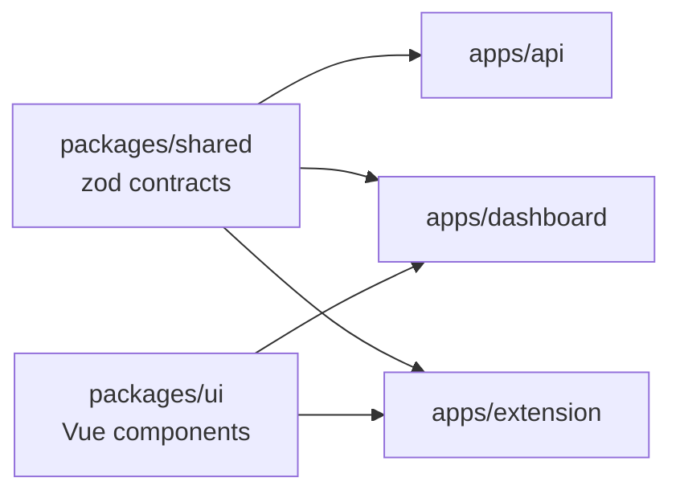

# ADR 0001: Monorepo with pnpm workspaces

- Status: Accepted
- Date: 2026-10-04
- Deciders: JJ

## Context

ContextLayer ships three deployables that must agree on the same payloads: the API (`apps/api`), the dashboard (`apps/dashboard`) and the Chrome extension (`apps/extension`). They share zod contracts (`packages/shared`, [ADR 0010](0010-runtime-validated-shared-contracts.md)), Vue components (`packages/ui`) and TypeScript/ESLint presets (`packages/config`). A contract change, such as a new field in `HealthReport`, must reach the producer and every consumer at once, or the drift only shows up at runtime.

One developer works with AI agents, so coordination should be cheap: one clone, one lockfile, one command per check. Each package must also stay honest about its own dependencies, because the three apps run in very different runtimes.

## Decision

**Implemented (Phase 1):**

- One Git repository with pnpm workspaces over `apps/*` and `packages/*` (`pnpm-workspace.yaml`).
- pnpm 12.9.1 pinned in the root `packageManager` field and provided by Corepack; Node >= 22.13 (`engines`, `.nvmrc`).
- Internal dependencies use `workspace:*`, so they always resolve to the local package.
- Versions shared by several packages (TypeScript `~6.0.3`, Vite, Vitest, Vue, zod) are declared once in the `catalog:` of `pnpm-workspace.yaml`. All pnpm settings live in that file (pnpm 11+ ignores the `pnpm` field of `package.json`); `allowBuilds` lets only `esbuild` run an install script.
- pnpm is the task runner: `pnpm -r run build` follows the dependency graph (`packages/shared` compiles before `apps/api`), `pnpm -r --parallel run dev` starts the watchers, and `pnpm test` is one Vitest run over all projects. No Turborepo or Nx.

`packages/config` is a dev dependency of every package and is left out of the graph.

Why pnpm:

- **Strict `node_modules`:** a package resolves only what it declares, so a phantom dependency fails locally instead of in a later build.
- **Content-addressable store:** each version is stored once and hard-linked, so installs are fast and small.
- **Supply-chain defaults (pnpm 11+):** a 24-hour `minimumReleaseAge`, `strictDepBuilds` and `verifyDepsBeforeRun`, plus `minimumReleaseAgeStrict: true` in `pnpm-workspace.yaml`. Without strict mode pnpm 12 silently adds a too-new exact pin to `minimumReleaseAgeExclude` (it did so for `pino-pretty` 13.2.0 during scaffolding); a range resolves to the newest version older than 24 hours (`jsdom` 30.1.1 instead of 30.1.2).

## Alternatives considered

- **Polyrepo with a published shared package.** Why not: every contract change becomes a publish, a version bump and three pull requests, and consumers can drift to different contract versions.
- **npm workspaces.** Why not: the hoisted `node_modules` allows undeclared imports, and npm has no catalogs for shared versions.
- **Yarn 4.** Comparable workspaces. Why not: its default Plug'n'Play mode needs editor SDKs and occasional compatibility patches, while pnpm gets the same strictness with an ordinary `node_modules` tree.
- **Turborepo or Nx on top of pnpm.** They add task caching and affected-only runs. Why not now: six packages and 56 unit tests do not need them, and each adds configuration and concepts. Revisit when CI time hurts.

## Consequences

Positive:

- A contract change, its API implementation and both clients land in one commit and one review.
- One lockfile and one version of TypeScript, Vite and zod everywhere.
- Undeclared imports fail fast.

Negative / trade-offs:

- pnpm 12 moves fast (risk R-18, [technical risks](../technical-risks.md)): unknown workspace settings are fatal and the lockfile is a multi-document YAML.
- The release-age gate also delays urgent fixes unless they are added to `minimumReleaseAgeExclude`.
- Node 25+ no longer bundles Corepack; the fallback is `npm i -g pnpm@12` or pnpm's standalone installer.
- Without a task graph, every check runs on every package.
- Consuming workspace packages from source needs resolver configuration ([ADR 0011](0011-source-first-workspace-packages.md)).

Follow-ups:

- **Implemented (Phase 2):** CI running `pnpm install --frozen-lockfile`, typecheck, lint, test, build and e2e ([.github/workflows/ci.yml](../../.github/workflows/ci.yml)).
- **Proposed:** `catalogMode: strict`, so that `pnpm add` refuses versions outside the catalog.
- **Proposed:** adopt Turborepo or Nx only when CI duration justifies it, in a new ADR.

## References

- Workspaces: https://pnpm.io/workspaces
- Catalogs: https://pnpm.io/catalogs
- Motivation (store, strictness): https://pnpm.io/motivation
- Settings (release age, builds): https://pnpm.io/settings
- Corepack: https://nodejs.org/api/corepack.html
