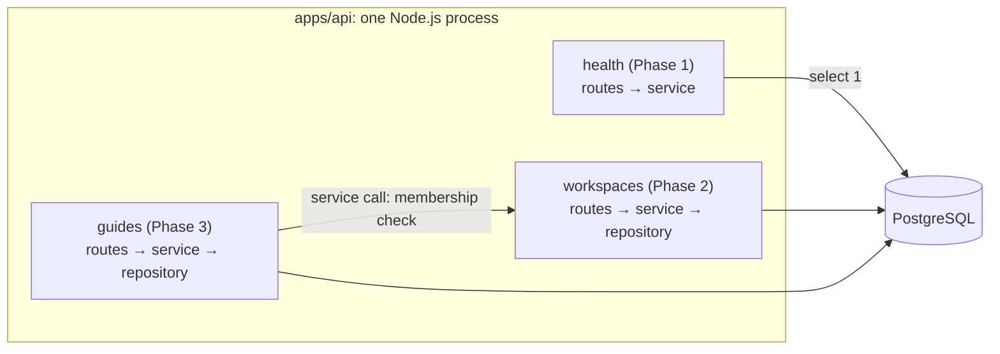

# ADR 0002: Modular monolith backend

- Status: Accepted
- Date: 2026-10-04
- Deciders: JJ

## Context

The backend will own several domains that arrive phase by phase ([roadmap](../roadmap.md)): identity, sessions and workspaces (Phase 2), target applications and guides with published versions (Phase 3), extension grants (Phase 4) and analytics ingestion (Phase 7). Some operations cross domains and must be atomic: creating a workspace also creates its owner membership, and publishing a guide freezes a version snapshot and changes the guide's status.

The team is one developer, everything runs locally without paid infrastructure ([ADR 0008](0008-local-first-development.md)), and no domain scales differently from the others yet. The code must still keep domains separable, because analytics ingestion will probably grow differently.

## Decision

One deployable Node.js process (`apps/api`) and one PostgreSQL database, organized by business module. **Implemented (Phase 1)** for the `health` module; the other modules are **Planned** ([API](../api.md)).

- Each module lives in `apps/api/src/modules/<name>/`: `<name>.routes.ts` (an encapsulated Fastify plugin with HTTP concerns only, [ADR 0003](0003-fastify-http-framework.md)), `<name>.service.ts` (use cases, no Fastify, no SQL), `<name>.repository.ts` (the only code that queries the module's tables, through Drizzle) and an optional `<name>.schemas.ts`.
- Dependencies point one way: routes → service → repository interface → Drizzle. Services receive dependencies as arguments, not as imported singletons.
- A module reaches another only through its exported service functions, never through its repository or its tables. Each table has one owning module ([data model](../data-model.md)).
- `src/app.ts` (`buildApp({ database, logger })`) is the composition root. `src/server.ts` creates the infrastructure (validated config, pino logger, pg pool) and passes it in.

In Phase 1, `modules/health/` has routes and a service but no repository, because it owns no tables. Its service receives a `probes.database` function rather than the database client, so it depends only on what it uses and tests pass a fake.

## Alternatives considered

- **Microservices per domain.** They solve independent scaling and independent team deployments, and ContextLayer has neither problem. Why not: atomic cross-domain operations would become sagas or an outbox, cross-domain calls would gain network failure modes, and deploys, configuration and tracing would multiply for a team of one.
- **Layer-first monolith** (`controllers/`, `services/`, `repositories/` at the top level). Why not: domain boundaries stay implicit, one feature touches every folder, and nothing marks what could leave the process later.
- **Serverless functions per endpoint.** Why not: cold starts, per-invocation database connections (which need an external pooler) and provider-specific packaging conflict with provider-agnostic deployment ([deployment](../deployment.md)).
- **One backend per client** (a dashboard BFF plus an extension API). Why not: both clients share the same domain rules. The real difference, cookies versus bearer tokens, belongs in the auth module ([ADR 0015](0015-authentication-strategy.md)).

## Consequences

Positive:

- One build, one deploy, one log stream. Local development is `pnpm dev` plus one PostgreSQL container.
- Cross-module operations are in-process calls inside one database transaction.
- The HTTP tests in `apps/api/test/health.test.ts` (9 of its 11) run the whole stack through `app.inject()` with a fake database: no network, no PostgreSQL.
- Cross-module refactoring is one type-checked commit.

Negative / trade-offs:

- One failure and scaling domain: a hot path such as analytics ingestion scales, and fails, together with everything else.
- Boundaries rely on convention and review, not process isolation, and a shared database makes cross-module joins tempting.
- All modules share one release cadence.

Follow-ups:

- **Implemented (Phase 2):** `auth` and `workspaces` modules; they reach each other only through interfaces wired in `app.ts`, and every workspace query is scoped by workspace and membership. **Planned (Phase 3):** every tenant-owned content query filters by `workspace_id` (risk R-17, [technical risks](../technical-risks.md)).
- **Proposed:** enforce boundaries once a second module exists (ESLint `no-restricted-imports` patterns or dependency-cruiser), so importing another module's repository fails the lint.
- **Planned (Phase 7):** analytics as the first extraction candidate: its own tables (`guide_runs`, `guide_events`), append-only writes and a batched, idempotent `POST /v1/analytics/events`.
- **Proposed:** if ingestion load affects the API, run it as a second entry point of the same codebase before considering a separate service.

## References

- Martin Fowler, MonolithFirst: https://martinfowler.com/bliki/MonolithFirst.html
- Martin Fowler, Microservice Premium: https://martinfowler.com/bliki/MicroservicePremium.html
- Fastify encapsulation: https://fastify.dev/docs/latest/Reference/Encapsulation/
- Fastify testing with `inject()`: https://fastify.dev/docs/latest/Guides/Testing/
