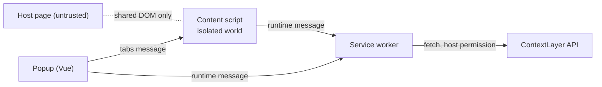

# ADR 0007: Chrome extension on Manifest V3

- Status: Accepted
- Date: 2026-10-04
- Deciders: JJ

## Context

ContextLayer has to run inside web applications it does not own (CRM, ERP, internal tools) without changing their source code. That takes code in the page with DOM access (Edit Mode, guide player), a privileged context that can call the API and hold credentials, and a distribution path corporate IT accepts.

On Chrome, Manifest V3 (MV3) is the only extension platform left: MV2 has been disabled for all users since Chrome 138 (the enterprise exemption ended with 139), and the Chrome Web Store removed the remaining MV2 items on 2026-08-31. Chrome releases every two weeks (stable: 154).

## Decision

Build the in-app layer as a Chrome MV3 extension (Chromium only; Firefox and Safari are MVP non-goals). **Implemented (Phase 1)** in `apps/extension`, with the manifest typed in `manifest.config.ts`.

| Context                                                       | Role                                                                                             | Phase 1                                                    |
| ------------------------------------------------------------- | ------------------------------------------------------------------------------------------------ | ---------------------------------------------------------- |
| Service worker (`background.js`, module)                      | The only API caller; validates every message ([ADR 0012](0012-service-worker-api-gateway.md))    | `api.health.get`                                           |
| Content script (`content.js`, classic script, isolated world) | DOM access and injected UI in a closed shadow root ([ADR 0013](0013-shadow-dom-ui-isolation.md)) | toast, `page.ping`, Edit Mode picker and preview (Phase 5) |
| Popup                                                         | Launcher and status view                                                                         | API status, "Check this page"                              |
| Side panel                                                    | Guide builder (popups close on blur), [ADR 0018](0018-side-panel-edit-mode.md)                   | Implemented (Phase 5): Edit Mode                           |

**Permission policy:** least privilege, widened only by user action.

- `permissions` (Phase 4): `storage` (credentials, [ADR 0015](0015-authentication-strategy.md)), `scripting` (per-site content scripts) and `activeTab` (the popup reads the address of the tab it was opened on); Phase 5 adds `sidePanel` (Edit Mode, enabled per tab from the popup, [ADR 0018](0018-side-panel-edit-mode.md)). None of them shows an install warning beyond the host permissions.
- `host_permissions` is the exact API origin, port included (`http://localhost:3000/*`, derived from `EXTENSION_API_BASE_URL`). A pattern without a port matches every port, so `originPattern()` always writes the port, including the scheme default that `URL.origin` omits (`https://api.example.com` → `https://api.example.com:443/*`; commits `13844ac` and `b6e5fd4`). This grant lets the service worker fetch the API without CORS.
- **Phase 1** declared the content script statically for the local dashboard only (`http://localhost:5173/*`, `:4173/*`), because content-script matches grant host access just like `host_permissions`. **Phase 4 removed it**: there are no static content scripts, so the install-time grant is the API origin alone. `minimum_chrome_version` is 120: above the newest web feature the Phase 1 code needs (the Popover API and `:popover-open`, Chrome 114) and far below stable (154). It rises only when a specific API requires it, recorded together with that API and version.
- **Implemented (Phase 4):** customer sites are `optional_host_permissions` (`https://*/*`, `http://*/*`), requested one exact origin at a time with `chrome.permissions.request()` inside the click in the popup, and only for origins registered as applications of the connected workspace. The worker registers content scripts at runtime and re-registers them on install, update, reload and browser start (in the spike, registrations made with `persistAcrossSessions` were gone after a browser restart of a command-line-loaded extension). Details in [ADR 0017](0017-per-application-site-access.md). Static grants never widen in an update, because an update that adds a warning-triggering permission disables the extension until the user accepts it. The token storage of [ADR 0015](0015-authentication-strategy.md) needs no newer Chrome (`setAccessLevel` is Chrome 102+).
- **Planned (Phase 8):** corporate deployment through enterprise policy. Admins force-install the extension (`ExtensionInstallForcelist`, or `installation_mode` in `ExtensionSettings`) and can restrict where extensions run (`runtime_blocked_hosts`, with `runtime_allowed_hosts` exceptions).

**Platform rules the code follows (Implemented):**

- Listeners register synchronously at top level; no state lives in module globals; the service worker never calls `import()`.
- Async replies use `return true` plus `sendResponse`. Promise-returning `onMessage` listeners only began a gradual rollout in Chrome 148.
- Messages are plain JSON validated with zod ([ADR 0010](0010-runtime-validated-shared-contracts.md)), and receivers check `sender.id`.
- No remotely hosted code: guides are data (targets, text, order), never executable instructions.

## Alternatives considered

| Option                                      | Why not                                                                                                                                                                                                                                                    |
| ------------------------------------------- | ---------------------------------------------------------------------------------------------------------------------------------------------------------------------------------------------------------------------------------------------------------- |
| Manifest V2                                 | Disabled in Chrome since 138; cannot be installed or published.                                                                                                                                                                                            |
| Script snippet embedded in the target app   | Each target app's owner must edit its HTML and CSP, the exact constraint the product removes. Possible later for apps the customer controls.                                                                                                               |
| Bookmarklet or console injection            | Does not persist across navigations, has no privileged context for API calls or tokens, and strict page CSPs block it.                                                                                                                                     |
| MAIN-world scripts or the `userScripts` API | MAIN-world code has no `chrome.*` APIs, falls under the page's CSP and Trusted Types, and can only reach the extension over channels the page can forge. `userScripts` targets user-script managers and needs a per-extension "Allow User Scripts" toggle. |
| Cross-browser framework from day one        | Firefox and Safari have no user yet. Revisit in [ADR 0009](0009-extension-build-tooling.md).                                                                                                                                                               |

## Consequences

### Positive

- Works in any web application without touching its source; the isolated world keeps page scripts away from extension APIs and globals.
- The install-time grant is limited to the API origin; customer-site access is granted per application and per origin at runtime (Phase 4, [ADR 0017](0017-per-application-site-access.md)).
- Fits corporate IT (force-install, host block lists).

### Negative and trade-offs

Each risk is detailed in [technical risks](../technical-risks.md).

- **Ephemeral service worker (R-01).** Chrome stops it after 30 s idle, or when a fetch response takes over 30 s. State lives in `chrome.storage` or the API; requests need short timeouts (5 s today) and idempotency.
- **Existing tabs (R-02).** Tabs open before an install or update get no content script, and old scripts become orphaned. Phase 1 keeps no UI host while idle and registers its listener before touching the DOM, so an orphaned script leaves nothing behind; re-injection is Planned (Phase 4).
- **Host access (R-03).** Users can withhold site access and enterprise policy can block hosts. If the API origin is withheld, service-worker fetches become ordinary CORS requests. **Proposed:** allow CORS for the pinned `chrome-extension://` origin once Phase 4 fixes the extension id.
- **Classic content scripts (R-15).** They shape the build ([ADR 0009](0009-extension-build-tooling.md)), and every byte is paid on every matched page.
- **Chrome churn (R-14).** Releases every two weeks. Branded Chrome ignores `--load-extension` since 137, so E2E tests use Playwright's bundled Chromium.
- **Store policy (R-19).** If published, Chrome Web Store data-disclosure rules apply to analytics events.

### Follow-ups

- **Planned (Phase 4):** a manifest `key` for a stable development id, and `externally_connectable` for the dashboard. **Planned (Phase 5):** the side panel.
- **Planned (Phase 6):** SPA route detection with the Navigation API, avoiding the "Read your browsing history" warning of `webNavigation` and `tabs`.

## References

- MV2 deprecation timeline: https://developer.chrome.com/docs/extensions/develop/migrate/mv2-deprecation-timeline
- Service worker lifecycle: https://developer.chrome.com/docs/extensions/develop/concepts/service-workers/lifecycle
- Declare permissions: https://developer.chrome.com/docs/extensions/develop/concepts/declare-permissions
- Match patterns: https://developer.chrome.com/docs/extensions/develop/concepts/match-patterns
- `chrome.scripting`: https://developer.chrome.com/docs/extensions/reference/api/scripting
- Messaging: https://developer.chrome.com/docs/extensions/develop/concepts/messaging
- Remotely hosted code: https://developer.chrome.com/docs/extensions/develop/migrate/remote-hosted-code
- Enterprise `ExtensionSettings`: https://support.google.com/chrome/a/answer/9867568
