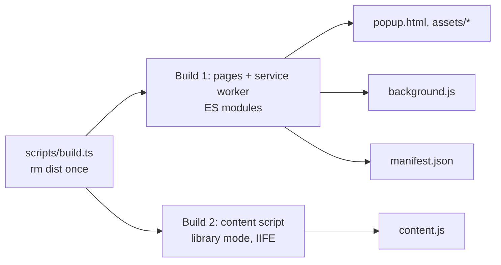

# ADR 0009: Plain Vite builds for the extension (no CRXJS/WXT)

- Status: Accepted
- Date: 2026-10-04
- Deciders: JJ

## Context

MV3 runs extension pages and the service worker as ES modules, but content scripts as classic scripts: neither the manifest's `content_scripts` nor `chrome.scripting.executeScript` / `registerContentScripts` has a module option. A content script is therefore either one self-contained file, or a loader that `import()`s ESM chunks, which must then be listed in `web_accessible_resources` (WAR). Chrome keeps resources private by default because exposed ones let websites fingerprint installed extensions, and ContextLayer runs inside customers' applications. Separately, extension service workers do not support dynamic `import()`.

The research spike built the same extension three ways (Vite 8.3.2 with Rolldown, Vue 3.5) and loaded each in headless Chromium via Playwright 1.63:

|                           | Plain Vite, two builds                         | CRXJS 3.0.0                                                                                                                                                                                               | WXT 0.21.4                                                                     |
| ------------------------- | ---------------------------------------------- | --------------------------------------------------------------------------------------------------------------------------------------------------------------------------------------------------------- | ------------------------------------------------------------------------------ |
| Production content script | One IIFE, no WAR                               | Loader plus ESM chunks (entry, Vue runtime, zod) as WAR for `<all_urls>` with `use_dynamic_url: false`. A test page fetched all three chunks with HTTP 200, so any matched site can detect the extension. | One IIFE, no WAR. WXT itself runs the same two-step build.                     |
| IIFE mode                 | Native (library mode)                          | Opt-in nested build with `plugins: []`. Importing a `.vue` file failed to build. No HMR.                                                                                                                  | Native                                                                         |
| Conventions               | None                                           | The plugin owns manifest and output layout                                                                                                                                                                | File-based entrypoints, auto-imports, dev registers content scripts at runtime |
| Dev loop                  | Rebuild in about 40–130 ms, then manual reload | HMR for the popup and loader scripts                                                                                                                                                                      | Dev server for pages, no HMR for shadow-root UI                                |
| Maintenance               | Vite core                                      | Active. Since 2025-10, about 74% of commits come from one maintainer.                                                                                                                                     | Healthy, but pre-1.0, so 0.x bumps break                                       |

## Decision

**Implemented (Phase 1):** plain Vite, with two builds that share `apps/extension/vite.config.ts`. `scripts/build.ts` deletes `dist` once, then runs both (with `--watch` in development, both watchers share one process).

1. **`createPagesConfig`.** `build.rolldownOptions.input` lists `popup.html` and `src/background/index.ts`. The worker keeps the stable name `background.js` and statically imports a chunk it shares with the popup. A plugin of about 10 lines emits `manifest.json` from the typed `createManifest()` (`chrome.runtime.ManifestV3`).
2. **`createContentScriptConfig`.** `build.lib` with `formats: ['iife']` produces one `content.js` with no `import` or `export`. Library mode is preferred over setting `output.format: 'iife'` by hand: it adds no preload helper and does not rewrite `import.meta`.

Both builds resolve workspace packages from source ([ADR 0011](0011-source-first-workspace-packages.md)) and inline build-time constants (`__CONTEXTLAYER_API_BASE_URL__`, `__CONTEXTLAYER_VERSION__`). The manifest declares no `web_accessible_resources`.

**Two verified pitfalls, both handled in the config:**

- **`process.env.NODE_ENV` in library mode.** Library mode does not replace `process.env.*`. Vue's runtime reads `process.env.NODE_ENV`, so a content script importing Vue throws `process is not defined`. The content build defines the variable explicitly.
- **`emptyOutDir` races.** With `emptyOutDir: true`, each watch rebuild of one build deletes the other build's output. Both builds set `emptyOutDir: false`, and only `scripts/build.ts` cleans `dist`.

**Rule: no dynamic `import()` anywhere in the service worker's import graph.** Extension service workers do not support it. Vite 8 also injects its preload helper, which touches `document` and `window`, into `background.js` whenever the worker code contains a dynamic import, even with `modulePreload: false`. Today it is a documented convention (a comment in `src/background/index.ts` and this ADR), not machine-enforced.

## Alternatives considered

- **CRXJS 3.0.0: rejected.** Its default output lets every matched site detect ContextLayer and read its code chunks; with runtime-registered customer domains (Phase 4) the chunks would be exposed for `http://*/*` and `https://*/*`. Its IIFE mode avoids that but drops user Vite plugins and HMR, which amounts to this decision hidden inside a plugin.
- **WXT 0.21: rejected for now.** Same output strategy, so it buys conventions and dev tooling, not a different bundle. The price is auto-imports, file-based entrypoints, different injection in dev and prod, and breaking pre-1.0 migrations; its idiomatic `createShadowRootUi` with `cssInjectionMode: 'ui'` also exposes CSS as a WAR. Revisit if Firefox/Safari builds or store-publishing automation become requirements.
- **Two config files run by `pnpm run "/^watch:/"`.** Works, but duplicates environment loading and needs a separate clean step.

## Consequences

### Positive

- Every file in `dist` maps to a config line.
- With no WAR, pages cannot probe `chrome-extension://` URLs.
- Native Rolldown, no compatibility layers.
- The manifest policy is unit-tested (`test/build/manifest.test.ts`), and the Playwright suite loads the unpacked `dist`.

### Negative and trade-offs

- **No HMR.** After each rebuild: Reload in `chrome://extensions`, then refresh the page. WXT and CRXJS IIFE mode give the shadow-root overlay no HMR either.
- **Restarts.** Edits to `manifest.config.ts` or `.env` need a dev restart (the config is evaluated once).
- **Not invisible.** No WAR does not hide the extension: while the toast (later the player) is visible, the page can observe the `
` host. Phase 1 mounts it lazily, removes it when the toast hides and sets no version attribute ([ADR 0013](0013-shadow-dom-ui-isolation.md)).
- **Owned code.** About 150 lines of build code.

### Follow-ups

- **Planned (Phase 6):** add `vue()`, and `tailwindcss()` if used, to the content build before it imports `.vue` files or `@contextlayer/ui`.
- **Proposed:** enforce the import rule in the pages-build plugin by failing the build if `background.js`, or any chunk it statically imports, has dynamic imports. A lint rule scoped to `src/background` cannot see transitive modules such as `@contextlayer/shared`.
- **Proposed:** if a WAR is ever needed, set `use_dynamic_url: true` and raise `minimum_chrome_version` to 130 (the flag is ignored before that).

## References

- Content scripts manifest key: https://developer.chrome.com/docs/extensions/reference/manifest/content-scripts
- `web_accessible_resources`: https://developer.chrome.com/docs/extensions/reference/manifest/web-accessible-resources
- Extension service worker basics: https://developer.chrome.com/docs/extensions/develop/concepts/service-workers/basics
- Vite build options and library mode: https://vite.dev/config/build-options, https://vite.dev/guide/build
- CRXJS content scripts: https://crxjs.dev/concepts/content/
- WXT ES modules and auto-imports: https://wxt.dev/guide/essentials/es-modules, https://wxt.dev/guide/essentials/config/auto-imports
- Playwright, Chrome extensions: https://playwright.dev/docs/chrome-extensions
