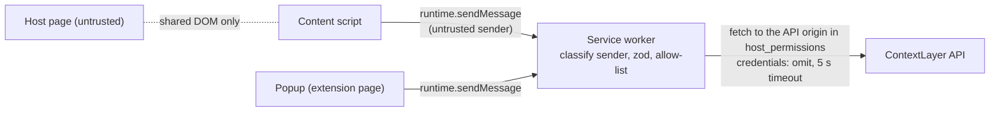

# ADR 0012: The service worker is the extension's only API gateway

- Status: Accepted
- Date: 2026-10-04
- Deciders: JJ

## Context

The extension has three contexts that could call the ContextLayer API: the popup, the content script and the service worker ([ADR 0007](0007-chrome-manifest-v3-extension.md)). They are not equally trustworthy or capable:

- **Content scripts act for the page.** Since Chrome 85 their `fetch` calls carry the page's origin and are subject to CORS, so the API would have to answer CORS for every customer origin. Since Chrome 142, Local Network Access (LNA) also prompts when a public page reaches a local address such as the dev API, and blocks it from a non-secure `http://` page. Extension contexts with host permissions are reported exempt (medium confidence; Chrome 144 and later).
- **Content scripts are exposed.** Chrome's guidance: assume their messages may be forged by a compromised renderer, and that anything sent to them may leak to the page. A token held there is one bug away from the host app.
- **The service worker is ephemeral.** It stops after about 30 s idle, after 5 min on one event, or when a `fetch` response takes more than 30 s ([R-01](../technical-risks.md)).

## Decision

**Implemented (Phase 1).** Only the service worker calls the API. Every other context asks it through a typed message.

- **One client.** `apps/extension/src/background/api-client.ts` is the only code that fetches the API. It builds URLs from the build-time `API_BASE_URL` and known paths (`HEALTH_PATH`), sends `credentials: 'omit'`, aborts after 5 s, accepts only 200 and 503, and parses the body with the shared `healthReportSchema`.
- **No CORS needed.** `host_permissions` is the exact API origin with its port, so the worker's requests bypass CORS. The API registers no CORS plugin.
- **Callers send messages.** The popup and content script call `requestApiHealth()` (`src/messaging/background-client.ts`), which sends `{ type: 'api.health.get' }` and validates the reply. A dead worker or an orphaned script becomes an `INTERNAL_ERROR` result, not an exception.
- **A pure router** in `src/background/handle-message.ts` runs these checks in order:
  1. `classifySender`: `sender.id` must equal the extension id. A sender whose `sender.url` is under `chrome-extension://<id>/` is an `extension-page`. A sender with `sender.tab` is a `content-script`. Any other sender gets `FORBIDDEN`. Chrome sets these fields, not the sender.
  2. `backgroundRequestSchema.safeParse`. A failure gets `BAD_REQUEST`.
  3. The `ALLOWED_SENDERS` allow-list for the request type. A context not on the list gets `FORBIDDEN`. `api.health.get` allows both contexts.
  4. The handler. An API failure becomes `API_UNREACHABLE`, and details go only to the log.
- **Lifecycle rules** (`src/background/index.ts`). Listeners are registered synchronously at top level. Async replies use `return true` plus `sendResponse`, because Promise-returning listeners only began a gradual rollout in Chrome 148. The worker keeps no state in module variables and uses no dynamic `import()`.
- **The content script takes orders only from the extension.** Its listener ignores senders other than `chrome.runtime.id`. There is no `window.postMessage` listener, because any page script can forge one.

**Planned (Phase 4 onward)**, under the same rules:

- Tokens live only where the service worker can read them ([ADR 0015](0015-authentication-strategy.md)). There is never a "get token" message, and content scripts never receive credentials or data about other origins.
- Privileged commands (sign-in, sign-out, save guide, start Edit Mode) are allowed only for `extension-page`.
- Content scripts may only ask for published guides for `sender.origin` (top frame, `sender.tab` present; never a URL from the payload) and send analytics events. The worker calls known endpoints only, so it is never an open proxy.
- Phase 7: writes carry client-generated ids (`clientEventId`) and are queued in `chrome.storage.local`, so a worker stopped mid-request can safely retry ([R-12](../technical-risks.md)).

## Alternatives considered

| Option                                               | Why not                                                                                                                                                                                                    |
| ---------------------------------------------------- | ---------------------------------------------------------------------------------------------------------------------------------------------------------------------------------------------------------- |
| Content scripts call the API directly                | The API must echo arbitrary customer origins in CORS, the request triggers LNA prompts attributed to the customer's site, and the token must live in a page renderer.                                      |
| Each extension page calls the API itself             | Possible (they share host permissions), but token refresh, timeouts and validation would be duplicated.                                                                                                    |
| A page ↔ MAIN-world bridge over `window.postMessage` | Any page script can send or read these messages, and a page-sent `MessageEvent` has `isTrusted: true`. MAIN-world code also falls under the page's CSP.                                                    |
| Long-lived ports for all traffic                     | A port keeps the worker alive only while messages flow, and Chrome closes ports when a page enters the back/forward cache. One-shot messages are simpler. Ports stay an option for streaming player state. |
| Offscreen document as the gateway                    | Another context to manage, with no `fetch` advantage over the service worker.                                                                                                                              |

## Consequences

### Positive

- Auth, timeouts, response validation and error mapping live in one module. A compromised page cannot read tokens it never sees.
- The API stays CORS-free: the dashboard is same-origin through `/api`, and the extension uses host permissions.
- The router is pure and unit-tested (`apps/extension/test/background-handle-message.test.ts`). The e2e suite exercises popup → worker → API and content script → worker → API.

### Negative and trade-offs

- An extra message hop per call, and each new capability needs a message type, a schema and an allow-list entry. Payloads are plain JSON (`Date`, `Map` and `undefined` do not survive).
- The worker's lifetime limits shape the client: short timeouts, idempotent writes, no in-memory queues.
- If a user withholds the extension's site access, the API grant is withheld too, and worker requests become ordinary CORS requests that fail (Chromium source, medium-high confidence).

### Follow-ups

- **Planned (Phase 4):** bearer tokens, an `onMessageExternal` handler that checks `sender.origin` ([ADR 0015](0015-authentication-strategy.md)), and frame checks on content-script requests.
- **Planned (Phase 6):** `frameId`/`documentId` targeting for `tabs.sendMessage`.
- **Proposed:** allow CORS for the pinned `chrome-extension://<id>` origin as a fallback when site access is withheld, or detect it with `chrome.permissions.contains` and prompt.

## References

- Cross-origin network requests: https://developer.chrome.com/docs/extensions/develop/concepts/network-requests
- Content-script fetches (Chrome 85): https://www.chromium.org/Home/chromium-security/extension-content-script-fetches/
- Local Network Access: https://developer.chrome.com/blog/local-network-access
- LNA and extensions with host permissions: https://groups.google.com/a/chromium.org/g/chromium-extensions/c/pUDh8RiTjJk
- Message passing: https://developer.chrome.com/docs/extensions/develop/concepts/messaging
- Stay secure: https://developer.chrome.com/docs/extensions/develop/security-privacy/stay-secure
- Service worker lifecycle: https://developer.chrome.com/docs/extensions/develop/concepts/service-workers/lifecycle
