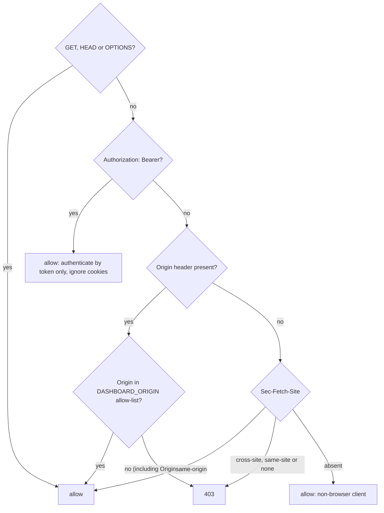
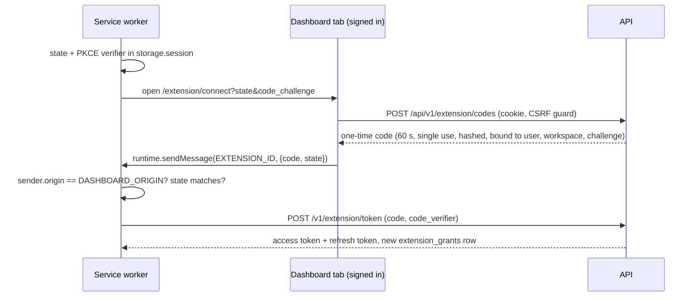

# ADR 0015: Cookie sessions for the dashboard, handed-off tokens for the extension

- Status: Proposed
- Date: 2026-10-04
- Deciders: JJ

## Context

Phase 1 has no authentication: the service worker fetches with `credentials: 'omit'`. Two clients will need identity:

- **The dashboard**, a SPA that reaches the API through its own origin under `/api` (Vite proxy in development, reverse proxy in production; [deployment](../deployment.md)).
- **The extension's service worker**, the only API caller ([ADR 0012](0012-service-worker-api-gateway.md)). It runs on `chrome-extension://<id>` and can stop between any two awaits.

Constraints: no paid identity provider ([ADR 0008](0008-local-first-development.md)); content scripts are untrusted; service-worker fetches reportedly carry no `Origin` and send `Sec-Fetch-Site: none` (medium confidence), so the API cannot recognize the extension by origin; RFC 9700 requires public clients to use PKCE, and their refresh tokens to be either sender-constrained (e.g. DPoP) or rotated with reuse detection; rotation is chosen because it needs no key management in a service worker that can stop at any time (DPoP stays a later option).

## Decision

**Proposed.** Separate credentials per client, one user and workspace model.

### Dashboard: opaque server-side sessions (Planned, Phase 2)

- **Token.** 32 random bytes (base64url) in a cookie. Only its SHA-256 hash is stored (`sessions.token_hash`); a slow hash adds nothing for a 256-bit random value. A new token is issued on login and privilege change; logout sets `revoked_at`.
- **Cookie.** `HttpOnly; Secure; SameSite=Strict; Path=/`.
  - Named `__Host-cl_session` in production and `cl_session` on `http://localhost`, where Chrome has historically rejected prefixed cookies.
  - Strict (OWASP's preference) works because every authenticated call is a same-origin `fetch` to `/api`; the static HTML shell needs no cookie.
  - Safari rejects `Secure` cookies on `http://localhost`: develop in Chrome or Firefox, or behind a local HTTPS proxy.
- **Lifetimes** (configurable). OWASP suggests idle timeouts of 2–5 min for high-value apps and 15–30 min for low-risk ones, and 4–8 h absolute for full-day use. Proposed defaults: **30 min idle, 8 h absolute**. Not the high-value range: guide content renders only as text, sessions are revocable, and no payment data exists. Cost: a daily re-login; the extension has its own grant. `last_seen_at` writes are throttled.
- **Passwords:** argon2id via `@node-rs/argon2`, whose defaults equal the OWASP minimum (19 MiB, t=2, p=1), with no install script. **Rate limits:** `@fastify/rate-limit` on register, login and token, keyed by IP and email, with `trustProxy`.
- **CSRF guard** (`onRequest`, unsafe methods on cookie routes), plus JSON-only bodies and `SameSite=Strict` as defense in depth:

A present but unlisted `Origin` is always rejected. There is no Origin-versus-Host fallback: Vite's `changeOrigin` rewrites `Host` to the API while `Origin` stays `http://localhost:5173`, so the development allow-list contains `:5173` (and `:4173` for preview). Rejecting `Sec-Fetch-Site: none` is stricter than Go's `CrossOriginProtection`.

### Extension: one-time code + PKCE handoff (Planned, Phase 4)

- **Start.** Sign-in is a privileged command, accepted only from extension pages.
- **Why PKCE and `state`.** The code passes through a web page; PKCE binds it to the worker that started the flow, and `state` makes the worker reject a code it did not request.
- **`externally_connectable`.** `matches` lists only the exact dashboard origins with their ports (`http://localhost:5173/*`, plus `http://localhost:4173/*` in development builds because the e2e suites run against `vite preview`); a pattern without a port matches every port. Omitting `ids` also stops other extensions from messaging this one.
- **Stable development id.** A manifest `key` holds a public key generated locally with openssl (private key never committed, no Chrome Web Store account). `DASHBOARD_ORIGIN` and `EXTENSION_ID` are baked in at build time.
- **Storage.** Opaque tokens, hashed server-side, never in content scripts or worker globals.
  - Access token (about 15 min): `chrome.storage.session`, in memory and trusted-contexts-only by default.
  - Refresh token (about 30 days): `chrome.storage.local`, after the worker calls `chrome.storage.local.setAccessLevel({ accessLevel: 'TRUSTED_CONTEXTS' })` at top level on every start. Chrome's reference documents `setAccessLevel()` for every storage area, `local` included, with `AccessLevel` available since Chrome 102 ([storage API](https://developer.chrome.com/docs/extensions/reference/api/storage#method-StorageArea-setAccessLevel)), so `minimum_chrome_version` stays at 120. The spike still verifies at runtime that content scripts can no longer read the area (item 5). If the call fails, the token stays in session storage and the user reconnects after a restart.
- **Rotation.** Each refresh returns a new refresh token and marks the parent `used_at`; presenting a used token revokes the grant. The worker can stop between server-side rotation and persisting the child, which would turn a crash into a sign-out. So the child is persisted first, refreshes are single-flight, and within a short grace window (about 60 s) replaying a parent whose child was never used consumes that child and issues a fresh one instead of revoking. The window briefly weakens reuse detection; restricted storage makes that acceptable.
- **Revocation.** One `extension_grants` row per connected browser, listed and revocable in the dashboard; sign-out calls `POST /v1/extension/revoke`; "log out everywhere" revokes all sessions and grants. Tokens are looked up on every request, so revocation is immediate. Bearer requests ignore cookies.

## Alternatives considered

| Option                                                     | Why not                                                                                                                                                                    |
| ---------------------------------------------------------- | -------------------------------------------------------------------------------------------------------------------------------------------------------------------------- |
| Extension reuses the dashboard cookie                      | Extension requests get same-site cookie treatment only while third-party cookies are not blocked, a user setting. CSRF and logout become entangled across clients.         |
| JWT in `localStorage`                                      | Readable by any XSS; not revocable before expiry.                                                                                                                          |
| Paid identity provider                                     | Violates local-first; reviewers would need accounts.                                                                                                                       |
| `launchWebAuthFlow` with our own authorize endpoint        | Needs exact `redirect_uri` validation, and cookie sharing with the profile is unverified. Kept as a later path on the same token endpoint.                                 |
| Password entry in the extension (ROPC)                     | Forbidden by RFC 9700.                                                                                                                                                     |
| `@fastify/session`, `@fastify/secure-session`, Better Auth | Raw session ids as store keys; no server-side revocation; trust in `chrome-extension://` origins the worker does not send. A small module on `@fastify/cookie` is simpler. |

## Consequences

- **Positive:** no token reaches page-reachable code, every session is revocable, the API needs no CORS, and the token endpoint is OAuth-shaped for later clients.
- **Negative:** three token types plus one-time codes (not yet in the [data model](../data-model.md)); the extension build depends on the dashboard origin; development cookies differ from production.
- **Spike before implementation** (dashboard items at the start of Phase 2, extension items at the start of Phase 4; then Accepted):
  1. `Origin`, `Sec-Fetch-Site` and cookies on service-worker fetches.
  2. Header values through the Vite proxy against the guard.
  3. `__Host-` and `Secure` cookies on localhost in Chrome, Firefox and Safari.
  4. `externally_connectable` on localhost delivering `sender.origin`.
  5. `storage.local.setAccessLevel` blocking content-script reads, and whether it persists.
  6. The rotation race, killing the worker through CDP `Target.closeTarget`.

## References

- OWASP Session Management: https://cheatsheetseries.owasp.org/cheatsheets/Session_Management_Cheat_Sheet.html
- OWASP CSRF Prevention: https://cheatsheetseries.owasp.org/cheatsheets/Cross-Site_Request_Forgery_Prevention_Cheat_Sheet.html
- Cross-origin protection algorithm: https://words.filippo.io/csrf/
- RFC 9700: https://www.rfc-editor.org/rfc/rfc9700.html
- `externally_connectable`: https://developer.chrome.com/docs/extensions/reference/manifest/externally-connectable
- `StorageArea.setAccessLevel()` (all storage areas, Chrome 102+): https://developer.chrome.com/docs/extensions/reference/api/storage#method-StorageArea-setAccessLevel
- Extension cookies: https://developer.chrome.com/docs/extensions/develop/concepts/storage-and-cookies
- Vite `server.proxy`: https://vite.dev/config/server-options#server-proxy
