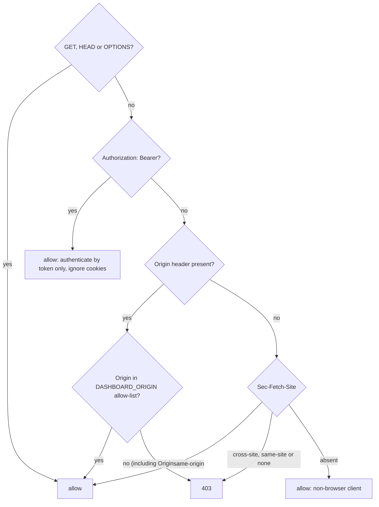
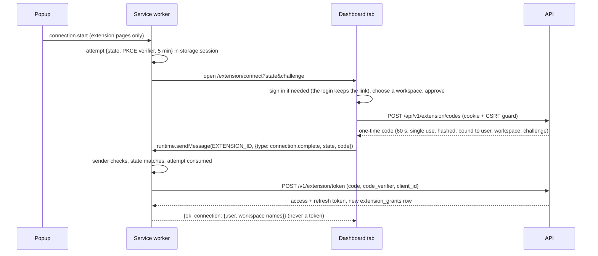

# ADR 0015: Cookie sessions for the dashboard, handed-off tokens for the extension

- Status: Accepted (dashboard implemented in Phase 2, extension implemented in Phase 4)
- Date: 2026-10-04 (updated 2026-10-05 with the Phase 4 spike and implementation)
- Deciders: JJ

## Context

Phase 1 has no authentication: the service worker fetches with `credentials: 'omit'`. Two clients need identity:

- **The dashboard**, a SPA that reaches the API through its own origin under `/api` (Vite proxy in development, reverse proxy in production; [deployment](../deployment.md)).
- **The extension's service worker**, the only API caller ([ADR 0012](0012-service-worker-api-gateway.md)). It runs on `chrome-extension://<id>` and can stop between any two awaits.

Constraints: no paid identity provider ([ADR 0008](0008-local-first-development.md)); content scripts are untrusted; the API cannot recognize the extension by origin (the Phase 4 spike measured `Origin: chrome-extension://<id>` and `Sec-Fetch-Site: none` on the worker's POSTs, no `Origin` on its GETs, and any web page can claim nothing better); RFC 9700 requires public clients to use PKCE, and their refresh tokens to be either sender-constrained (e.g. DPoP) or rotated with reuse detection. Rotation is chosen because it needs no key management in a service worker that can stop at any time (DPoP stays a later option).

## Decision

Separate credentials per client, one user and workspace model. Both halves are implemented; the extension half was accepted after the Phase 4 spike (results below).

### Dashboard: opaque server-side sessions (Implemented, Phase 2)

- **Token.** 32 random bytes (base64url) in a cookie. Only its SHA-256 hash is stored (`sessions.token_hash`); a slow hash adds nothing for a 256-bit random value. A new token is issued on every login and registration, and the session the browser presented before is revoked (no fixation); logout sets `revoked_at`. Workspace roles are read from the database on every request, so a role change takes effect without a new token.
- **Cookie.** `HttpOnly; Secure; SameSite=Strict; Path=/`.
  - Named `__Host-cl_session` in production and `cl_session` on `http://localhost`, where Chrome has historically rejected prefixed cookies.
  - Strict (OWASP's preference) works because every authenticated call is a same-origin `fetch` to `/api`; the static HTML shell needs no cookie.
  - Safari rejects `Secure` cookies on `http://localhost`: develop in Chrome or Firefox, or behind a local HTTPS proxy.
- **Lifetimes** (configurable). OWASP suggests idle timeouts of 2–5 min for high-value apps and 15–30 min for low-risk ones, and 4–8 h absolute for full-day use. Proposed defaults: **30 min idle, 8 h absolute**. Not the high-value range: guide content renders only as text, sessions are revocable, and no payment data exists. Cost: a daily re-login; the extension has its own grant. `last_seen_at` writes are throttled.
- **Passwords:** argon2id via `@node-rs/argon2`, whose defaults equal the OWASP minimum (19 MiB, t=2, p=1), with no install script. **Rate limits:** `@fastify/rate-limit` on login (keyed by IP and email), register, the extension code endpoint and the extension token endpoint (each keyed by IP), with `trustProxy` limited to the proxies named in `TRUST_PROXY`.
- **CSRF guard** (`onRequest`, unsafe methods on cookie routes), plus JSON-only bodies and `SameSite=Strict` as defense in depth:

A present but unlisted `Origin` is always rejected. There is no Origin-versus-Host fallback: Vite's `changeOrigin` rewrites `Host` to the API while `Origin` stays `http://localhost:5173`, so the development allow-list contains `:5173` (and `:4173` for preview). Rejecting `Sec-Fetch-Site: none` is stricter than Go's `CrossOriginProtection`.

The Bearer branch cannot be used to slip a forged request into a cookie route: every cookie route runs `requireSession`, which answers 401 to any request carrying an `Authorization` header, valid or not, instead of falling back to the cookie it may also carry. And a browser cannot add `Authorization` to a cross-site request without a CORS preflight the API never approves. The only route exempt from the guard is `POST /v1/extension/token`, by route configuration (`config.csrf: false`): it reads no cookie and authenticates with the credential in its body, so a forged cross-site call carries nothing the attacker did not already know.

### Extension: one-time code + PKCE handoff (Implemented, Phase 4)

- **Start.** Connecting, disconnecting and every status command are accepted from extension pages only (a sender matrix in the worker). The attempt is written to `storage.session` before the dashboard tab opens; the URL carries `state` and the S256 challenge, never the verifier.
- **Dashboard page.** `/extension/connect` requires a session (the login redirect keeps the link), shows the account, needs an explicit workspace choice (none is preselected) and a confirmation, then issues the code and hands only `{code, state}` to the extension. It reports success only after the extension's acknowledgement; a refused, expired or unanswered handoff says that nothing was connected. The code never appears in the URL, the DOM or storage.
- **What the worker checks** before acting on an external message, all from fields Chrome fills in: the message matches a strict schema (`connection.complete` or `connection.cancel`); the sender has no `id` (not another extension); `sender.origin` equals the dashboard origin exactly (no prefix or suffix match); `frameId` is 0 (top frame); `documentLifecycle`, when reported, is `active`; the tab is the one the attempt opened; the URL is the dashboard's `/extension/connect`; `state` matches. A wrong sender or state leaves the attempt untouched; the first matching message consumes it, so a replayed message finds nothing; an attempt older than 5 minutes is refused. Closing the dashboard tab cancels the attempt.
- **Replacing a connection.** One connection per extension profile. A new connection (including switching workspace, which is a full new flow) is saved only after the exchange succeeds, so a failed or refused attempt leaves the current connection working. Then the previous grant is revoked with reason `replaced`, and site activations of the previous workspace no longer apply ([ADR 0017](0017-per-application-site-access.md)).
- **`externally_connectable`.** `matches` holds exactly one dashboard origin with its port (`EXTENSION_DASHBOARD_URL`, default `http://localhost:5173`); a pattern without a port matches every port. Omitting `ids` stops other extensions from messaging this one. End-to-end builds point it at the preview server instead of listing two origins (changed from the plan).
- **Stable id.** The manifest `key` holds a committed development public key (`packages/shared/src/extension-identity.ts`), so every clone and CI run installs `ebdclkadgcmjipockfofmlakcfijojko`; its private key is not in the repository and is not needed. A production build sets `EXTENSION_PUBLIC_KEY` and `EXTENSION_ID`; the build fails if they do not match. The dashboard reads `EXTENSION_ID` to address the extension, and the API (where it is required in production) issues tokens only to that `client_id`.

**Authentication per route** (`/v1/extension/*`):

| Route                                                                | Credential                                     | Notes                                                                   |
| -------------------------------------------------------------------- | ---------------------------------------------- | ----------------------------------------------------------------------- |
| `POST codes`, `GET connections`, `DELETE connections/:id`            | Dashboard session cookie                       | CSRF guard; any `Authorization` header → 401; codes rate-limited per IP |
| `POST token`                                                         | Code + verifier, or refresh token, in the body | No cookie, no bearer; exempt from the CSRF guard; rate-limited per IP   |
| `POST revoke`, `GET session`, `GET applications`, `GET guides[/:id]` | `Authorization: Bearer <access token>`         | Cookies never read; the workspace is the grant's, never a request value |

An invalid or missing bearer answers 401 with `WWW-Authenticate: Bearer realm="contextlayer-extension"` (plus `error="invalid_token"` when a token was sent); it never falls back to a cookie. Every token is looked up on every request, so a revocation is effective at the next request.

**Tokens.** Opaque, typed prefixes (`clc_` code, `cla_` access, `clr_` refresh) and 256 random bits; only SHA-256 hashes are stored. Access tokens last 15 minutes (`EXTENSION_ACCESS_TOKEN_MINUTES`, at most 60). A grant lasts at most 30 days (`EXTENSION_GRANT_DAYS`, at most 30) and every refresh token expires with its grant: rotation never extends a connection. A consumed code presented again revokes the grant it created (`code-replay`).

**Strict rotation, no grace window** (changed from the plan, which proposed a 60-second grace window). Each refresh marks the presented token used and returns a new one; presenting a used refresh token revokes the whole grant (`refresh-reuse`). The revocation is committed even though the request fails: the service returns normally from its transaction and the route answers 400 afterwards. There is no window in which a replayed parent is tolerated, because a grace window would also let a stolen parent token be redeemed unnoticed after a legitimate refresh.

The cost is measured, not hypothetical: the spike showed that when Chrome stops the worker during a fetch, the response is lost. If that happens after the server rotated, the worker still holds the parent, its next refresh is a reuse, and the connection ends; the popup then says the connection expired or was revoked and offers to connect again (one approval in the dashboard, whose session is usually still valid). Refreshes are rare (single-flight, only when the access token is within 30 seconds of expiry), so this should seldom happen; the e2e suite reproduces it on purpose.

**The worker's client.** Each request retries at most once, after one refresh; a second 401 ends the connection (no loops). A network error, a timeout, a 429 or a 5xx keeps the credentials: an unreachable API is not a revocation. A 400 or 401 from the token endpoint ends the connection and clears every credential. A refresh answer is saved only if the stored refresh token is still the one it replaced, so a late answer cannot bring back a connection the user disconnected or replaced meanwhile. Requests use `credentials: 'omit'`, `redirect: 'error'` (no credential follows a redirect), a 5-second timeout and only paths on the API origin.

**Storage.**

| Value                                                    | Where                                                                                                |
| -------------------------------------------------------- | ---------------------------------------------------------------------------------------------------- |
| PKCE attempt, access token, application cache, page list | `chrome.storage.session` (in memory, trusted contexts only by default)                               |
| Refresh token, connection facts, enabled sites           | `chrome.storage.local`, only after `setAccessLevel(TRUSTED_CONTEXTS)` succeeded; otherwise `session` |

The worker calls `setAccessLevel` at top level on every start and awaits it before writing a credential. If it fails, credentials stay in `session` and the popup says the user will reconnect after a browser restart. Nothing goes to `localStorage`, `storage.sync`, the DOM, page variables, logs, URLs, content-script messages or list responses. The popup only receives public facts (user name and email, workspace name, dates, states).

**What survives what** (measured in the spike and in the e2e suite):

| Event                                | `storage.session` | Restricted `storage.local` | Connection                               |
| ------------------------------------ | ----------------- | -------------------------- | ---------------------------------------- |
| Worker stopped by Chrome (idle, CDP) | kept              | kept                       | kept; an in-flight fetch is lost         |
| Extension reload or update           | cleared           | kept                       | kept: the next request refreshes         |
| Browser restart                      | cleared           | kept                       | kept: the next request refreshes         |
| `local` could not be restricted      | —                 | not used                   | lost at browser restart: connect again   |
| Grant expired (30 days) or revoked   | —                 | —                          | ended at the next request: connect again |

**Logout, disconnect and revoke are different.** Signing out of the dashboard ends the cookie session only; the extension stays connected. Disconnecting in the popup forgets the credentials locally first, then asks the API to revoke (`reason: disconnected`); offline, the popup says the server could not confirm and points to "Connected browsers". Revoking in the dashboard's "Connected browsers" ends the grant on the server; the extension notices at its next request. A "log out everywhere" action does not exist yet.

## Alternatives considered

| Option                                                     | Why not                                                                                                                                                                    |
| ---------------------------------------------------------- | -------------------------------------------------------------------------------------------------------------------------------------------------------------------------- |
| Extension reuses the dashboard cookie                      | Extension requests get same-site cookie treatment only while third-party cookies are not blocked, a user setting. CSRF and logout become entangled across clients.         |
| JWT in `localStorage`                                      | Readable by any XSS; not revocable before expiry.                                                                                                                          |
| Paid identity provider                                     | Violates local-first; reviewers would need accounts.                                                                                                                       |
| `launchWebAuthFlow` with our own authorize endpoint        | Needs exact `redirect_uri` validation, and cookie sharing with the profile is unverified. Kept as a later path on the same token endpoint.                                 |
| Password entry in the extension (ROPC)                     | Forbidden by RFC 9700.                                                                                                                                                     |
| Grace window on refresh-token reuse (the original plan)    | Lets a stolen parent token be redeemed unnoticed after a legitimate refresh; strict reuse detection costs an occasional reconnection instead.                              |
| `@fastify/session`, `@fastify/secure-session`, Better Auth | Raw session ids as store keys; no server-side revocation; trust in `chrome-extension://` origins the worker does not send. A small module on `@fastify/cookie` is simpler. |

## Consequences

- **Positive:** no token reaches page-reachable code, every session is revocable, the API needs no CORS, and the token endpoint is OAuth-shaped for later clients.
- **Negative:** three token types plus one-time codes ([data model](../data-model.md)); the extension build depends on the dashboard origin; development cookies differ from production; a refresh answer lost after rotation costs a reconnection.
- **Spike before implementation** (dashboard items at the start of Phase 2, extension items at the start of Phase 4):
  1. `Origin`, `Sec-Fetch-Site` and cookies on service-worker fetches.
  2. Header values through the Vite proxy against the guard.
  3. `__Host-` and `Secure` cookies on localhost in Chrome, Firefox and Safari.
  4. `externally_connectable` on localhost delivering `sender.origin`.
  5. `storage.local.setAccessLevel` blocking content-script reads, and whether it persists.
  6. The rotation race, killing the worker through CDP `Target.closeTarget`.

### Phase 2 results (dashboard items 2 and 3)

- **Item 2, headers through the proxy.** The Vite dev and preview proxies forward the browser's `Origin` (`http://localhost:5173` or `:4173`) and `Sec-Fetch-Site: same-origin` unchanged; `changeOrigin` rewrites only `Host`. Every dashboard write in the Playwright suite (register, login, create workspace, logout) passes the guard through the proxy, and integration tests cover the rejections (foreign `Origin`, `Origin: null`, `Sec-Fetch-Site: cross-site` and `none`, `text/plain` bodies).
- **Item 3, cookies on localhost.** Verified in Chromium (Playwright's bundled build): `cl_session` with `HttpOnly; Secure; SameSite=Strict; Path=/` is stored and sent on `http://localhost`, and is invisible to `document.cookie`. Firefox and Safari were not tested in this phase; the Safari limitation above stands. `__Host-cl_session` is used only in production, over HTTPS, and is covered by a configuration test.
- **Implemented as proposed:** argon2id with the OWASP minimum, SHA-256 token hashes, 30 min idle and 8 h absolute lifetimes (both configurable), `last_seen_at` written at most once a minute, revocation on logout.

### Phase 4 results (extension items 1, 4, 5 and 6)

Measured with a throwaway extension in Playwright's bundled Chromium **153.0.8010.12** (new headless, macOS). Chrome 120, the manifest's `minimum_chrome_version`, was not tested; the minimum stays at 120 because every API used is documented for earlier versions (`storage.session` and `setAccessLevel` 102, `optional_host_permissions` and `MessageSender.documentId`/`documentLifecycle` before 120).

- **Item 1, worker fetches.** POST: `Origin: chrome-extension://<id>`, `Sec-Fetch-Site: none`, `Sec-Fetch-Mode: cors`; GET: no `Origin`. With `credentials: 'omit'` no cookie is sent; with `'include'` the site's cookie is. The Phase 2 guard therefore rejected `POST /v1/extension/token`, hence the route-level exemption above. A redirect to a host without permission fails; `redirect: 'error'` is the policy.
- **Item 4, `externally_connectable` on localhost.** A top-frame sender has `origin`, `url`, `frameId: 0`, `documentId`, `documentLifecycle: "active"` and `tab`, and no `id`. A same-origin subframe reports a non-zero `frameId`. A page on another port or host does not even get `chrome.runtime.sendMessage`. Another extension is refused ("Receiving end does not exist") because `ids` is omitted.
- **Item 5, storage access levels.** By default a content script can read `storage.local` (including `onChanged`) but not `storage.session`. After `setAccessLevel(TRUSTED_CONTEXTS)` both reads fail ("Access to storage is not allowed from this context") and `onChanged` delivers nothing; the restriction persisted after a worker restart and after a browser restart without being set again. `storage.session` survives a worker restart and is empty after a browser restart.
- **Item 6, the rotation race.** Stopping the worker with CDP `Target.closeTarget` during a 6-second fetch loses the request: the caller sees "message channel closed", and the work is not resumed. This is the case that ends a connection under strict rotation; the e2e suite reproduces it.
- **Also measured:** the stable id derived from the manifest key equals the runtime id; match patterns with a port do not cover other ports; `chrome.runtime.reload()` of an unpacked extension only brings it back when Developer mode is on.

## References

- OWASP Session Management: https://cheatsheetseries.owasp.org/cheatsheets/Session_Management_Cheat_Sheet.html
- OWASP CSRF Prevention: https://cheatsheetseries.owasp.org/cheatsheets/Cross-Site_Request_Forgery_Prevention_Cheat_Sheet.html
- Cross-origin protection algorithm: https://words.filippo.io/csrf/
- RFC 9700: https://www.rfc-editor.org/rfc/rfc9700.html
- `externally_connectable`: https://developer.chrome.com/docs/extensions/reference/manifest/externally-connectable
- `StorageArea.setAccessLevel()` (all storage areas, Chrome 102+): https://developer.chrome.com/docs/extensions/reference/api/storage#method-StorageArea-setAccessLevel
- `runtime.MessageSender`: https://developer.chrome.com/docs/extensions/reference/api/runtime#type-MessageSender
- Extension cookies: https://developer.chrome.com/docs/extensions/develop/concepts/storage-and-cookies
- Vite `server.proxy`: https://vite.dev/config/server-options#server-proxy
