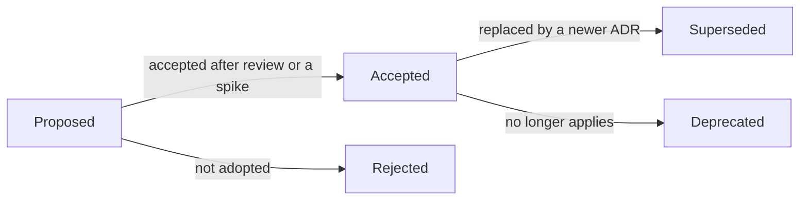

# Architecture Decision Records

An Architecture Decision Record (ADR) is a short document that captures one significant decision: the forces behind it, what was chosen, which alternatives were rejected and why, and what the choice costs. The practice comes from Michael Nygard's 2011 article "Documenting Architecture Decisions"; ContextLayer uses a lightweight variant of the MADR template.

For the big picture, read [architecture](../architecture.md) first. ADRs explain individual choices in that picture.

## Why this project uses ADRs

- **The reasoning is part of the deliverable.** ContextLayer is a portfolio project, and reviewers ask "why this and not X?" more often than "what". Every ADR names the alternatives and the trade-off that was accepted.
- **Durable memory.** Decisions outlive the session or the person that made them: commit messages reference ADRs instead of repeating the rationale, and code comments point at the ADR behind a non-obvious choice: `compose.yaml` → 0008, `apps/extension/manifest.config.ts` → 0007, `apps/extension/vite.config.ts` → 0009, `apps/dashboard/vite.config.ts` → 0011, `apps/extension/src/content/overlay.ts` → 0013.
- **Decisions keep their evidence and date.** The Phase 1 decisions rest on research done on 2026-10-04 (pinned versions, Chrome platform behavior, local experiments). Recording versions and sources shows when a premise changes, for example when Drizzle 1.0 becomes stable or typescript-eslint supports TypeScript 7.
- **Changing course stays visible.** A superseding ADR shows how the design evolved instead of rewriting history.

## When to write one

Write an ADR when a decision:

- is expensive to reverse (framework, database, authentication model, extension architecture);
- affects more than one package or the contract between packages;
- chooses between real alternatives that a reasonable engineer could prefer; or
- knowingly accepts a risk or a limitation.

Routine changes (a dependency patch, a new endpoint that follows existing conventions) do not need one; they belong in the commit message.

## Format

Each ADR is one Markdown file named `NNNN-kebab-case-title.md`. The four-digit number is never reused. Aim for 250 to 700 words of prose; ADRs that record platform evidence or several sub-decisions (the extension, build and security ADRs) may run to about 1,100. Link to the other documents for details instead of repeating them.

| Section                 | Content                                                                                                 |
| ----------------------- | ------------------------------------------------------------------------------------------------------- |
| Header                  | `# ADR NNNN: Title`, then the `Status`, `Date` and `Deciders` lines                                     |
| Context                 | The problem and its forces: requirements, constraints, and facts that hold on that date (with versions) |
| Decision                | What was chosen, with status labels: **Implemented (Phase 1)**, **Planned (Phase N)** or **Proposed**   |
| Alternatives considered | Every serious option, each with a concrete "Why not"                                                    |
| Consequences            | Positive, Negative / trade-offs, and Follow-ups (each follow-up labeled Planned or Proposed)            |
| References              | Official documentation for claims that are not obvious                                                  |

Template:

```md
# ADR NNNN: Title in sentence case

- Status: Proposed
- Date: YYYY-MM-DD
- Deciders: JJ

## Context

What forces the decision: requirements, constraints, and facts (with versions and dates).

## Decision

What we do, labeled **Implemented (Phase 1)**, **Planned (Phase N)** or **Proposed**, with paths to the code that implements it.

## Alternatives considered

- **Option A.** What it offers. Why not: the concrete reason.
- **Option B.** What it offers. Why not: the concrete reason.

## Consequences

Positive:

- ...

Negative / trade-offs:

- ...

Follow-ups:

- **Planned (Phase N):** ...

## References

- Official documentation: https://...
```

## Status lifecycle



| Status     | Meaning                                                                                                                               | Can the text change?                                                                                |
| ---------- | ------------------------------------------------------------------------------------------------------------------------------------- | --------------------------------------------------------------------------------------------------- |
| Proposed   | Drafted and open for review. It needs a spike, a prototype or more evidence before the project commits to it                          | Yes                                                                                                 |
| Accepted   | The decision in force; code and other documents follow it                                                                             | Only editorial fixes (typos, broken links) and status updates. A different decision needs a new ADR |
| Superseded | Replaced by a newer ADR. The header reads `- Status: Superseded by ADR MMMM` with a link, and the new ADR names the one it supersedes | No                                                                                                  |
| Deprecated | No longer applies and nothing replaces it, for example because the feature was removed                                                | No                                                                                                  |
| Rejected   | A Proposed ADR that was not adopted. It stays in the index so the discussion is not repeated                                          | No                                                                                                  |

The two Proposed ADRs have explicit decision points. [ADR 0014](0014-element-targeting-strategy.md) is validated when target capture (Phase 5) and the resolution engine (Phase 6) are built against a fixture corpus. [ADR 0015](0015-authentication-strategy.md) needs a spike before implementation: dashboard sessions in Phase 2, the extension token handoff in Phase 4 ([roadmap](../roadmap.md)).

## How to add an ADR

1. Take the next free number (highest number in the index plus one). Never renumber or reuse one.
2. Copy the template into `docs/adr/NNNN-short-title.md` with `Status: Proposed`, today's date and the deciders.
3. Write the Context and the alternatives before the Decision. State facts with versions and dates, and link official sources.
4. Add a row to the index below, and link the ADR from the documents it affects ([architecture](../architecture.md), [data model](../data-model.md), [API](../api.md), [technical risks](../technical-risks.md), [deployment](../deployment.md)).
5. Review it in the pull request that introduces the first code depending on it, or earlier when a spike is needed. On acceptance, set `Status: Accepted` and the acceptance date.
6. If it replaces an earlier decision, mark the old ADR `Superseded by` and link both ways.
7. Run `pnpm format` (Prettier also formats Markdown) and reference the ADR in the commit message.

## Index

The Status column is the state of the decision. The Implementation column says how much of it exists in code.

| ADR                                                | Title                                                                  | Status   | Implementation                                                                |
| -------------------------------------------------- | ---------------------------------------------------------------------- | -------- | ----------------------------------------------------------------------------- |
| [0001](0001-pnpm-workspaces-monorepo.md)           | Monorepo with pnpm workspaces                                          | Accepted | Implemented (Phase 1)                                                         |
| [0002](0002-modular-monolith-backend.md)           | Modular monolith backend                                               | Accepted | Implemented (Phase 1): `health` module; business modules Planned (Phases 2-7) |
| [0003](0003-fastify-http-framework.md)             | Fastify as the HTTP framework                                          | Accepted | Implemented (Phase 1)                                                         |
| [0004](0004-postgresql-primary-database.md)        | PostgreSQL as the primary database                                     | Accepted | Implemented (Phase 1): local server; first tables Planned (Phase 2)           |
| [0005](0005-drizzle-orm.md)                        | Drizzle ORM and Drizzle Kit migrations                                 | Accepted | Implemented (Phase 1): client and tooling; first migration Planned (Phase 2)  |
| [0006](0006-vue-3-frontend-framework.md)           | Vue 3 for the dashboard and extension UI                               | Accepted | Implemented (Phase 1): dashboard and popup; side panel Planned (Phase 5)      |
| [0007](0007-chrome-manifest-v3-extension.md)       | Chrome extension on Manifest V3                                        | Accepted | Implemented (Phase 1): skeleton; per-site access Planned (Phase 4)            |
| [0008](0008-local-first-development.md)            | Local-first, self-hosted development environment                       | Accepted | Implemented (Phase 1)                                                         |
| [0009](0009-extension-build-tooling.md)            | Plain Vite builds for the extension (no CRXJS/WXT)                     | Accepted | Implemented (Phase 1)                                                         |
| [0010](0010-runtime-validated-shared-contracts.md) | Runtime-validated shared contracts with zod                            | Accepted | Implemented (Phase 1)                                                         |
| [0011](0011-source-first-workspace-packages.md)    | Source-first workspace packages via a custom export condition          | Accepted | Implemented (Phase 1)                                                         |
| [0012](0012-service-worker-api-gateway.md)         | The service worker is the extension's only API gateway                 | Accepted | Implemented (Phase 1): health calls; bearer tokens Planned (Phase 4)          |
| [0013](0013-shadow-dom-ui-isolation.md)            | Shadow DOM isolation for injected UI                                   | Accepted | Implemented (Phase 1): toast overlay; guide player UI Planned (Phase 6)       |
| [0014](0014-element-targeting-strategy.md)         | Multi-signal target descriptors for element targeting                  | Proposed | Planned: capture (Phase 5), resolution (Phase 6)                              |
| [0015](0015-authentication-strategy.md)            | Cookie sessions for the dashboard, handed-off tokens for the extension | Proposed | Planned: dashboard sessions (Phase 2), extension handoff (Phase 4)            |

Where to start: 0002 and 0012 describe the two runtime boundaries (API modules and the extension's API gateway); 0013, 0014 and 0015 cover the hardest open problems (injected UI, element targeting, authentication).

## References

- Michael Nygard, Documenting Architecture Decisions: https://cognitect.com/blog/2011/11/15/documenting-architecture-decisions
- MADR (Markdown Architectural Decision Records): https://adr.github.io/madr/
- ADR community resources: https://adr.github.io/
