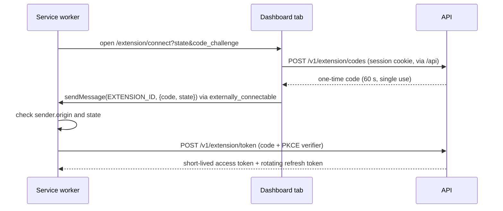

# API

> **Status.** **Implemented (Phase 1):** only `GET /health` and `GET /health/live`, plus what they rely on: the `ApiError` envelope, request ids, security headers, and zod validation and serialization. Every business endpoint below is **Planned** for the phase shown. The authentication design is **Proposed** ([ADR 0015](adr/0015-authentication-strategy.md)).

Related: [architecture](architecture.md), [data model](data-model.md), [ADR 0002](adr/0002-modular-monolith-backend.md), [ADR 0003](adr/0003-fastify-http-framework.md), [ADR 0010](adr/0010-runtime-validated-shared-contracts.md), [ADR 0012](adr/0012-service-worker-api-gateway.md), [deployment](deployment.md).

## 1. Conventions

- **JSON only** (`application/json; charset=utf-8`). Fastify's default parsers also accept `text/plain`, which then fails the route's zod object schema with a 400. Any other content type gets a 415 (Implemented). **Proposed (Phase 2):** remove the `text/plain` parser. It is one of the content types a cross-site form can send without a CORS preflight.
- **camelCase payloads.** snake_case exists only in SQL, mapped by Drizzle `casing: 'snake_case'`.
- **Paths:** plural nouns. Tenant resources nest under `/v1/workspaces/:workspaceId/…`, so authorization is one membership lookup and every log line names the tenant. Path ids are validated as UUIDs (a malformed id is a 400, not a database error). Non-CRUD actions are `POST` sub-resources (`/publish`).
- **Status codes:** `GET`/`PATCH`/`PUT` return 200, a create returns 201 with the resource, `DELETE` returns 204.
- **Values:** UUID strings, ISO 8601 UTC timestamps, and no `.transform()` in shared schemas ([ADR 0010](adr/0010-runtime-validated-shared-contracts.md)).
- **No CORS** (Implemented, by design; see section 2).

### 1.1 Versioning (Planned, Phase 2)

Business routes live under `/v1`. Health stays unversioned, because probes are infrastructure, not a product contract. The dashboard ships with the API, but installed extensions update on Chrome's schedule (enterprise channels can pin a version), so the API keeps serving at least the previous extension release. Additive changes (new endpoints, new optional fields) stay in `v1`, and clients ignore unknown fields because zod objects strip them. Breaking changes go to `/v2`, served next to `v1` for a deprecation window.

### 1.2 Error envelope (Implemented)

```json
{
  "error": {
    "code": "NOT_FOUND",
    "message": "Route not found",
    "requestId": "41b3032b-dadc-4b52-a064-051fb377f734"
  }
}
```

The codes are `API_ERROR_CODES` in `packages/shared/src/api-error.ts`. The mapping is in `apps/api/src/http/error-handler.ts`:

| `code`                | HTTP                | When                                                                                       | `message`                                             |
| --------------------- | ------------------- | ------------------------------------------------------------------------------------------ | ----------------------------------------------------- |
| `VALIDATION_FAILED`   | 400                 | zod rejected params, query or body                                                         | `Request validation failed`                           |
| `BAD_REQUEST`         | 400 or unmapped 4xx | malformed JSON (400); unsupported media type (415); body too large (413)                   | Fastify's text for `FST_*` errors, else `Bad request` |
| `UNAUTHORIZED`        | 401                 | no valid credential (Phase 2+)                                                             | `Authentication required`                             |
| `FORBIDDEN`           | 403                 | the role or the CSRF guard refuses (Phase 2+)                                              | `Forbidden`                                           |
| `NOT_FOUND`           | 404                 | unknown route or method; a resource outside the caller's workspaces                        | `Route not found` / `Not found`                       |
| `CONFLICT`            | 409                 | uniqueness or state conflict (Phase 2+)                                                    | `Conflict`                                            |
| `RATE_LIMITED`        | 429                 | limit exceeded (Phase 2+)                                                                  | `Too many requests`                                   |
| `INTERNAL_ERROR`      | 500                 | any 5xx except 503; an error without a 4xx/5xx status; a response that violates its schema | `Internal server error`                               |
| `SERVICE_UNAVAILABLE` | 503                 | an error thrown with status 503                                                            | `Service temporarily unavailable`                     |

An unmapped 4xx keeps its real HTTP status and uses `BAD_REQUEST`. The 503 from `GET /health` is a `HealthReport`, not an `ApiError`.

### 1.3 Request ids (Implemented)

`genReqId` assigns `randomUUID()` to every request. An `onRequest` hook returns it as `x-request-id`, including on 404s and errors, and it also appears as `error.requestId` and on every log line of the request. Fastify 5 ignores incoming `request-id` headers by default (`requestIdHeader: false`), so clients cannot inject ids into the logs. Proposed for Phase 8: accept the id that the reverse proxy sets.

### 1.4 Pagination (Planned, Phase 3)

`?limit=` (1–100, default 20) and an opaque `?cursor=`, returning `{ "items": [...], "nextCursor": null }`.

- The cursor is the base64url-encoded sort key of the last row, for example `(updatedAt, id)`, served by a matching index such as `guides (workspace_id, updated_at desc, id desc)` ([data model](data-model.md#5-indexes)). A mutable sort key like `updatedAt` can still skip a row edited during paging; lists that must never skip rows sort by the immutable UUIDv7 `id`. It drives a keyset query: `where (updated_at, id) < ($1, $2) order by updated_at desc, id desc`.
- Lists in creation order can use the UUIDv7 `id` alone, because it is time-ordered.
- Offsets were rejected: they skip or repeat rows under concurrent inserts and slow down with depth. The cost is no page jumps or totals, which these screens do not need.

### 1.5 Idempotency

- `PUT …/steps` (full replacement) and `DELETE` (archive) are idempotent by design (Phase 3).
- `POST /v1/analytics/events`: each event carries a `clientEventId`. Duplicates are acknowledged but stored once, and the response is `{ accepted, duplicates }` (Phase 7, [data model 3.7](data-model.md#37-idempotent-event-ingestion)).
- `POST …/publish` returns the latest version when the draft has not changed since, so a double click does not create a second version (Proposed).
- Refresh-token rotation has a short reuse grace window, because the service worker can stop between the server rotating a token and the extension storing the new one (Phase 4).
- Other creates are not idempotent; the dashboard prevents double submission. No generic `Idempotency-Key` header is planned.

### 1.6 Rate limiting (Planned, Phase 2)

`@fastify/rate-limit` 11 (supports Fastify 5): a modest global limit plus strict limits on login, register and `POST /v1/extension/token`, keyed by IP and by email where present.

- The store is in memory. That is fine for one process; a second replica needs a shared store ([deployment](deployment.md)).
- `trustProxy` must name the reverse proxy, or `request.ip` is the proxy's address.
- Responses are `429 RATE_LIMITED` with `retry-after`. Phase 2 must verify that the plugin's error reaches `setErrorHandler`; if it does not, an `errorResponseBuilder` builds the envelope.

### 1.7 Caching and headers

- **Implemented:** the health plugin's encapsulated `onSend` hook sets `cache-control: no-store`. `@fastify/helmet` defaults apply everywhere: `content-security-policy: default-src 'self'; …`, `x-content-type-options: nosniff`, `referrer-policy: no-referrer`, `strict-transport-security`, `cross-origin-resource-policy: same-origin`, `x-frame-options: SAMEORIGIN`.
- **Planned:** `no-store` on every authenticated response, so tenant data never sits in a cache.
- **Proposed:** an `ETag` on `GET /v1/extension/guides`, so the service worker can revalidate cheaply.

## 2. Clients and authentication

| Client                             | Reaches the API                                                                                                                                                                                                                                                                              | Credential                                                                                     | Status                                            |
| ---------------------------------- | -------------------------------------------------------------------------------------------------------------------------------------------------------------------------------------------------------------------------------------------------------------------------------------------- | ---------------------------------------------------------------------------------------------- | ------------------------------------------------- |
| Dashboard                          | same origin `/api/*`; the prefix is stripped by the Vite dev (5173) and preview (4173) proxy, and by a reverse proxy in production. No CORS.                                                                                                                                                 | opaque session cookie: HttpOnly, Secure, SameSite=Strict, `__Host-` in production. CSRF guard. | proxy Implemented; session Planned (Phase 2)      |
| Extension service worker           | `EXTENSION_API_BASE_URL` directly. `host_permissions` pins that exact origin, port included, so no CORS while the grant is active. If the user withholds site access, the bypass disappears (R-12); CORS for the pinned `chrome-extension://<id>` origin is the Proposed fallback (Phase 4). | `Authorization: Bearer <opaque token>`, `credentials: 'omit'`                                  | health call Implemented; tokens Planned (Phase 4) |
| Content scripts, popup, side panel | never; they message the service worker ([ADR 0012](adr/0012-service-worker-api-gateway.md))                                                                                                                                                                                                  | none                                                                                           | Implemented rule                                  |
| Probes                             | `/health`, `/health/live`                                                                                                                                                                                                                                                                    | none                                                                                           | Implemented                                       |

Rules (Proposed, [ADR 0015](adr/0015-authentication-strategy.md)):

- A bearer request is authenticated by its token alone, and cookies are ignored. The extension also omits cookies, because cookies are [not isolated by port](https://www.rfc-editor.org/rfc/rfc6265#section-8.5): in development, a cookie set through `localhost:5173` also reaches `localhost:3000`.
- Chrome reportedly sends service-worker requests with no `Origin` header and with `Sec-Fetch-Site: none` (medium confidence). The API cannot recognize the extension by origin, so the extension has its own tokens.
- A bearer token is bound to one workspace through its grant. Any other `:workspaceId` returns 404.
- No credential → 401. Not a member → 404, which hides that the workspace exists. A member with an insufficient role → 403.

CSRF guard for cookie-authenticated unsafe methods (Proposed, Phase 2). Web pages send `Origin` on every non-GET/HEAD request (as `null` from opaque origins, which the guard rejects). Extension service-worker fetches are the reported exception (see above), and they carry a bearer token, so they skip the guard.

| Request                                                | Result                                  |
| ------------------------------------------------------ | --------------------------------------- |
| `GET`, `HEAD`, `OPTIONS`                               | pass                                    |
| `Authorization: Bearer …`                              | guard skipped; cookies ignored          |
| `Origin` in the `DASHBOARD_ORIGIN` allow-list          | pass                                    |
| `Origin` present but not allowed                       | 403 `FORBIDDEN`                         |
| no `Origin`, `Sec-Fetch-Site: same-origin`             | pass                                    |
| no `Origin`, any other `Sec-Fetch-Site` (incl. `none`) | 403 `FORBIDDEN`                         |
| neither header (curl, tests)                           | pass; a valid session is still required |

In development the allow-list holds `http://localhost:5173` and `http://localhost:4173` (preview). The guard never compares `Origin` with `Host`, because the Vite proxy's `changeOrigin` rewrites `Host` to the API while `Origin` stays the dashboard's (in Vite 8.3.2, http-proxy-3 only sets `Host`; Vite rewrites `Origin` only for WebSocket upgrades with `rewriteWsOrigin`). Phase 2 still pins this with an integration test through the real proxy.

Extension connection (Planned, Phase 4):



## 3. Implemented endpoints (Phase 1)

### `GET /health` (readiness)

`apps/api/src/modules/health/` probes PostgreSQL through `Database.ping({ timeoutMs })`, which runs `select 1` with node-postgres' per-query `query_timeout`. The bound is 2,000 ms (`HEALTH_PROBE_TIMEOUT_MS` in `apps/api/src/app.ts`), and the health service also enforces it. A timed-out client is destroyed rather than returned to the pool (max 10 connections), so health checks against a stalled database cannot exhaust it.

- **200** with `status: "ok"` when the database is up; **503** with `status: "unavailable"` otherwise.
- Both statuses declare `healthReportSchema` (`packages/shared/src/health.ts`), so the body is validated on the way out and clients always get a precise state.
- The failure reason is logged at `warn` ("health probe failed") and never returned.
- Headers: `cache-control: no-store`, `x-request-id`.
- Fastify also answers `HEAD /health`, which runs the probe too.

```json
{
  "status": "ok",
  "service": "contextlayer-api",
  "version": "0.0.0",
  "timestamp": "2026-10-04T19:21:55.925Z",
  "uptimeSeconds": 3600,
  "checks": { "database": { "status": "up", "latencyMs": 2 } }
}
```

When PostgreSQL is down, the same shape arrives with HTTP 503:

```json
{
  "status": "unavailable",
  "service": "contextlayer-api",
  "version": "0.0.0",
  "timestamp": "2026-10-04T19:29:04.794Z",
  "uptimeSeconds": 3720,
  "checks": { "database": { "status": "down", "latencyMs": 2000 } }
}
```

- `version` comes from `apps/api/package.json`. `uptimeSeconds` and `latencyMs` are rounded, and `latencyMs` includes timeouts.
- The dashboard calls `getJson(HEALTH_PATH, healthReportSchema, { acceptedStatuses: [200, 503] })` through `/api/health` and aborts it after 5 s.
- The service worker's `fetchApiHealth()` has a 5 s timeout and accepts 200 and 503.

### `GET /health/live` (liveness)

Returns **200** `{ "status": "ok" }` with `no-store` and checks no dependencies. Liveness and readiness are separate on purpose: an orchestrator restarts a container that fails liveness, so a liveness check that touched PostgreSQL would restart every healthy instance during a database outage. Failing readiness only takes an instance out of the load balancer.

### Unknown routes

All of these return **404** with `{ "error": { "code": "NOT_FOUND", "message": "Route not found", "requestId": "…" } }`:

- an unknown path;
- an unregistered method such as `POST /health`;
- `OPTIONS` (no CORS plugin is registered).

## 4. Modules and planned endpoints

API paths are listed as the API sees them; the dashboard adds the `/api` prefix. Roles (Proposed): `owner` > `admin` > `editor` > `member`, where "editor+" means `editor` or above. "Session" is the dashboard cookie and "bearer" is the extension token.

| Module         | Owns                                      | Phase                 |
| -------------- | ----------------------------------------- | --------------------- |
| `health`       | none                                      | Implemented (Phase 1) |
| `auth`         | `users`, `sessions`                       | Planned (Phase 2)     |
| `workspaces`   | `workspaces`, `workspace_members`         | Planned (Phase 2)     |
| `applications` | `applications`                            | Planned (Phase 3)     |
| `guides`       | `guides`, `guide_steps`, `guide_versions` | Planned (Phase 3)     |
| `extension`    | `extension_grants` and both token tables  | Planned (Phase 4)     |
| `analytics`    | `guide_runs`, `guide_events`              | Planned (Phase 7)     |

| Endpoint                                                      | Purpose                                           | Auth                                                     | Phase |
| ------------------------------------------------------------- | ------------------------------------------------- | -------------------------------------------------------- | ----- |
| `POST /v1/auth/register`                                      | account + session                                 | public, rate-limited                                     | 2     |
| `POST /v1/auth/login`                                         | argon2id check, new session                       | public, rate-limited                                     | 2     |
| `POST /v1/auth/logout`                                        | revoke session, clear cookie                      | session                                                  | 2     |
| `GET /v1/auth/session`                                        | user + memberships                                | session                                                  | 2     |
| `GET \| POST /v1/workspaces`                                  | my workspaces; create (caller becomes owner)      | session                                                  | 2     |
| `GET /v1/workspaces/:workspaceId`                             | detail                                            | member; session or bearer                                | 2     |
| `GET \| POST /v1/workspaces/:workspaceId/members`             | list; add an existing user                        | admin+                                                   | 2     |
| `PATCH \| DELETE /v1/workspaces/:workspaceId/members/:userId` | change role; remove (the last owner is protected) | admin+; only an owner grants `owner`; a member may leave | 2     |
| `GET \| POST /v1/workspaces/:workspaceId/applications`        | list; create (name, origins)                      | GET: member, session or bearer; POST: admin+             | 3     |
| `PATCH \| DELETE …/applications/:applicationId`               | update; delete (409 while guides reference it)    | admin+                                                   | 3     |
| `GET \| POST /v1/workspaces/:workspaceId/guides`              | cursor list (status, application); create draft   | editor+; session or bearer                               | 3     |
| `GET \| PATCH \| DELETE …/guides/:guideId`                    | draft with steps; metadata; archive               | editor+; session or bearer                               | 3     |
| `PUT …/guides/:guideId/steps`                                 | replace the ordered list atomically               | editor+; session or bearer (Edit Mode, Phase 5)          | 3     |
| `POST …/guides/:guideId/publish`                              | next immutable version                            | editor+ (open question in [product](product.md))         | 3     |
| `POST /v1/extension/codes`                                    | session → one-time code                           | session, CSRF guard                                      | 4     |
| `POST /v1/extension/token`                                    | code + PKCE verifier, or refresh token → tokens   | credential in body; rate-limited                         | 4     |
| `POST /v1/extension/revoke`                                   | revoke the calling grant                          | bearer                                                   | 4     |
| `GET /v1/workspaces/:workspaceId/extension-grants`            | my connected browsers                             | session                                                  | 4     |
| `GET /v1/extension/guides?url=`                               | published guides for a page, grant's workspace    | bearer                                                   | 4     |
| `POST /v1/analytics/events`                                   | batched, idempotent ingestion                     | bearer                                                   | 7     |
| `GET /v1/workspaces/:workspaceId/analytics/guides/:guideId`   | runs, completion, per-step drop-off per version   | editor+; session                                         | 7     |

Members (learners) never read drafts: they consume published versions through `GET /v1/extension/guides`. Whether members may see aggregates is open ([product](product.md)).

**Proposed refinement:** `GET /v1/extension/guides` should take `?origin=` instead of `?url=`. Query strings are logged, and full customer URLs can contain record ids. The server only needs the origin to match `applications.origins`, and the extension can then evaluate URLPatterns natively (Node 22 has no `URLPattern`).

## 5. Contracts

- **Where.** `packages/shared/src/<module>.ts` exports the zod schemas, their inferred types and the path constants. `health.ts` sets the pattern: `HEALTH_PATH`, `LIVENESS_PATH`, `healthReportSchema`, `livenessReportSchema`.
- **API (Implemented).** Routes declare `schema: { params, querystring, body, response: { <status>: schema } }` using shared schemas.
  - fastify-type-provider-zod's `validatorCompiler` validates requests; a failure becomes `VALIDATION_FAILED`.
  - Its `serializerCompiler` encodes responses with zod. A reply that breaks its own schema becomes a logged 500 instead of an unchecked body (verified with a deliberately wrong response).
  - Module plugins are typed `FastifyPluginAsyncZod`, because type providers do not carry over into registered plugins.
- **Dashboard (Implemented).** `getJson(path, schema, { acceptedStatuses, signal })` in `apps/dashboard/src/lib/http.ts` parses every response. Drift becomes `HttpError('invalid-response')`. A 5xx with a body that is not ours (for example a proxy error page) counts as a `status` error, meaning the API is unavailable rather than out of contract. Phase 2 adds the unsafe-method counterpart, which also parses `ApiError` bodies.
- **Extension (Implemented).** The service worker parses API responses with the shared schemas, and runtime messages with `src/messaging/protocol.ts`.
- **Strictness (Proposed).** Request bodies use `z.strictObject`, because `z.object` silently drops unknown keys and hides client typos. Responses stay `z.object`, so older clients ignore new fields.
- **Contract tests (Phase 3).** Route tests parse responses with the shared schemas, as `apps/api/test/health.test.ts` does today.

## 6. Module internal structure

```text
apps/api/src/modules/guides/
  guides.routes.ts      plugin: route schemas, auth preHandlers, status codes
  guides.service.ts     use cases, transactions, role rules, domain errors
  guides.repository.ts  Drizzle queries; every function takes workspaceId
  guides.schemas.ts     optional: API-internal schemas
```

- **Wiring.** `buildApp()` (`apps/api/src/app.ts`) wires everything by hand: repository, then service, then routes. Health already works this way (`createHealthService(...)`, then `app.register(healthRoutes, { healthService })`); it has no repository because its probe is injected.
- **Registration.** Modules are registered without `fastify-plugin`, so their hooks stay local. `health` is registered at the root (unversioned); business modules will be registered with a `/v1/...` prefix (Planned, Phase 2).
- **Boundaries.** Modules call each other only through exported service functions, never through each other's tables ([architecture](architecture.md)).
- **Domain errors (Proposed, Phase 2).** A `DomainError` would carry `code`, status and a client-safe message that the error handler returns as is. Today, any non-`FST_*` 4xx gets its generic message.

## 7. OpenAPI (Proposed, later)

`@fastify/swagger` with `transform: jsonSchemaTransform` (exported by fastify-type-provider-zod 7) can generate an OpenAPI document from the same zod route schemas, and `@fastify/swagger-ui` could serve it in development. `@fastify/swagger` 9.9 is already installed as a peer of the type provider but is not registered. It is deferred because every current client is our own TypeScript code that imports the zod schemas, so the document would have no consumer. Triggers: an external integration (an MVP non-goal) or external contract testing.

## 8. Error-handling rules

1. Every non-2xx JSON response is an `ApiError`. The only exception is the 503 readiness report.
2. Never leak internals (**Implemented**):
   - a 5xx returns a generic message and is logged at `error` with its stack and the request id;
   - a 4xx is logged at `info` and returns its generic message, except Fastify's input-free `FST_*` messages.
3. Validation details: **Proposed (Phase 2, for forms)** an optional `details: [{ path, message }]` on `VALIDATION_FAILED`, built from zod issue paths and never echoing input values. It is an additive change.
4. Clients branch on `code`, never on `message`, and treat unknown codes as generic failures. A new code is a contract change in `packages/shared`.
5. Credentials stay out of logs and URLs. `authorization`, `cookie` and `set-cookie` are redacted (`apps/api/src/logger.ts`, **Implemented**), and tokens and codes travel only in headers or bodies. Login failures do not say which part was wrong.
6. New codes are added only when a client must branch on them; until then an unmapped 4xx keeps its status with `BAD_REQUEST`.
