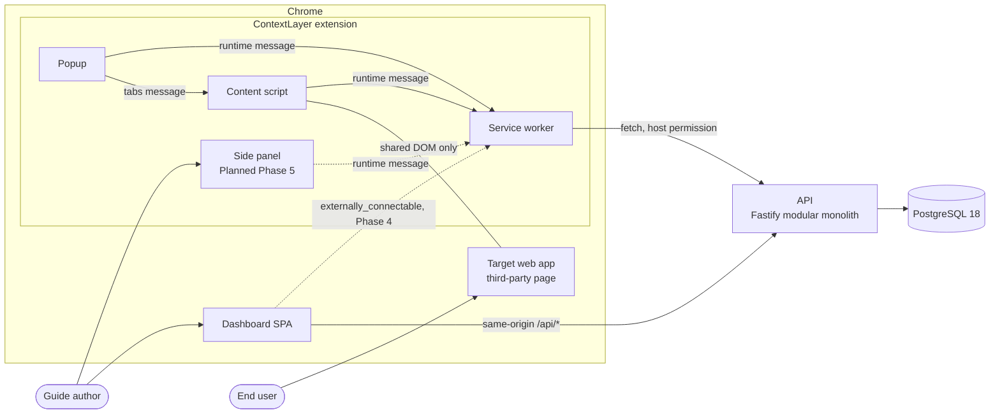
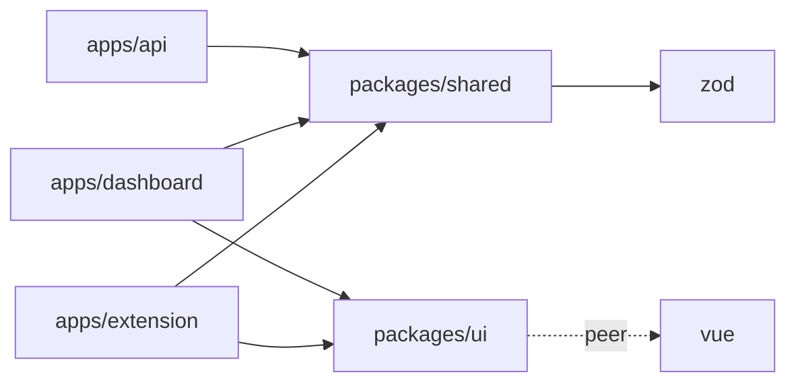
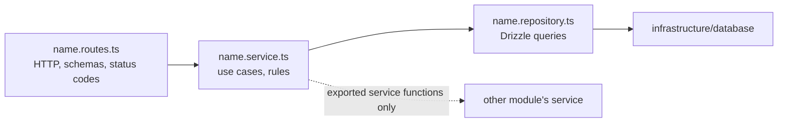
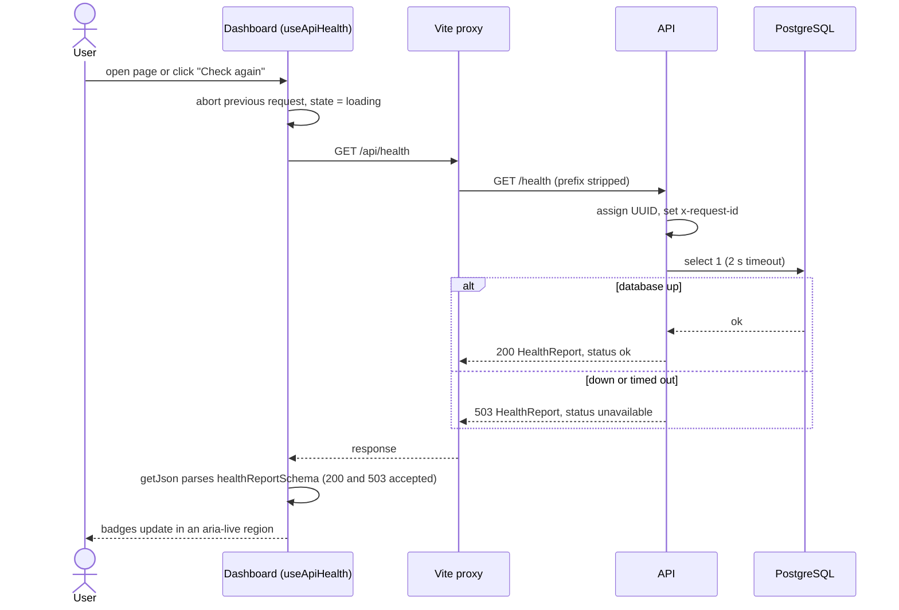
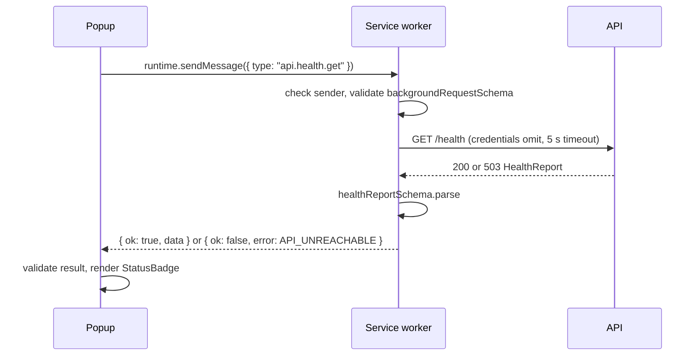
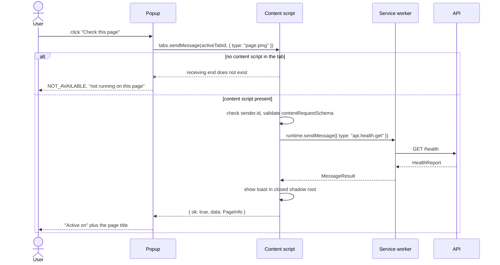
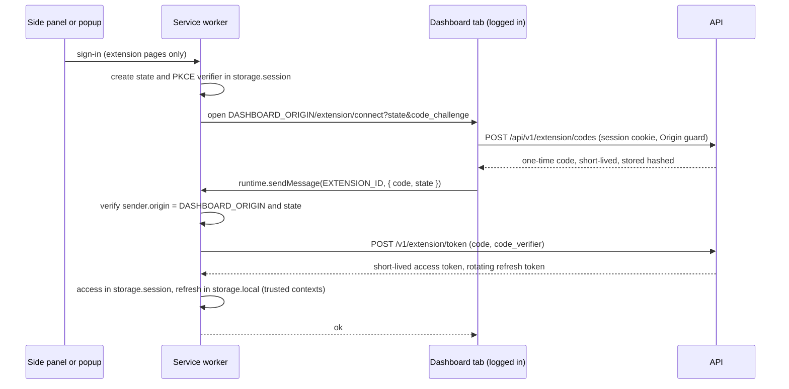
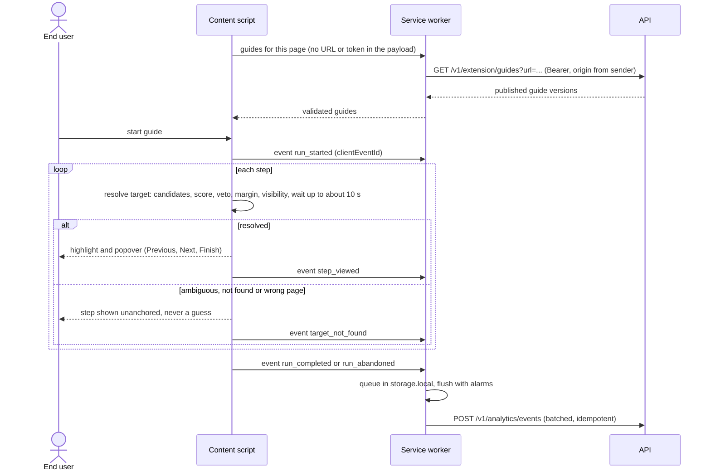
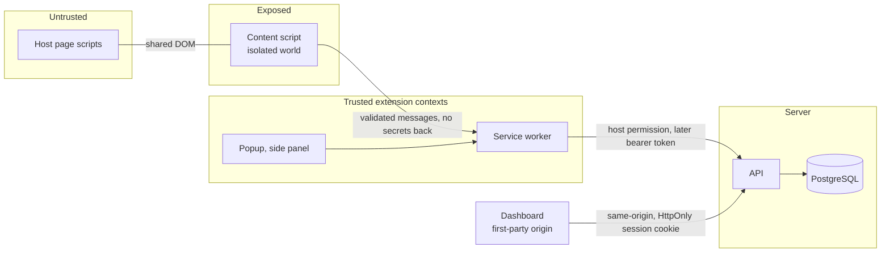

# Architecture

What Phases 1 (Foundation), 2 (Identity and workspaces) and 3 (Applications, guides and publishing) built, the rules the code follows, and where planned features fit. Decisions live in the [ADRs](adr/README.md); risk IDs (R-NN) refer to [technical risks](technical-risks.md).

Status labels: **Implemented (Phase N)** exists in the repository and is tested; **Planned (Phase N)** is scheduled in the [roadmap](roadmap.md); **Proposed** is a direction that may change after a spike.

## 1. Overview and guiding principles

ContextLayer has three deployables and one database: a Fastify API on PostgreSQL, a Vue dashboard that reaches the API through its own origin under `/api` (Vite proxy in development, reverse proxy in production), and a Chrome Manifest V3 extension that injects guides into third-party web apps. Phase 1 proved every communication path with a health check; Phase 2 added accounts, server-side sessions and workspaces with roles; Phase 3 added applications and guides authored in the dashboard and published as immutable versions. The extension connects to them in Phase 4.

| Principle               | In this codebase                                                                                                                                        | Why                                            | Trade-off                                         |
| ----------------------- | ------------------------------------------------------------------------------------------------------------------------------------------------------- | ---------------------------------------------- | ------------------------------------------------- |
| Modular monolith        | One API process, modules under `apps/api/src/modules/` ([ADR 0002](adr/0002-modular-monolith-backend.md))                                               | Team of one, no independent scaling need       | Boundaries rely on convention and review          |
| Contracts at boundaries | zod schemas from `packages/shared`, validated by every receiver ([ADR 0010](adr/0010-runtime-validated-shared-contracts.md))                            | Apps ship separately; drift must fail loudly   | zod weight in the content script (R-15)           |
| Least privilege         | No extension `permissions`, host access pinned to exact origins, no credentials in content scripts ([ADR 0012](adr/0012-service-worker-api-gateway.md)) | The extension runs inside customers' apps      | Customer domains need a runtime grant flow (R-03) |
| Local-first             | Compose for PostgreSQL, apps on the host, no cloud account ([ADR 0008](adr/0008-local-first-development.md))                                            | Free and reproducible for any reviewer         | Production concerns are documented, not run       |
| Explicit composition    | Dependencies passed in (`buildApp({ database, logger })`, a typed manifest object); no DI container or auto-imports                                     | Every wire can be followed and faked in a test | Some boilerplate                                  |
| Small modules           | One responsibility per file; `chrome.*` and network calls wrap pure functions                                                                           | Logic is tested without a browser or server    | More files per feature                            |

### 1.1 Key risks

The full register, with likelihood, impact and verification, is in [technical risks](technical-risks.md). These risks shape the architecture most:

| Risk                                   | Architectural answer                                                                                                                                                                                | Section  |
| -------------------------------------- | --------------------------------------------------------------------------------------------------------------------------------------------------------------------------------------------------- | -------- |
| R-01 Service-worker termination        | Implemented: no state in globals, top-level listeners, 5 s timeouts. Planned: state in `chrome.storage`, an idempotent event queue (Phases 4, 7)                                                    | 7.2      |
| R-03 Host permissions                  | Implemented: no `permissions`; host access pinned to the API and the two dashboard origins. Planned (Phase 4): customer origins granted per application at runtime                                  | 7.3      |
| R-04 Fragile element targeting         | Proposed ([ADR 0014](adr/0014-element-targeting-strategy.md)): a versioned multi-signal `TargetDescriptor` and scored resolution with explicit outcomes, never a silent guess                       | 8.6, 9.1 |
| R-11 Security of injected UI           | Implemented: closed shadow root in a plain `
` host, `textContent` only, no page message channel, sender classification in the service worker                                                   | 7.4, 10  |
| R-12 Extension ↔ backend communication | Implemented: the service worker is the only API caller, with schema validation and timeouts. Planned (Phase 7): idempotent event ingestion                                                          | 8.1, 10  |
| R-13 Authentication and token storage  | Implemented (Phase 2, [ADR 0015](adr/0015-authentication-strategy.md)): dashboard cookie sessions and CSRF guard. Proposed (Phase 4): extension tokens from a code + PKCE handoff                   | 8.5, 10  |
| R-17 Multi-tenant data isolation       | Implemented (Phases 2–3): membership checks, 404 for other tenants' ids, `workspace_id` on content tables, a composite foreign key from guides to applications, isolation matrices over every route | 5.2, 9.1 |

## 2. System context

Dashed edges are planned. In Phase 1 the content script runs only on the local dashboard (`http://localhost:5173` and `:4173`), which stands in for the target app.

## 3. Components and responsibilities

| Component         | Responsibility                                                       | Tech                                                 | Status                                                                                           |
| ----------------- | -------------------------------------------------------------------- | ---------------------------------------------------- | ------------------------------------------------------------------------------------------------ |
| `apps/api`        | HTTP API, business rules, persistence                                | Node 22, Fastify 5, zod type provider, pino, Drizzle | Implemented: `health`, `auth`, `workspaces`, `applications`, `guides`                            |
| PostgreSQL        | System of record                                                     | PostgreSQL 18 in Docker Compose                      | Implemented: identity (Phase 2) and content (Phase 3) tables                                     |
| `apps/dashboard`  | Workspaces, guides, analytics                                        | Vue 3.5, vue-router 5, Vite 8, Tailwind CSS 4        | Implemented: auth, workspaces, members (Phase 2); applications, guide editor, versions (Phase 3) |
| Service worker    | Only API client, message router; later tokens, script registration   | MV3 module service worker                            | Implemented (Phase 1): `api.health.get`                                                          |
| Content script    | Everything on the host page; later picking, targeting, playback      | Classic IIFE, isolated world, closed Shadow DOM      | Implemented (Phase 1): `page.ping`, toast                                                        |
| Popup             | Launcher and status view; sign-in and site-access requests (Phase 4) | Vue 3, Tailwind, `packages/ui`                       | Implemented (Phase 1)                                                                            |
| Side panel        | Guide authoring                                                      | Vue 3 extension page                                 | Planned (Phase 5)                                                                                |
| `packages/shared` | zod contracts and inferred types                                     | zod 4                                                | Implemented: health, `ApiError`, auth, workspaces                                                |
| `packages/ui`     | Vue components, theme tokens                                         | Vue SFCs, Tailwind v4                                | Implemented (Phase 1): `StatusBadge`                                                             |
| `packages/config` | tsconfig and ESLint presets                                          | TypeScript 6.0, ESLint 10                            | Implemented (Phase 1)                                                                            |

## 4. Monorepo structure and dependency rules

The repository is a pnpm workspace ([ADR 0001](adr/0001-pnpm-workspaces-monorepo.md)), so a contract change and all its consumers land in one commit.

- **Apps depend on packages; packages never import apps.** pnpm's strict `node_modules` makes undeclared imports fail, and no package declares an app.
- **`packages/shared` is framework-free:** zod is its only dependency, and it compiles with `lib: ["ES2023"]` and `types: []`, so DOM, Node, Vue and Fastify APIs do not type-check there.
- **`packages/ui` depends only on Vue** (a peer dependency); components take props and never fetch.
- **`packages/config` is tooling-only**, a `devDependency` everywhere.
- **One version source:** the `catalog:` in `pnpm-workspace.yaml`. TypeScript stays on `~6.0.3` because typescript-eslint 8.71 supports `<6.1.0` (R-18).

**Source-first resolution** ([ADR 0011](adr/0011-source-first-workspace-packages.md)). `@contextlayer/shared` exports `"@contextlayer/source": "./src/index.ts"` ahead of its compiled `dist`; TypeScript, Vite, Vitest and `tsx` enable that condition, so type-checking, tests and dev servers never wait for a build. The production API build sets `customConditions: []` and imports `dist`, which `pnpm -r build` builds first. `packages/ui` is source-only because only Vite consumes it. Rejected: build-before-everything (slow, watch races) and path aliases (they leak into runtime resolution).

## 5. Backend (`apps/api`)

### 5.1 Process entry and composition root

- `apps/api/src/server.ts` is the **process entry**: configuration, logger, database client, `buildApp`, graceful shutdown, `listen`. It is the only file that exits the process; environment access is centralized in `config/env.ts`.
- `apps/api/src/app.ts` is the **composition root**: `buildApp({ config, database, logger, now })` configures Fastify, registers cross-cutting plugins (helmet, cookies, CSRF guard, rate limits) and wires modules. It opens no connections. `now` is an injectable clock, so session expiry is tested without waiting.

Because infrastructure is injected, `apps/api/test/health.test.ts` runs the real HTTP stack through `app.inject()` with a fake database, and the integration tests run the same stack against a dedicated PostgreSQL test database ([ADR 0003](adr/0003-fastify-http-framework.md) explains the choice of Fastify).

### 5.2 Module anatomy and dependency direction

- **Implemented (Phase 1):** `modules/health/health.routes.ts` and `health.service.ts`. The service depends on a probe function, not Drizzle, so it has no repository.
- **Implemented (Phase 2):** `modules/auth/` (routes, service, users and sessions repositories, passwords, session tokens and cookie, the `requireSession` pre-handler) and `modules/workspaces/` (routes, service, repository). Each module owns its Drizzle table file.
- **Implemented (Phase 3):** `modules/applications/` (routes, service, repository) and `modules/guides/` (routes, service, a repository for guides and steps, an insert-only repository for published versions).
- **Planned (Phase 4 onward):** `extension`, `analytics` ([API](api.md)).
- Dependencies point inward. A module never reads another module's tables; it uses an interface the composition root hands it, which keeps extraction possible (section 14). In Phase 2, `workspaces` gets user lookups and profiles through a `UserDirectory` implemented by the `auth` service, and `auth` lists a user's workspaces through a function backed by the `workspaces` service; `workspace_members.user_id` is the only cross-module reference, a foreign key.
- Modules are Fastify plugins registered without `fastify-plugin`, so hooks stay encapsulated: business modules live in a `/v1` scope whose `onSend` hook sets `cache-control: no-store`.

### 5.3 Request lifecycle

1. **Request id:** `genReqId` assigns a UUID, echoed as `x-request-id` and attached to the request's log lines.
2. **Headers:** `@fastify/helmet` defaults.
3. **CSRF guard and validation:** an `onRequest` hook rejects cross-site unsafe requests (`403`) before the body is read; then the zod `validatorCompiler` checks params, query and body (`400 VALIDATION_FAILED`). Authenticated routes run `requireSession` as a pre-handler (`401`), and the login rate limit runs after validation so its key can include the email.
4. **Handler:** the route calls its service and picks the status.
5. **Serialization:** the `serializerCompiler` validates the reply against the schema for that status, so contract drift becomes a logged 500, not an unchecked body. It encodes with zod, so shared schemas avoid one-way `.transform()` and dates travel as ISO strings.
6. **Errors:** `apps/api/src/http/error-handler.ts` produces `{ error: { code, message, requestId } }`.

### 5.4 Configuration, logging, errors

**Configuration.** `apps/api/src/config/env.ts` validates the environment once with zod into a typed `AppConfig`. Invalid input throws `ConfigError`; `server.ts` prints it and exits with code 1. Failing at boot beats failing at the first request that needs the value.

**Logging.** `apps/api/src/logger.ts` creates one pino instance shared by Fastify, the pool and shutdown: pretty in development, JSON to stdout elsewhere, `authorization`, `cookie` and `set-cookie` redacted. Its error serializer drops query parameters and PostgreSQL `detail` from database errors, because Drizzle and node-postgres embed bound values (an email, a password hash) in them; a test checks that no credential reaches the log. Tests default to a silent logger.

**Errors.**

| Situation                      | Status | `code`                                   | Client sees                                      | Logged      |
| ------------------------------ | ------ | ---------------------------------------- | ------------------------------------------------ | ----------- |
| Unknown route                  | 404    | `NOT_FOUND`                              | `Route not found`                                | request log |
| Schema validation failure      | 400    | `VALIDATION_FAILED`                      | generic message                                  | request log |
| Other 4xx                      | 4xx    | mapped (`UNAUTHORIZED`, `CONFLICT`, ...) | Fastify's own `FST_*` message, otherwise generic | info        |
| Any 503 error                  | 503    | `SERVICE_UNAVAILABLE`                    | generic ("try later" stays distinguishable)      | error       |
| Any other 5xx or unexpected    | 500    | `INTERNAL_ERROR`                         | generic                                          | error       |
| Dependency down, `GET /health` | 503    | none: a `HealthReport`, not an error     | the report                                       | warn        |

Arbitrary messages may contain internals, so they are replaced. Domain errors are results returned by services (for example `'last-owner'`) that each route maps to a status, code and client-safe message. Clients branch on `code` (an enum in `packages/shared/src/api-error.ts`), never on `message`.

### 5.5 Database access and migrations

`apps/api/src/infrastructure/database/client.ts` wraps a `pg.Pool` (max 10, 5 s connect timeout, TCP keep-alive) in a small `Database` interface (`db`, `ping({ timeoutMs })`, `close()`). The ping uses node-postgres' per-query `query_timeout` (2 s), so a database that stops answering cannot exhaust the pool through repeated health checks; a pool `error` listener logs idle-client failures instead of crashing. Drizzle uses `casing: 'snake_case'` at runtime and in `apps/api/drizzle.config.ts` ([ADR 0004](adr/0004-postgresql-primary-database.md), [ADR 0005](adr/0005-drizzle-orm.md)).

- **Implemented (Phase 2):** `drizzle/0000_identity.sql` creates the identity and tenancy tables; `schema.ts` re-exports each module's table file. Migrations are generated SQL, reviewed and committed, never applied at API startup. CI runs `db:migrate` and `drizzle-kit check`.
- **Implemented (Phase 3):** `0001_content.sql` (generated), plus two custom migrations with SQL drizzle-kit cannot express ([ADR 0016](adr/0016-immutable-published-guide-versions.md)):
  - `0002_content_constraints.sql`: a deferrable unique constraint, and a trigger that rejects updates of published versions except clearing `published_by`.
  - `0003_protect_published_versions.sql`: a trigger that rejects deleting them.
- **Implemented (Phase 2):** integration tests use `TEST_DATABASE_URL`, refuse any database whose name does not end in `_test`, migrate it once per run and truncate between tests.
- **Planned (Phase 8):** migrations run as a one-off job before rollout ([deployment](deployment.md)).

### 5.6 Graceful shutdown

`close-with-grace` handles `SIGINT`, `SIGTERM` and uncaught errors with `app.close()`: stop accepting connections, drain requests, end the pool in an `onClose` hook. A 10 s deadline guarantees exit. A failed `listen` logs a fatal error and exits with code 1.

## 6. Dashboard (`apps/dashboard`)

- **Feature folders:** `src/features/<name>/` holds a feature's API calls, composables and components: `system-status/`, `auth/` (API calls, session store, sign-in and registration pages), `workspaces/` (shell, switcher, overview, members, onboarding), `applications/` (list, registration and editing with line-by-line origin validation) and `guides/` (guide list, editor, publishing, version history and the read-only version page). Shared form controls live in `src/components/`.
- **Guide editor (Implemented, Phase 3):** pure state helpers in `features/guides/guide-editor.ts` (reorder, add, remove, the full `PUT …/steps` request, dirty detection by content); the page saves metadata and steps with the revision they were based on and explains a 409 with a reload. Instructions are edited as plain text (`features/guides/rich-text.ts`: blank lines make paragraphs, `- ` lines make lists) and shown by `RichTextView`, a render function that only creates element and text nodes; `vue/no-v-html` is an error.
- **HTTP client:** `src/lib/http.ts` is the only `fetch` wrapper. `request(method, path, { schema, body, acceptedStatuses, signal })` (and its `getJson` shorthand) prefixes `/api`, sends JSON with `credentials: 'same-origin'`, reads the `ApiError` code, message and `retry-after` from error responses, accepts listed statuses only (health accepts 200 and 503, both carry a report), parses with the schema and throws a typed `HttpError` (`network`, `status`, `invalid-response`); a foreign 5xx body such as a proxy error page counts as `status`, not contract drift.
- **State:** composables hold small state machines. `useApiHealth` exposes `loading | ready | error`, times out after 5 s and aborts the previous request on refresh, so a stale response never wins. The session store (`features/auth/session.ts`) is the only cross-feature state: `unknown | anonymous | authenticated { user, workspaces }`, loaded once from `GET /v1/auth/session` and shared by concurrent callers. It never holds the token, which lives only in the HttpOnly cookie. No Pinia: one store did not justify it.
- **Routing (Implemented, Phase 2):** vue-router with one `beforeEach` guard. Routes are marked `requiresAuth` or `guestOnly`; signed-out users go to `/login?redirect=…` (only same-app paths are honoured, so the parameter cannot become an open redirect), and `/` resolves to the first workspace or to onboarding. `/status` stays public. Workspace routes (Phase 3): `applications`, `applications/:applicationId`, `guides/:guideId` and `guides/:guideId/versions/:version`.
- **Same-origin `/api`:** Vite dev (5173) and preview (4173) proxy `/api/*` to `DASHBOARD_API_PROXY_TARGET`, stripping the prefix; a reverse proxy does this in production (Planned, Phase 8). One origin means no CORS and a first-party session cookie ([ADR 0015](adr/0015-authentication-strategy.md)). The proxy rewrites `Host`, so the CSRF guard checks `Origin` against a `DASHBOARD_ORIGIN` allow-list, never against `Host` ([Vite server.proxy](https://vite.dev/config/server-options#server-proxy)).

## 7. Extension (`apps/extension`)

### 7.1 Execution contexts

An MV3 extension is several programs with different privileges in one package ([ADR 0007](adr/0007-chrome-manifest-v3-extension.md)).

| Context                          | Runs in                         | May                                                                                                                        | May not                                                                    | Status                |
| -------------------------------- | ------------------------------- | -------------------------------------------------------------------------------------------------------------------------- | -------------------------------------------------------------------------- | --------------------- |
| Service worker (`background.js`) | Extension origin, no DOM        | Call the API (sole caller), route messages; later hold tokens                                                              | Keep state in globals; use DOM; use dynamic `import()`                     | Implemented (Phase 1) |
| Content script (`content.js`)    | Isolated world in the host page | Change the page DOM; render UI in a closed shadow root; message the SW                                                     | Call the API; hold credentials; trust page messages; run in the MAIN world | Implemented (Phase 1) |
| Popup (`popup.html`)             | Extension page                  | Use `chrome.*`; message the SW and content scripts; start sign-in and site-access requests that the SW completes (Phase 4) | Host long workflows: it closes, losing state, when focus leaves            | Implemented (Phase 1) |
| Side panel                       | Extension page                  | Authoring forms the page cannot observe                                                                                    | Assume it stays open; an open panel delays extension updates               | Planned (Phase 5)     |

The service worker and the content script share one shape: `index.ts` registers `chrome.*` listeners and delegates to a pure `handle-message.ts`, unit-tested without Chrome, that returns an explicit result; the shell turns any unexpected rejection into `INTERNAL_ERROR`, so a sender always gets a reply. The popup has no listener; it calls `requestApiHealth()` and `pingActiveTab()` (`src/popup/active-tab.ts`), which validate replies and turn failures into results.

### 7.2 MV3 lifecycle constraints

- **Service-worker termination (R-01):** about 30 s idle, 5 min on one event, or a fetch response slower than 30 s ([lifecycle](https://developer.chrome.com/docs/extensions/develop/concepts/service-workers/lifecycle)). Implemented: no state in globals, top-level synchronous listeners, 5 s API timeout. Planned: tokens in `chrome.storage` (Phase 4); an idempotent event queue in `chrome.storage.local` flushed by `chrome.alarms` (Phase 7).
- **Async replies:** Promise-returning `onMessage` listeners only began a gradual rollout in Chrome 148 ([messaging](https://developer.chrome.com/docs/extensions/develop/concepts/messaging)), so listeners return `true` and call `sendResponse`; payloads are plain JSON.
- **Existing tabs, orphaned scripts (R-02):** content scripts are not injected into tabs open before an install or update, and old ones throw "Extension context invalidated". Implemented: `apps/extension/src/messaging/background-client.ts` maps that to an `INTERNAL_ERROR` result. Planned (Phase 4): re-inject and re-register dynamic scripts in `runtime.onInstalled`, because updates wipe them.
- **No dynamic `import()` in the service worker:** a documented rule; a build-time check is Proposed.
- **No remotely hosted code** ([MV3 requirements](https://developer.chrome.com/docs/webstore/program-policies/mv3-requirements)): guides are data, never action scripts interpreted at runtime.

### 7.3 Permission model

| Capability               | Implemented (Phase 1)                                                                                                                                                                         | Planned                                                                                                                |
| ------------------------ | --------------------------------------------------------------------------------------------------------------------------------------------------------------------------------------------- | ---------------------------------------------------------------------------------------------------------------------- |
| `permissions`            | none                                                                                                                                                                                          | `storage`, `scripting` (Phase 4), `sidePanel` (Phase 5), `alarms` (Phase 7); no install warnings                       |
| API host access          | `host_permissions` = API origin with the port always explicit (`http://localhost:3000/*` in dev, `:443` for a default HTTPS port), from `EXTENSION_API_BASE_URL`, which must be a bare origin | Proposed: allow `chrome-extension://<id>` in API CORS, since withheld site access also withholds this grant            |
| Target pages             | Static content script on `http://localhost:5173/*` and `http://localhost:4173/*` (the local dashboard as stand-in)                                                                            | Phase 4: `optional_host_permissions`, `permissions.request` per application origin, `scripting.registerContentScripts` |
| Web pages → extension    | none (no `externally_connectable`)                                                                                                                                                            | Phase 4: exact dashboard origin only                                                                                   |
| Web-accessible resources | none, so pages cannot probe extension URLs                                                                                                                                                    | Only if needed, with `use_dynamic_url: true`                                                                           |
| `minimum_chrome_version` | 120                                                                                                                                                                                           | Raised only for a specific API, documented with it (`storage.local.setAccessLevel` does not need it: Chrome 102+)      |
| Avoided                  | `tabs`, `webNavigation`, `<all_urls>`                                                                                                                                                         | Navigation API in the content script instead of the "Read your browsing history" warning                               |

A pattern without a port matches every port ([match patterns](https://developer.chrome.com/docs/extensions/develop/concepts/match-patterns)), and content-script matches grant host access just like `host_permissions`, so both are pinned to exact origins: the effective grant is the API and the two dashboard origins. Enterprise force-install is the planned corporate path (R-03, R-19).

### 7.4 Injected UI

`apps/extension/src/content/overlay.ts` owns everything drawn on a host page ([ADR 0013](adr/0013-shadow-dom-ui-isolation.md)). Implemented (Phase 1):

- The host is a plain `
`, not a custom element: a page could predefine a custom element with that tag and reach the shadow root through `ElementInternals`. It exists only while something is shown, lives under `document.documentElement` (which survives frameworks that replace `<body>`) and carries no version attribute.
- A **closed** shadow root hides the tree from `host.shadowRoot`; `:host { all: initial !important }` blocks inherited styles and page rules aimed at the host. The isolated world has its own prototypes, so a page that patches `attachShadow` cannot interfere.
- Styles are a constructable stylesheet in px (rem follows the page's root font-size) with a system font stack (`@font-face` does not apply in shadow roots).
- The toast is a `popover="manual"` top-layer element, above any page `z-index` or `overflow: hidden`, with `role="status"` and `textContent` only.

Tailwind is not used in the shadow root because v4 utilities relying on `@property` (shadows, rings, transforms) compute to `none` there; a shadow-safe pipeline is Planned with the player (Phase 6, R-09).

### 7.5 Build

Pages and the service worker run as ES modules but content scripts as classic scripts, so `apps/extension/scripts/build.ts` cleans `dist` once and runs two Vite builds from `apps/extension/vite.config.ts` ([ADR 0009](adr/0009-extension-build-tooling.md)):

1. **Pages and service worker** as ES modules with a stable `background.js`; a ~10-line plugin serializes the typed `chrome.runtime.ManifestV3` object from `manifest.config.ts` into `manifest.json`.
2. **Content script** in library mode as one IIFE, `content.js`, with `process.env.NODE_ENV` defined explicitly.

Both use `emptyOutDir: false` so one watch rebuild cannot delete the other's output. CRXJS was rejected because its default output exposes content-script chunks as web-accessible resources on every matched site; WXT emits the same two builds plus framework conventions and pre-1.0 migrations. Cost: no HMR, so a ~0.1 s rebuild is followed by a manual reload.

## 8. Communication

### 8.1 Channel matrix

| Channel                          | Transport                                                                       | Validation and trust                                                        | Status                                                                          |
| -------------------------------- | ------------------------------------------------------------------------------- | --------------------------------------------------------------------------- | ------------------------------------------------------------------------------- |
| Dashboard → API                  | `fetch` to same-origin `/api/*`, proxied                                        | Shared schemas both sides; HttpOnly session cookie, CSRF guard              | Implemented: health (Phase 1), auth and workspaces (Phase 2), content (Phase 3) |
| Popup → service worker           | `chrome.runtime.sendMessage`                                                    | zod, `sender.id`, sender context                                            | Implemented (Phase 1): `api.health.get`                                         |
| Content script → service worker  | `chrome.runtime.sendMessage`                                                    | Same, as untrusted input                                                    | Implemented: `api.health.get`. Planned: guides for `sender.origin`, events      |
| Popup / SW → content script      | `chrome.tabs.sendMessage(tabId, message)`                                       | zod, `sender.id`; missing receiver is an expected state                     | Implemented: `page.ping`. Planned (Phase 6): `frameId` / `documentId` targeting |
| Service worker → API             | `fetch` within `host_permissions` (no CORS), `credentials: 'omit'`, 5 s timeout | Shared schema; bearer token from Phase 4                                    | Implemented (Phase 1)                                                           |
| Dashboard page → extension       | `chrome.runtime.sendMessage(EXTENSION_ID)` via `externally_connectable`         | Exact dashboard origin, `sender.origin` and `state` checked                 | Planned (Phase 4)                                                               |
| Side panel ↔ SW / content script | Runtime and tabs messaging                                                      | Privileged commands from extension pages only                               | Planned (Phase 5)                                                               |
| Host page ↔ content script       | Shared DOM only                                                                 | No `window.postMessage` listener (page scripts can forge it), no MAIN world | Implemented (Phase 1) as a rule                                                 |
| API → PostgreSQL                 | node-postgres pool via Drizzle                                                  | `DATABASE_URL`; loopback-only port in dev                                   | Implemented (Phase 1): `select 1`                                               |

### 8.2 Implemented: dashboard health check

### 8.3 Implemented: popup → service worker → API

### 8.4 Implemented: `page.ping` from the popup through the content script

### 8.5 Planned (Phase 4): extension sign-in handoff

Proposed in [ADR 0015](adr/0015-authentication-strategy.md); needs a spike first. The extension is a public OAuth-style client and never sees the password or the dashboard cookie.

### 8.6 Planned (Phases 6–7): guide playback

Message names are illustrative; resolution follows [ADR 0014](adr/0014-element-targeting-strategy.md) (Proposed).

## 9. Data and contracts

**Implemented (Phase 1).** `packages/shared` defines the health reports, the `ApiError` envelope and its code enum. `healthReportSchema` is checked three times: as the API response schema, in the dashboard's `getJson`, and in the service worker after `fetch`. Extension messages use zod discriminated unions (`apps/extension/src/messaging/protocol.ts`) and return `{ ok: true, data } | { ok: false, error }`, because thrown errors do not cross message boundaries usefully. Next: [data model](data-model.md), [API](api.md).

**Contract evolution rules** (in effect since the first `/v1` routes in Phase 2):

- **Additive within a version.** New optional fields and endpoints are safe: `z.object` strips unknown keys, so older clients ignore new fields. New enum values break clients that parse with `z.enum`, so they count as breaking unless the field is declared open.
- **Breaking changes get a new route version** (`/v2` beside `/v1`); health stays unversioned.
- **Extension version skew.** Chrome updates extensions lazily and enterprises can pin versions, so the API keeps serving the previous extension release. The dashboard ships with the API and has no skew.
- **Versioned stored documents.** `TargetDescriptor` and rich-text step bodies carry a `version` checked by a discriminated union; unknown versions are rejected and readers for all stored versions are kept.

### 9.1 PostgreSQL model

The identity and tenancy tables exist since Phase 2 and the content tables since Phase 3; the rest of the [data model](data-model.md) is Proposed and arrives with the phase that needs it. Each table belongs to one module, the only one that reads or writes it (section 5.2).

| Group          | Tables                                                                    | Owning module            | Phase                 |
| -------------- | ------------------------------------------------------------------------- | ------------------------ | --------------------- |
| Identity       | `users`, `sessions`                                                       | `auth`                   | Implemented (Phase 2) |
| Tenancy        | `workspaces`, `workspace_members`                                         | `workspaces`             | Implemented (Phase 2) |
| Content        | `applications`, `guides`, `guide_steps`, `guide_versions`                 | `applications`, `guides` | Implemented (Phase 3) |
| Extension auth | `extension_grants`, `extension_refresh_tokens`, `extension_access_tokens` | `extension`              | Planned (Phase 4)     |
| Analytics      | `guide_runs`, `guide_events`                                              | `analytics`              | Planned (Phase 7)     |

Keys default to PostgreSQL 18's built-in `uuidv7()` (time-ordered, so inserts stay at the right edge of the index), which makes PostgreSQL 18 the minimum server version; times are `timestamptz`. Target descriptors, step bodies and published snapshots are JSONB documents with a `version` field validated by zod in `packages/shared`. Authors edit mutable drafts (`guides`, `guide_steps`); publishing copies them into an immutable `guide_versions.snapshot`, which players read and runs reference. Tables queried by tenant carry `workspace_id`, repositories require a `workspaceId`, and composite foreign keys (for example `guides (workspace_id, application_id)` → `applications (workspace_id, id)`) make those cross-tenant references impossible in the database (`guide_runs` → `guide_versions` is the documented exception, enforced by the analytics service); row-level security is Proposed for later (R-17). Rationale and rejected alternatives: [data model](data-model.md#3-design-decisions).

## 10. Security model

- **Host page: untrusted.** It can modify what ContextLayer adds and dispatch events. A closed shadow root isolates styles but is not a security boundary (UI events are composed), so authoring inputs belong in the side panel (Planned, Phase 5).
- **Content script: exposed.** A compromised renderer can forge its messages ([stay secure](https://developer.chrome.com/docs/extensions/develop/security-privacy/stay-secure)). Implemented: receivers check `sender.id`; the service worker classifies senders as extension pages or content scripts against a per-request-type allow-list; every message is parsed with zod; the worker builds only known API URLs, so it is not an open proxy. Planned: content scripts may only request guides for `sender.origin` and send events.
- **No credentials in content scripts or pages.** None exist yet, and the worker fetches with `credentials: 'omit'`. Planned (Phase 4): access token in `chrome.storage.session`, refresh token in `chrome.storage.local` restricted to trusted contexts, no "get token" message.
- **CSP and no remote code.** Extension pages run under the default MV3 CSP (`script-src 'self'`), so Vue templates are precompiled. Planned (Phase 5): `z.config({ jitless: true })` in extension entry points, because zod 4 otherwise probes `new Function`, which that CSP blocks and reports. The page's `style-src` does not govern constructable stylesheets and its Trusted Types do not apply to the isolated world; MAIN-world code would lose both (R-10).
- **Guide content (R-11).** Implemented (Phase 3): step bodies are a restricted rich-text AST validated by zod on write (strict objects, limited blocks, characters and runs), never HTML; the dashboard renders them with text nodes only and `vue/no-v-html` is an error; links must be `https:` with `rel="noopener noreferrer"`. Planned (Phase 6): the player renders them with `createElement` and `textContent`. `innerHTML` and `v-html` are banned in injected UI because event-handler attributes created by a content script compile in the page's main world, turning author HTML into stored XSS inside the customer's app.
- **API.** Helmet defaults; no CORS plugin (same-origin dashboard, host-permitted worker); JSON bodies only. Implemented (Phase 2, [ADR 0015](adr/0015-authentication-strategy.md)): an `Origin` / `Sec-Fetch-Site` guard on unsafe requests, rate limits on login and registration, `no-store` on every `/v1` response.
- **Sessions (Implemented, Phase 2).** Passwords are stored only as argon2id hashes. The session token is 32 random bytes in an `HttpOnly; Secure; SameSite=Strict; Path=/` cookie (`__Host-` prefixed in production); the database stores its SHA-256 hash. Sessions expire after 30 min idle or 8 h, are revoked on logout, and a login revokes the session the browser presented before. The dashboard never sees the token: no `localStorage`, no JavaScript-readable cookie, no JWT.
- **Tenant isolation (Implemented, Phase 2).** Every workspace route checks membership first; a non-member gets the same 404 as for a missing workspace, a member with too low a role gets 403. Member changes lock the workspace row so concurrent requests cannot remove its last owner.
- **Secrets.** `.env` is git-ignored and `.env.example` holds local-only defaults (`contextlayer`/`contextlayer`); credential headers are redacted; PostgreSQL binds to `127.0.0.1`. Anything baked into the extension is public: today only the API origin.

## 11. Cross-cutting concerns

- **Configuration.** One root `.env`, validated by the API at startup; the extension bakes `EXTENSION_API_BASE_URL` in at build time, the dashboard bakes nothing. `NODE_ENV` is deliberately absent: Vite reads `.env`, and a `NODE_ENV` there would turn production builds into development builds. Implemented (Phase 2): `DASHBOARD_ORIGIN` (CSRF allow-list, required in production), session lifetimes, auth rate limits, `TRUST_PROXY`, `TEST_DATABASE_URL`. Planned (Phase 4): `EXTENSION_ID`.
- **Observability.** Implemented: request ids in API logs, `x-request-id` and every error body, so a user-visible error maps to a log line; extension contexts log to DevTools with a `[ContextLayer]` prefix. Planned (Phase 8): metrics and tracing.
- **Performance budgets (R-15).** `content.js` is about 89 kB (26 kB gzip), mostly zod, and is injected into every matching page: recorded tech debt. Options: `zod/mini` or hand-written guards, and framework-free in-page UI unless a feature justifies Vue ([ADR 0006](adr/0006-vue-3-frontend-framework.md)). Proposed: a CI size check (Phase 8). Timeouts are short by design (2 s probe, 5 s fetch, 5 s pool connect).
- **Accessibility.** Implemented: live regions and `role="alert"` on the status card, `role="status"` on the toast, decorative dots hidden from assistive technology; labelled form fields with `aria-invalid` and `aria-describedby` errors, `role="alert"` for form errors and a polite live region for member changes (Phase 2); axe audits with 0 violations on the status, sign-in, registration, onboarding, overview and members screens. Planned (Phase 6, R-16): a non-modal player card with an announcer, no focus stealing, Esc to dismiss, reduced motion.
- **Error handling.** One shape per boundary (`ApiError`, `HttpError`, `MessageResult`); expected states such as a tab without a content script are results, not exceptions.

## 12. Testing strategy

| Layer                | Tool                                    | Covers today                                                                                                                                                                                 | Tests |
| -------------------- | --------------------------------------- | -------------------------------------------------------------------------------------------------------------------------------------------------------------------------------------------- | ----- |
| Unit: contracts      | Vitest (Node)                           | Health and error envelopes; origins, rich text, TargetDescriptor, URL patterns, pagination and request bodies at their limits                                                                | 69    |
| Unit + HTTP: API     | Vitest, `app.inject()`, fakes           | Config, health, error envelopes, password hashing, session tokens and cookie flags, CSRF guard decisions, log redaction                                                                      | 48    |
| Integration: API     | Vitest, real PostgreSQL (`_test` DB)    | Auth, sessions, CSRF, rate limits, workspaces and roles; applications, guides, ordered steps (with a forced rollback), publishing (with races); two isolation matrices; database constraints | 128   |
| Component: UI kit    | Vitest, jsdom, Vue Test Utils           | `StatusBadge` label, tones, hidden dot                                                                                                                                                       | 3     |
| Component: dashboard | Vitest, jsdom, Vue Test Utils           | HTTP client, session store, route guards, auth forms, workspace switcher; applications pages, guide list, editor state and page, publishing, version page, rich text                         | 90    |
| Unit: extension      | Vitest, jsdom                           | Sender classification, service-worker router, content handler, manifest and origin-pattern policy                                                                                            | 18    |
| E2E: dashboard       | Playwright, built preview + built API   | Auth flow; application → guide → steps → v1 → edit → v2 → v1 unchanged, another tenant gets 404; status page; axe on every screen                                                            | 9     |
| E2E: extension       | Playwright, unpacked `dist` in Chromium | Service worker, popup → SW → API, missing content script, content → SW → API, lazy closed host, hostile page                                                                                 | 6     |

`pnpm test` runs the unit, component and integration tests (356 at the end of Phase 3; `pnpm test` is the source of truth) in one Vitest run and needs PostgreSQL for the integration project; `pnpm test:e2e` builds first and needs a migrated database; on CI it always starts the built servers, while locally Playwright reuses any server already listening (for example `pnpm dev` on :3000, which runs the API from source). CI ([.github/workflows/ci.yml](../.github/workflows/ci.yml)) runs every check on pull requests and pushes to `main`. Branded Chrome ignores `--load-extension` since Chrome 137, hence Playwright's bundled Chromium ([docs](https://playwright.dev/docs/chrome-extensions)). Gaps: cookie behaviour outside Chromium, extension fixtures for strict CSP, SPA navigation, shadow DOM, iframes and service-worker termination (Phases 4–6).

## 13. Local development

Setup, commands, ports and troubleshooting are in the [README](../README.md): `cp .env.example .env`, `pnpm install`, `docker compose up -d`, `pnpm db:migrate`, `pnpm dev`, then load `apps/extension/dist` unpacked. Rationale: [ADR 0008](adr/0008-local-first-development.md).

## 14. Future evolution

The monolith stays until a module needs a different scaling or availability profile. The first extraction candidate is **analytics ingestion** (`POST /v1/analytics/events`, Planned Phase 7):

- It is write-heavy and bursty, and its volume grows with end users, not authors.
- Events are append-only, idempotent (`clientEventId`) and tolerate eventual consistency, so ingestion can move behind a queue without changing the client contract.
- It owns its tables (`guide_runs`, `guide_events`) and only reads published guide versions.

Section 5.2's rules make this mechanical: no other module reads those tables and the contract already lives in `packages/shared`. The second candidate is the **guide delivery read path** (`GET /v1/extension/guides`): published versions are immutable and cacheable. Auth, workspaces and authoring share transactions and stay together. Deployment shapes are in [deployment](deployment.md).

## 15. Related documents

- [Product](product.md), [technical risks](technical-risks.md), [data model](data-model.md), [API](api.md), [deployment](deployment.md), [roadmap](roadmap.md), [README](../README.md)
- [ADR index](adr/README.md):
  - [0001 pnpm workspaces](adr/0001-pnpm-workspaces-monorepo.md), [0002 modular monolith](adr/0002-modular-monolith-backend.md), [0003 Fastify](adr/0003-fastify-http-framework.md), [0004 PostgreSQL](adr/0004-postgresql-primary-database.md), [0005 Drizzle](adr/0005-drizzle-orm.md)
  - [0006 Vue 3](adr/0006-vue-3-frontend-framework.md), [0007 Manifest V3](adr/0007-chrome-manifest-v3-extension.md), [0008 local-first](adr/0008-local-first-development.md), [0009 extension build tooling](adr/0009-extension-build-tooling.md), [0010 shared contracts](adr/0010-runtime-validated-shared-contracts.md)
  - [0011 source-first packages](adr/0011-source-first-workspace-packages.md), [0012 service-worker API gateway](adr/0012-service-worker-api-gateway.md), [0013 Shadow DOM isolation](adr/0013-shadow-dom-ui-isolation.md), [0014 element targeting](adr/0014-element-targeting-strategy.md) (Proposed), [0015 authentication](adr/0015-authentication-strategy.md) (Proposed)
