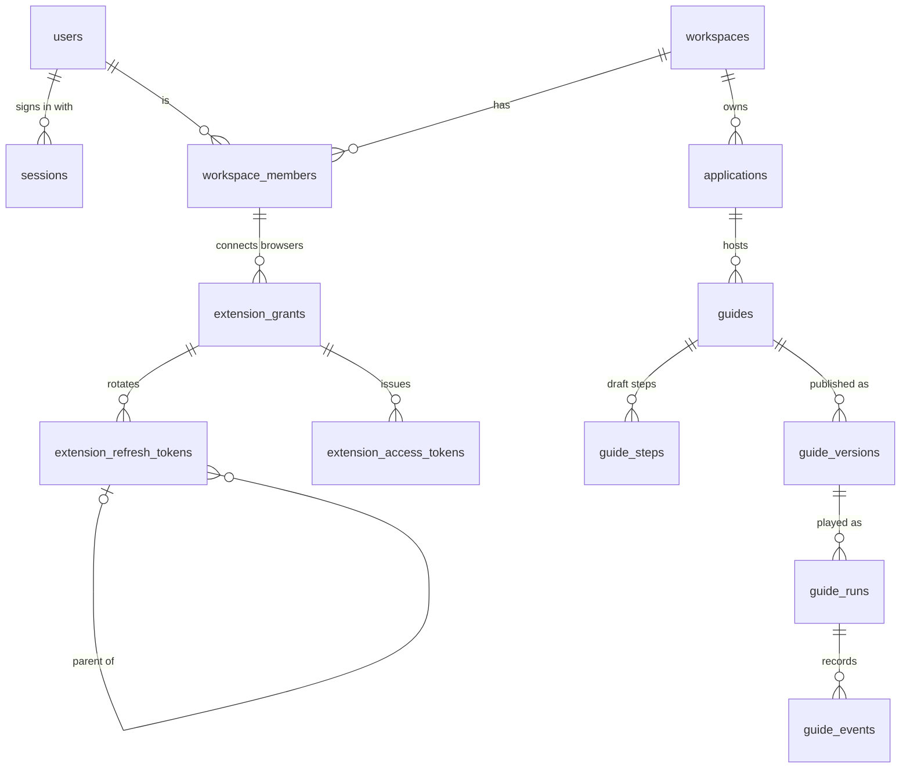

# Data model

> **Status.** **Implemented (Phase 2):** `users`, `sessions`, `workspaces` and `workspace_members`, created by `apps/api/drizzle/0000_identity.sql` ([section 8](#8-the-phase-2-first-migration)). Their Drizzle tables live with their modules (`apps/api/src/modules/auth/auth.schema.ts`, `modules/workspaces/workspaces.schema.ts`) and are re-exported from `apps/api/src/infrastructure/database/schema.ts`. **Proposed:** every other table; each arrives with the phase that needs it. **Implemented (Phase 1):** the Drizzle client with `casing: 'snake_case'`, `apps/api/drizzle.config.ts` and the `pnpm db:generate` / `pnpm db:migrate` scripts, verified against PostgreSQL 18.6.

Related: [ADR 0004](adr/0004-postgresql-primary-database.md) (PostgreSQL), [ADR 0005](adr/0005-drizzle-orm.md) (Drizzle), [ADR 0014](adr/0014-element-targeting-strategy.md) (target descriptors), [ADR 0015](adr/0015-authentication-strategy.md) (authentication), [API](api.md), [technical risks](technical-risks.md), [roadmap](roadmap.md).

## 1. Overview

| Group          | Tables                                                                    | Arrives in            |
| -------------- | ------------------------------------------------------------------------- | --------------------- |
| Identity       | `users`, `sessions`                                                       | Implemented (Phase 2) |
| Tenancy        | `workspaces`, `workspace_members`                                         | Implemented (Phase 2) |
| Content        | `applications`, `guides`, `guide_steps`, `guide_versions`                 | Planned (Phase 3)     |
| Extension auth | `extension_grants`, `extension_refresh_tokens`, `extension_access_tokens` | Planned (Phase 4)     |
| Analytics      | `guide_runs`, `guide_events`                                              | Planned (Phase 7)     |



Not drawn: the denormalized `workspace_id` on `guides`, `guide_runs` and `guide_events`, and the actor columns (`created_by`, `published_by`, `user_id`) that point to `users`.

## 2. Conventions

- **Names:** snake_case plural tables and snake_case columns; TypeScript stays camelCase. `casing: 'snake_case'` must stay set in both `drizzle.config.ts` and `createDatabase()`, or generated SQL and runtime queries disagree on column names.
- **Keys:** `id uuid primary key default uuidv7()`. The exceptions are `workspace_members` (composite key) and `guide_events` (`bigint` identity: numerous, never addressed individually, already identified by `client_event_id`).
- **Time:** `timestamptz` only. `created_at` and `updated_at` default to `now()`; Drizzle's `$onUpdate` maintains `updated_at`, with no triggers.
- **JSON:** `jsonb` with camelCase keys (the documents travel to clients unchanged). Versioned documents (`guide_steps.target`, `guide_steps.body`, `guide_versions.snapshot`) always carry a `version` field and a `jsonb_typeof(x) = 'object' and x ? 'version'` check. Small value objects (`URLPatternInit` URL patterns, event `metadata`) are validated by zod but are not versioned.
- **Limits:** string lengths and array sizes live in the zod contracts in `packages/shared`. The database enforces only the invariants that would corrupt meaning: enumerations, status/timestamp pairs, positions, hash sizes.
- **Foreign keys:** PostgreSQL [does not index referencing columns](https://www.postgresql.org/docs/current/ddl-constraints.html#DDL-CONSTRAINTS-FK), so every FK column used in joins or tenant and content delete checks gets an explicit index. Accepted exception: the actor columns `guides.created_by`, `guide_versions.published_by` and `guide_runs.user_id` are not indexed, because deleting a user is rare and may scan them. `sessions` gets a full `sessions (user_id)` index, because a partial index cannot serve the cascade.

## 3. Design decisions (Proposed)

### 3.1 UUIDv7 primary keys

PostgreSQL 18 has a built-in [`uuidv7()`](https://www.postgresql.org/docs/18/functions-uuid.html). A UUIDv7 begins with a millisecond timestamp ([RFC 9562](https://www.rfc-editor.org/rfc/rfc9562)), so new rows land at the right edge of the B-tree, like a sequence; random v4 keys scatter inserts across the index. The ids are safe in URLs and can be generated by a client (3.7).

- **Rejected:** `bigint` identity (smaller and faster, but enumerable in URLs and it leaks volume); `gen_random_uuid()` (v4, poor insert locality); ids generated in Node (work on older PostgreSQL versions, but add a dependency and a second id source).
- **Trade-offs:** 16-byte keys, and the creation time is readable from the id (only workspace members see these ids). **PostgreSQL 18 becomes the minimum server version**, as [deployment](deployment.md) states. If a provider lacks 18, the fallback is an application-side `$defaultFn`.

### 3.2 `timestamptz` everywhere

`timestamptz` stores an instant. `timestamp` without time zone stores a wall-clock value whose meaning depends on the session `TimeZone`. The API exchanges ISO 8601 UTC strings. Repositories map `Date` to string; shared schemas never use `.transform()` for this ([ADR 0010](adr/0010-runtime-validated-shared-contracts.md)).

### 3.3 `text` + `CHECK` instead of PostgreSQL enums

You can add values to an enum, but you [cannot remove or reorder them](https://www.postgresql.org/docs/current/datatype-enum.html) without recreating the type. A value added inside a transaction [cannot be used before commit](https://www.postgresql.org/docs/current/sql-altertype.html). A `CHECK` change is the same for adding and removing values: drop it, add the new one `NOT VALID`, then `VALIDATE CONSTRAINT`, which does not block writes. The cost (a few bytes per row, weaker introspection) is negligible. Roles, statuses, placements and event types are the most likely to change during the MVP. Each value list is a `const` array in `packages/shared` that both zod and the Drizzle `check()` use.

### 3.4 Case-insensitive email: a `lower()` unique index, not `citext`

Decision: `email text` plus `unique index users_email_lower_key on users (lower(email))`. The single repository function `findUserByEmail` compares `lower(email) = lower($1)`, and the stored value keeps the user's casing.

- **`citext`** needs `CREATE EXTENSION` (one more privilege and portability question on managed services) and a Drizzle custom type. The [PostgreSQL manual itself recommends nondeterministic collations instead](https://www.postgresql.org/docs/current/citext.html).
- **A nondeterministic ICU collation** needs no extension, but its semantics surprise readers, and `LIKE` only supports it from PostgreSQL 18.
- **Trade-off:** a query that forgets `lower()` compares case-sensitively. Every email lookup goes through one repository function, and a test checks that `Alice@Example.com` finds `alice@example.com`.

### 3.5 JSONB documents with versioned zod schemas

`guide_steps.target` (TargetDescriptor, [ADR 0014](adr/0014-element-targeting-strategy.md)), `guide_steps.body` and `guide_versions.snapshot` are nested documents that are read and written whole and never filtered on the server. Normalizing locators, anchors and hops into tables would cost joins and a migration per format change, with no integrity gain.

- **Validation:** zod discriminated unions on `version` in `packages/shared`. The API validates on write and the extension validates on read. The database only adds a cheap guard (`jsonb_typeof(x) = 'object' and x ? 'version'`); core PostgreSQL has no JSON Schema support.
- **Evolution:** a shape change always bumps `version`. Shared code upcasts older versions on read, and a backfill script retires old versions. A document is never reshaped under the same version.
- **Safety:** the body is a restricted AST rendered with `textContent`, never HTML, which closes stored XSS into customer applications (R-11).

### 3.6 Mutable drafts, immutable published snapshots

Authors edit `guides` and `guide_steps`. Publishing copies the guide and its ordered steps into `guide_versions.snapshot` (`version = max + 1`) in one transaction. Players read only the latest snapshot of a `published` guide, and runs reference `guide_version_id`. Half-finished edits therefore never reach end users, and an event's `step_position` keeps its meaning.

- **Rejected:** playing live rows (draft edits leak, analytics drift); copy-on-write versioned step rows (every query needs a version filter); event sourcing (too much machinery for an MVP).
- **Trade-offs:** duplication (about 100 KB per version for 20 steps); the snapshot needs its own `version`; ids inside JSON are not FK-checked.

### 3.7 Idempotent event ingestion

The service worker can be terminated between sending a batch and receiving the reply (R-01, R-12). The extension therefore creates a `clientEventId` when an event happens, queues the event in `chrome.storage.local` and resends it until acknowledged. The server runs `insert … on conflict (client_event_id) do nothing returning id`, so only newly inserted events update `guide_runs`. **Proposed:** the extension also generates the run id and `run_started` upserts the run, so playback never waits on the network. Events are best-effort data, because a page can forge content-script activity (R-11). The server checks run ownership and step bounds, clamps `occurred_at` and records its own `received_at`. If `guide_events` is partitioned by `occurred_at` later, unique keys [must include the partition key](https://www.postgresql.org/docs/current/ddl-partitioning.html). The key would become `(client_event_id, occurred_at)`. That only deduplicates retries if the stored `occurred_at` is the client's original value, so clamping must go into a separate column or depend only on the event itself, never on `received_at`. The identity primary key would also have to become `(id, occurred_at)`.

### 3.8 Tenant isolation

Tables queried by tenant carry `workspace_id`. Child tables reached only through a tenant-checked parent (`guide_steps`, `guide_versions`, token tables) inherit isolation through their FK. Repositories take `workspaceId` as a required argument and never offer an unscoped "find by id". The workspace comes from the URL (dashboard) or from the grant (extension) ([API](api.md)).

**Composite foreign keys** keep the denormalized key honest. `guides (workspace_id, application_id)` references `applications (workspace_id, id)`. `guide_events (workspace_id, run_id)` references `guide_runs (workspace_id, id)`. `extension_grants (workspace_id, user_id)` references `workspace_members`. These three references cannot cross tenants at the database level, at the cost of one extra `unique (workspace_id, id)` index per parent. `guide_runs` is the exception: `guide_version_id` references `guide_versions (id)` alone, and `guide_versions` has no `workspace_id`, so the database does not tie `guide_runs.workspace_id` to the workspace of the version's guide. The analytics service copies `workspace_id` from the version's guide when it creates a run. (Proposed alternative: give `guide_versions` a `workspace_id` with a composite FK to `guides (workspace_id, id)`, and make `guide_runs (workspace_id, guide_version_id)` reference `guide_versions (workspace_id, id)`.)

**Row-level security: Proposed for later** (R-17). Drizzle 0.45 can declare policies (`pgPolicy`). RLS needs a non-owner role, one transaction per request with `set_config('app.workspace_id', …, true)`, and care with pooled connections. Adopt it when a second service or ad-hoc reporting touches the database.

### 3.9 Deletion and archival

| Rule                        | Applies to                                                                                                                                                                    | Why                                                                                     |
| --------------------------- | ----------------------------------------------------------------------------------------------------------------------------------------------------------------------------- | --------------------------------------------------------------------------------------- |
| `CASCADE` (composition)     | `sessions`, `workspace_members`, `extension_grants` (via membership), token tables, `guide_steps`                                                                             | No meaning or history without the parent. Removing a member disconnects their browsers. |
| `RESTRICT` (history)        | `applications`, `guides`, `guide_runs` → `workspaces`; `guides` → `applications`; `guide_versions` → `guides`; `guide_runs` → `guide_versions`; `guide_events` → `guide_runs` | No single `DELETE` can wipe published history or analytics.                             |
| `SET NULL` (actors)         | `guides.created_by`, `guide_versions.published_by`, `guide_runs.user_id`                                                                                                      | Content and aggregates outlive a deleted account.                                       |
| Soft delete (`archived_at`) | `guides`                                                                                                                                                                      | Authors expect undo; versions and runs must stay.                                       |

`DELETE …/guides/:guideId` archives. Purging a guide or deleting a workspace is a future explicit job that deletes in dependency order.

### 3.10 Deferrable unique positions

`unique (guide_id, position) deferrable initially deferred`. A non-deferrable unique constraint is [checked row by row](https://www.postgresql.org/docs/current/sql-createtable.html), so `set position = position + 1` can collide midway through the update. `INITIALLY IMMEDIATE` would defer only to the end of each statement. `PUT …/steps` runs several statements in one transaction (update kept steps, insert new ones, delete removed ones), so the check has to wait for commit.

- **Rejected:** negative-position two-pass updates (obscure); fractional rank keys (keys grow and need rebalancing); delete-and-reinsert (step ids change).
- **Caveats:** a deferrable unique constraint cannot be an `ON CONFLICT` arbiter or an FK target, and neither is needed here. Drizzle 0.45's `unique()` builder cannot express `DEFERRABLE` (it only has `nullsNotDistinct()`), so this constraint lives in a custom migration (section 7).

## 4. Table specification

The identity and tenancy tables below match the applied migration; the rest is Proposed DDL. The DDL generated by drizzle-kit is authoritative. This sketch fixes types, nullability, constraints and delete behaviour. drizzle-orm 0.45 has no `bytea` column type, so a small `customType` maps it to `Buffer`.

```sql
-- Identity and tenancy: Implemented (Phase 2)
create table users (
  id                uuid primary key default uuidv7(),
  email             text not null,                         -- as entered (trimmed); unique via users_email_lower_key
  password_hash     text not null,                         -- argon2id PHC string
  display_name      text not null,
  created_at        timestamptz not null default now(),
  updated_at        timestamptz not null default now()
);
create unique index users_email_lower_key on users (lower(email));

create table sessions (                                    -- dashboard sessions (ADR 0015)
  id           uuid primary key default uuidv7(),
  user_id      uuid not null references users (id) on delete cascade,
  token_hash   bytea not null                              -- sha256(token)
    constraint sessions_token_hash_key unique
    constraint sessions_token_hash_length check (octet_length(token_hash) = 32),
  created_at   timestamptz not null default now(),         -- set from the API's clock, like last_seen_at
  last_seen_at timestamptz not null default now(),         -- idle expiry; written at most once a minute
  expires_at   timestamptz not null,                       -- absolute expiry
  revoked_at   timestamptz,
  user_agent   text,
  ip           inet
);
create index sessions_user_idx on sessions (user_id);  -- full index: also serves the ON DELETE CASCADE from users

create table workspaces (
  id         uuid primary key default uuidv7(),
  name       text not null,                                -- 1–80 characters, validated by the API
  created_at timestamptz not null default now(),
  updated_at timestamptz not null default now()
);

create table workspace_members (
  workspace_id uuid not null references workspaces (id) on delete cascade,
  user_id      uuid not null references users (id) on delete cascade,
  role         text not null
    constraint workspace_members_role_check check (role in ('owner', 'admin', 'editor', 'member')),
  created_at   timestamptz not null default now(),
  primary key (workspace_id, user_id)
);
create index workspace_members_user_idx on workspace_members (user_id);

-- Content: Phase 3
create table applications (                                -- target web apps where guides run
  id           uuid primary key default uuidv7(),
  workspace_id uuid not null references workspaces (id) on delete restrict,
  name         text not null,
  origins      text[] not null check (cardinality(origins) between 1 and 20), -- 'https://crm.example.com'
  created_at   timestamptz not null default now(),
  updated_at   timestamptz not null default now(),
  unique (workspace_id, id)
);
create index applications_origins_gin on applications using gin (origins);

create table guides (
  id                uuid primary key default uuidv7(),
  workspace_id      uuid not null references workspaces (id) on delete restrict,
  application_id    uuid not null,
  title             text not null,
  description       text not null default '',
  status            text not null default 'draft' check (status in ('draft', 'published', 'archived')),
  start_url_pattern jsonb,                                 -- URLPatternInit; null = any page of the app
  created_by        uuid references users (id) on delete set null,
  created_at        timestamptz not null default now(),
  updated_at        timestamptz not null default now(),
  archived_at       timestamptz,
  check ((status = 'archived') = (archived_at is not null)),
  foreign key (workspace_id, application_id) references applications (workspace_id, id) on delete restrict
);
create index guides_workspace_status_idx on guides (workspace_id, status);
create index guides_workspace_updated_idx on guides (workspace_id, updated_at desc, id desc);
create index guides_application_idx on guides (application_id);

create table guide_steps (
  id          uuid primary key default uuidv7(),
  guide_id    uuid not null references guides (id) on delete cascade,
  position    integer not null check (position >= 0),    -- 0-based, contiguous
  title       text not null,
  body        jsonb not null check (jsonb_typeof(body) = 'object' and body ? 'version'),
  target      jsonb not null check (jsonb_typeof(target) = 'object' and target ? 'version'),
  url_pattern jsonb,                                       -- author-edited; null = target.page.urlPattern
  placement   text not null default 'auto' check (placement in ('auto', 'top', 'right', 'bottom', 'left')),
  created_at  timestamptz not null default now(),
  updated_at  timestamptz not null default now(),
  constraint guide_steps_guide_id_position_key unique (guide_id, position) deferrable initially deferred
);

create table guide_versions (
  id           uuid primary key default uuidv7(),
  guide_id     uuid not null references guides (id) on delete restrict,
  version      integer not null check (version >= 1),
  snapshot     jsonb not null                              -- { version: 1, guide: {...}, steps: [...] }
               check (jsonb_typeof(snapshot) = 'object' and snapshot ? 'version'),
  published_by uuid references users (id) on delete set null,
  published_at timestamptz not null default now(),
  unique (guide_id, version)
);

-- Extension auth: Phase 4 (token semantics in ADR 0015)
create table extension_grants (                            -- one per connected browser
  id           uuid primary key default uuidv7(),
  user_id      uuid not null,
  workspace_id uuid not null,
  label        text not null,
  created_at   timestamptz not null default now(),
  last_used_at timestamptz,
  revoked_at   timestamptz,
  foreign key (workspace_id, user_id) references workspace_members (workspace_id, user_id) on delete cascade
);
create index extension_grants_member_idx on extension_grants (workspace_id, user_id);

create table extension_refresh_tokens (                    -- rotation + reuse detection
  id         uuid primary key default uuidv7(),
  grant_id   uuid not null references extension_grants (id) on delete cascade,
  token_hash bytea not null unique check (octet_length(token_hash) = 32),
  parent_id  uuid references extension_refresh_tokens (id) on delete set null,
  used_at    timestamptz,                                  -- presented again after use => revoke grant
  expires_at timestamptz not null,
  created_at timestamptz not null default now()
);
create index extension_refresh_tokens_grant_idx on extension_refresh_tokens (grant_id);
create index extension_refresh_tokens_parent_idx on extension_refresh_tokens (parent_id);

create table extension_access_tokens (                     -- short-lived, opaque
  id         uuid primary key default uuidv7(),
  grant_id   uuid not null references extension_grants (id) on delete cascade,
  token_hash bytea not null unique check (octet_length(token_hash) = 32),
  expires_at timestamptz not null
);
create index extension_access_tokens_grant_idx on extension_access_tokens (grant_id);

-- Analytics: Phase 7
create table guide_runs (
  id                 uuid primary key default uuidv7(),    -- Proposed: supplied by the extension
  workspace_id       uuid not null references workspaces (id) on delete restrict,
  guide_version_id   uuid not null references guide_versions (id) on delete restrict,
  user_id            uuid references users (id) on delete set null,
  started_at         timestamptz not null,
  last_step_position integer not null default 0,
  status             text not null default 'in_progress' check (status in ('in_progress', 'completed', 'abandoned')),
  completed_at       timestamptz,
  abandoned_at       timestamptz,
  check ((status = 'completed') = (completed_at is not null)),
  check ((status = 'abandoned') = (abandoned_at is not null)),
  unique (workspace_id, id)
);
create index guide_runs_version_status_idx on guide_runs (guide_version_id, status);

create table guide_events (                                -- append-only
  id              bigint generated always as identity primary key,
  workspace_id    uuid not null,
  run_id          uuid not null,
  client_event_id uuid not null unique,                    -- idempotency key
  type            text not null check (type in ('run_started', 'step_viewed', 'step_completed',
                    'target_not_found', 'run_completed', 'run_abandoned')),
  step_position   integer check (step_position >= 0),      -- null for run-level events
  occurred_at     timestamptz not null,                    -- client clock
  received_at     timestamptz not null default now(),      -- server clock
  metadata        jsonb not null default '{}',             -- e.g. resolution outcome; never page text
  foreign key (workspace_id, run_id) references guide_runs (workspace_id, id) on delete restrict
);
create index guide_events_workspace_time_idx on guide_events (workspace_id, occurred_at);
create index guide_events_run_idx on guide_events (run_id);
```

## 5. Indexes

| Index                                                | Serves                                                                    |
| ---------------------------------------------------- | ------------------------------------------------------------------------- |
| `users (lower(email))` unique                        | login and registration                                                    |
| `sessions (token_hash)` unique                       | the session lookup on every request                                       |
| `sessions (user_id)`                                 | "your sessions", "log out everywhere", the cascade when a user is deleted |
| `workspace_members (user_id)`                        | "my workspaces" (the primary key covers lookups by workspace)             |
| `applications using gin (origins)`                   | `origins @> array[$origin]` when the extension asks for guides            |
| `guides (workspace_id, status)`                      | guide lists, player discovery                                             |
| `guides (workspace_id, updated_at desc, id desc)`    | cursor-paginated "recently edited" lists                                  |
| `guide_steps (guide_id, position)`                   | ordered steps (the index of the deferrable unique constraint)             |
| `guide_versions (guide_id, version)` unique          | latest version per guide                                                  |
| `guide_runs (guide_version_id, status)`              | completion per version                                                    |
| `guide_events (workspace_id, occurred_at)`           | per-tenant time ranges                                                    |
| `guide_events (client_event_id)` unique, `(run_id)`  | idempotent insert, run timeline                                           |
| token-table `token_hash` uniques, `grant_id` indexes | token lookups, cascades                                                   |

## 6. JSON documents

### TargetDescriptor v1

Shortened from the targeting research ([ADR 0014](adr/0014-element-targeting-strategy.md)). The full zod schema will live in `packages/shared`.

```json
{
  "version": 1,
  "capturedAt": "2026-10-04T15:21:07Z",
  "capture": {
    "extensionVersion": "0.1.0",
    "chromeMajor": 154,
    "pickedTag": "span",
    "promotion": "interactive-ancestor"
  },
  "page": {
    "urlPattern": {
      "protocol": "https",
      "hostname": "app.acme.test",
      "pathname": "/projects/:projectId/settings"
    }
  },
  "framePath": [],
  "shadowPath": [],
  "container": {
    "kind": "dialog",
    "role": "dialog",
    "accessibleName": "Billing details",
    "modal": true
  },
  "element": {
    "tag": "button",
    "role": "button",
    "accessibleName": "Save changes",
    "text": "Save changes",
    "testIds": [{ "attr": "data-testid", "value": "billing-save" }],
    "id": { "value": "save-7f3a9c21", "generated": true },
    "attributes": { "type": "submit" },
    "classes": { "stable": ["btn", "btn-primary"], "droppedCount": 4 },
    "nthOfType": { "index": 2, "count": 2 },
    "rect": { "x": 1180, "y": 640, "width": 120, "height": 36 }
  },
  "anchors": [{ "relation": "precedingHeading", "level": 2, "text": "Payment method" }],
  "locators": [
    {
      "strategy": "testId",
      "attr": "data-testid",
      "value": "billing-save",
      "scope": "root",
      "matchCount": 1
    },
    {
      "strategy": "role",
      "role": "button",
      "name": "Save changes",
      "exact": true,
      "scope": "container",
      "matchCount": 1
    },
    {
      "strategy": "xpath",
      "expression": "//form[@id='billing-form']/div[4]/button[2]",
      "scope": "root",
      "matchCount": 1
    }
  ],
  "resolution": {
    "minScore": 0.65,
    "minMargin": 0.15,
    "timeoutMs": 10000,
    "onAmbiguous": "show-unanchored",
    "onNotFound": "show-unanchored"
  }
}
```

Rules: unknown versions are rejected on write. Captured strings are capped (about 80 characters) and emails and long digit runs are redacted. Pages are stored as URLPattern init objects (`:projectId`), never as raw URLs, because captured signals can carry personal data from customer applications. `minScore` and `minMargin` are starting values, to be calibrated against a fixture corpus.

### Rich-text body v1

Adapted from the research example: its `"format": "cl-richtext@1"` tag becomes a numeric `version`, consistent with the descriptor.

```json
{
  "version": 1,
  "blocks": [
    {
      "type": "paragraph",
      "children": [
        { "type": "text", "text": "Click " },
        { "type": "text", "text": "Save changes", "marks": ["bold"] },
        { "type": "text", "text": " to store the billing details." }
      ]
    },
    {
      "type": "list",
      "ordered": false,
      "items": [[{ "type": "text", "text": "The card must be valid for 30 more days." }]]
    },
    {
      "type": "paragraph",
      "children": [
        {
          "type": "link",
          "href": "https://docs.acme.test/billing",
          "children": [{ "type": "text", "text": "Billing help" }]
        }
      ]
    }
  ]
}
```

Allowed: `paragraph` and `list` blocks; `text` with the marks `bold`, `italic` and `code`; `link` with an `https:` href only, rendered with `rel="noopener noreferrer"`. No HTML, styles or images. Proposed limits: 20 blocks and 2,000 characters per step.

## 7. Migrations workflow (Drizzle Kit)

1. Change the module's table file (`modules/<module>/<module>.schema.ts`, re-exported from `apps/api/src/infrastructure/database/schema.ts`).
2. Generate a named migration with `pnpm db:generate --name <change>` (it builds `packages/shared` first, because the schema imports its role list). This writes `apps/api/drizzle/NNNN_<change>.sql` and updates `drizzle/meta/` (the snapshot and `_journal.json`). It diffs against the previous snapshot, not against a database.
3. Review the SQL: destructive statements, drizzle-kit's rename-or-recreate prompts, defaults, constraint names, and locks on large tables (`NOT VALID` then `VALIDATE`).
4. Put anything Drizzle cannot express (the deferrable constraint, partitions, backfills) in a file created by `drizzle-kit generate --custom --name <change>`.
5. Run `pnpm db:migrate` (recorded in `drizzle.__drizzle_migrations`), `pnpm --filter @contextlayer/api db:check` and `pnpm test`.
6. Commit the SQL and `drizzle/meta/` together with the code that uses them.

Rules:

- Never edit or delete an applied migration. An edited file does not re-run where it already ran, so environments drift silently; fix forward with a new migration.
- Never use `drizzle-kit push` against shared databases.
- Never run migrations at API startup: run `pnpm db:migrate` locally, and a one-off job before rollout in production ([deployment](deployment.md)).
- Use expand/contract in production (add a nullable column, backfill, enforce later), because the old API version keeps running during a rollout.

## 8. The Phase 2 first migration

**Implemented.** `apps/api/drizzle/0000_identity.sql` creates `users` (with `users_email_lower_key`), `sessions`, `workspaces` and `workspace_members` as in section 4. It needs only core PostgreSQL 18: no extension and no custom SQL. Constraint names are explicit, because the API recognizes unique violations by constraint name (`isUniqueViolation` in `client.ts`). Verified from an empty volume (`docker compose down -v`, `up -d --wait`, `pnpm db:migrate`) and `drizzle-kit check`.

Differences from the Phase 1 proposal, each removed because nothing in Phase 2 used it (add it with the feature that needs it, through a new migration):

- **No `workspaces.slug`.** Routes use the UUID; a slug needs rules for renames and collisions that no screen requires yet.
- **No `users.email_verified_at`.** Email delivery is out of scope, so nothing could set it.
- **No seed script.** Registering in the dashboard takes seconds, and the e2e test creates its own account; a seeded demo password would be one more credential to keep out of production.

The `users` table as implemented (`modules/auth/auth.schema.ts`):

```ts
const timestamps = {
  createdAt: timestamp({ withTimezone: true }).notNull().defaultNow(),
  updatedAt: timestamp({ withTimezone: true })
    .notNull()
    .defaultNow()
    .$onUpdate(() => new Date()),
}

export const users = pgTable(
  'users',
  {
    id: uuid()
      .primaryKey()
      .default(sql`uuidv7()`),
    email: text().notNull(),
    passwordHash: text().notNull(),
    displayName: text().notNull(),
    ...timestamps,
  },
  (table) => [uniqueIndex('users_email_lower_key').on(sql`lower(${table.email})`)],
)
```

The integration tests run every migration against a separate database (`TEST_DATABASE_URL`, name ending in `_test`) and truncate the tables between tests; the development database is never touched by tests.

## 9. Open questions

1. **Handoff codes:** `POST /v1/extension/codes` needs storage for a 60-second, single-use, hashed code bound to a PKCE challenge. Use an `extension_auth_codes` table, or memory (only works with a single API process)?
2. **Origin ownership:** `origins text[]` cannot enforce one application per origin within a workspace. Use a service check (racy) or an `application_origins (workspace_id, origin)` table with a unique constraint?
3. **Unanchored steps** (a centered intro card) would need a nullable `target`; v1 keeps it `not null`.
4. **Rollback:** should `guides.live_version_id` pin an older version, instead of players always reading the highest one?
5. **Abandonment:** besides an explicit `run_abandoned`, should a job close idle runs, and after how long?
6. **Cleanup and retention** of expired sessions and tokens and of old events: an in-process job or a CLI run by cron? The answer also decides when partitioning pays off.
7. **Concurrent draft edits** from the dashboard and the side panel: check `expectedUpdatedAt` (409 on mismatch) or add a revision counter?
8. **Workspace switch in the extension:** a new grant, or a mutable `extension_grants.workspace_id`?
