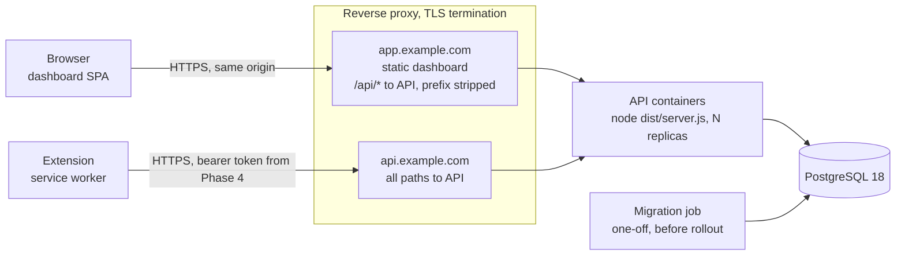

# Deployment

Phase 1 runs locally only. Production deployment is **Planned (Phase 8)** and provider-agnostic; its shape is fixed now so earlier phases do not block it. Phases: [roadmap](roadmap.md); risk IDs: [technical risks](technical-risks.md).

## Principles

**Implemented (Phase 1)** as repository policy ([ADR 0008](adr/0008-local-first-development.md)):

- **Local-first.** Compose for stateful services, pnpm for apps: free to run, and the seams a deployment needs exist from day one.
- **Twelve-factor config.** Every setting is an environment variable ([12factor.net/config](https://12factor.net/config)), validated with zod at startup (`apps/api/src/config/env.ts`), so one API artifact runs everywhere. The extension is the deliberate exception ([below](#building-artifacts)).
- **No provider-specific code.** No cloud SDKs in `apps/*`; infrastructure sits behind small interfaces (`Database` in `apps/api/src/infrastructure/database/client.ts`, one pino logger).
- **No account required.** No cloud, SaaS or Chrome Web Store account. Implemented (Phase 4): the stable development extension ID comes from a committed public key; a production build brings its own key pair.

## Local environment today

**Implemented (Phase 1).** Only PostgreSQL runs in a container (`compose.yaml`); the apps run on the host via `pnpm dev` for native file watching, direct debugging and fast restarts. Trade-off: every developer installs Node 22 (`.nvmrc`).

- **Image:** `postgres:18-alpine`, `restart: unless-stopped`, local-only credentials `contextlayer`/`contextlayer`.
- **Loopback binding:** `127.0.0.1:${POSTGRES_PORT:-5432}:5432`. Docker otherwise publishes on all interfaces, and on Linux its iptables rules bypass firewalls such as ufw; a database with a known password must not reach the LAN.
- **Healthcheck:** `pg_isready` every 5 s, 10 retries (`$$` defers expansion to the container shell), so `docker compose up -d --wait` blocks until ready.
- **PostgreSQL 18 volume layout:** the volume is mounted at `/var/lib/postgresql`, not `.../data`, because 18+ images keep data per major version (`/var/lib/postgresql/18/docker`); a later `pg_upgrade` then sees both clusters on one mount.
- **One `.env`** at the root, read by Compose, the API, drizzle-kit and both Vite configs.

| Service           | Address                                        | Configured by                          |
| ----------------- | ---------------------------------------------- | -------------------------------------- |
| PostgreSQL        | `127.0.0.1:5432`                               | `POSTGRES_PORT`                        |
| API               | `http://localhost:3000` (IPv4 + IPv6 loopback) | `API_HOST`, `API_PORT`                 |
| Dashboard dev     | `http://localhost:5173`, `/api/*` proxied      | `apps/dashboard/vite.config.ts`        |
| Dashboard preview | `http://localhost:4173`, `/api/*` proxied      | same file; used by Playwright          |
| Extension         | no port; unpacked `apps/extension/dist`        | `EXTENSION_API_BASE_URL` at build time |

## Production topology

**Planned (Phase 8).** One TLS reverse proxy, stateless API containers, PostgreSQL 18 and a migration job.



- **Dashboard origin.** The proxy serves the Vite build and forwards `/api/*` with the prefix stripped, like the Vite proxy in development, so session cookies stay first-party and the API needs no CORS ([ADR 0015](adr/0015-authentication-strategy.md), Proposed). With vue-router (Phase 2), unknown paths fall back to `index.html`.
- **Extension API origin (Proposed).** The build accepts only a bare origin for `EXTENSION_API_BASE_URL` (`parseApiBaseUrl()` in `apps/extension/manifest.config.ts` rejects paths, queries and fragments) and the service worker requests root paths, so the API must answer at an origin root. A dedicated `api.example.com` keeps `host_permissions` off the dashboard, and the host-only `__Host-` cookie never reaches it. Alternative: path-prefix support to call `https://app.example.com/api`; one hostname fewer, but host access to the dashboard.
- **Proxy (Proposed).** Caddy for automatic ACME certificates; Nginx or Traefik work equally.
- **Scaling.** The Phase 2 rate-limit store is in-memory per process, so a second replica needs a shared store. `TRUST_PROXY` must name the proxy (Implemented, Phase 2) and the API must be reachable only through it, or `X-Forwarded-For` can be spoofed.

```caddyfile
app.example.com {
	handle_path /api/* {
		reverse_proxy api:3000
	}
	handle {
		root * /srv/dashboard
		try_files {path} /index.html
		file_server
	}
}

api.example.com {
	reverse_proxy api:3000
}
```

## Building artifacts

`pnpm build` (Implemented, Phase 1) emits `packages/shared/dist`, `apps/api/dist` (`tsc`), `apps/extension/dist`, and the dashboard as plain static files in `apps/dashboard/dist` (base path `/api` hard-coded in `apps/dashboard/src/lib/http.ts`). Packaging is Planned (Phase 8).

**API image (Proposed).** Multi-stage on the current Node LTS (Node 24 by Phase 8, see below); the runtime stage holds production dependencies, `apps/api/dist`, `packages/shared/dist` with `packages/shared/package.json` (its `exports` map resolves `@contextlayer/shared` to `dist`), and `apps/api/package.json` (read by `apps/api/src/version.ts`), running as the non-root `node` user. The code imposes:

- `NODE_ENV=production`, explicitly: the default `development` loads `pino-pretty`, a devDependency.
- `API_HOST=0.0.0.0`: `localhost` is unreachable from outside a container.
- `CMD ["node", "dist/server.js"]`, not `pnpm start`, so SIGTERM reaches Node and `close-with-grace` drains requests and the pool within 10 s (`apps/api/src/server.ts`). Docker's default stop timeout is also 10 s; set `stop_grace_period: 15s`.
- Probes: liveness `/health/live` (no dependency checks), readiness `/health` (PostgreSQL `select 1`, 2 s timeout, 503 when down); probe timeout at least 3 s. A database outage then removes instances from rotation instead of restart-looping them.
- Node 22 reaches end of life on 2027-04-30; Phase 8 moves to Node 24 LTS.

**Extension per environment.** The API origin is compiled into the code and into `host_permissions` (`apps/extension/manifest.config.ts`): the manifest is fixed at build time, and that install-time grant is what lets the service worker call the API without CORS ([ADR 0007](adr/0007-chrome-manifest-v3-extension.md)). Hence one build, and one store zip or signed CRX, per environment. Alternative not chosen: one build that reads the API origin from enterprise policy (`storage.managed`) and requests it through `optional_host_permissions`; fewer builds, but a runtime grant step and an unconfigured extension outside managed installs:

```sh
EXTENSION_API_BASE_URL=https://api.example.com pnpm --filter @contextlayer/extension build
```

The shell variable wins over `.env` (Vite's `loadEnv`). Forgetting it ships `http://localhost:3000`, so Phase 8 CI rejects production builds without an `https` origin. Build-time values are public; never secrets.

## Configuration and secrets per environment

| Variable                                                                               | Read by                                                                      | Local                                                     | Production                                  | Status                |
| -------------------------------------------------------------------------------------- | ---------------------------------------------------------------------------- | --------------------------------------------------------- | ------------------------------------------- | --------------------- |
| `NODE_ENV`, `LOG_LEVEL`                                                                | API                                                                          | `development`, `info`                                     | `production`, `info`                        | Implemented (Phase 1) |
| `API_HOST`, `API_PORT`                                                                 | API                                                                          | `localhost`, `3000`                                       | `0.0.0.0`, `3000`                           | Implemented (Phase 1) |
| `DATABASE_URL`                                                                         | API, drizzle-kit                                                             | Compose database                                          | secret, TLS                                 | Implemented (Phase 1) |
| `EXTENSION_API_BASE_URL`                                                               | extension build                                                              | `http://localhost:3000`                                   | `https://api.example.com`                   | Implemented (Phase 1) |
| `DASHBOARD_ORIGIN`                                                                     | CSRF guard (allow-list)                                                      | `http://localhost:5173`, `http://localhost:4173`          | `https://app.example.com`                   | Implemented (Phase 2) |
| `EXTENSION_DASHBOARD_URL`                                                              | extension build (`externally_connectable`, connect page)                     | `http://localhost:5173`                                   | `https://app.example.com`                   | Implemented (Phase 4) |
| Session cookie settings                                                                | API                                                                          | `cl_session`, `Secure` (no `__Host-` prefix on localhost) | `__Host-cl_session`, `Secure`               | Implemented (Phase 2) |
| `TRUST_PROXY`                                                                          | API `trustProxy`                                                             | off                                                       | proxy addresses or CIDRs                    | Implemented (Phase 2) |
| `EXTENSION_ID`, `EXTENSION_PUBLIC_KEY`                                                 | extension and dashboard builds; API (`EXTENSION_ID`, required in production) | the committed dev key and its ID                          | per environment, checked against each other | Implemented (Phase 4) |
| `EXTENSION_ACCESS_TOKEN_MINUTES`, `EXTENSION_GRANT_DAYS`, `EXTENSION_*_RATE_LIMIT_MAX` | API                                                                          | 15, 30, 120 / 30                                          | same                                        | Implemented (Phase 4) |

`POSTGRES_*` and `DASHBOARD_API_PROXY_TARGET` are local-only; planned names are Proposed. The only runtime secret today is `DATABASE_URL` (Phase 2 sessions add none: tokens are random and stored only as hashes). A production extension key pair is a release secret, not a runtime one: only its public half goes into the build, no server reads the private half, and it is needed only to sign self-hosted CRXs (Phase 8). The development key's private half is not in the repository and is not needed. Secrets live in the platform's store (see [Hosting options](#hosting-options)) or a root-only env file on a VM; the code only reads environment variables, so changing stores changes no code.

## Database operations

**Version.** PostgreSQL 18 everywhere: the [proposed data model](data-model.md) relies on the built-in `uuidv7()`, new in 18 ([ADR 0004](adr/0004-postgresql-primary-database.md)). A provider without 18 would push UUIDv7 generation into the API.

- **Managed vs self-hosted.** Managed services trade price, version lag and restricted extensions for point-in-time recovery, patching and failover; self-hosted is cheapest and identical to local, but backups and upgrades are ours. Proposed: self-hosted for a demo, managed once real users exist.
- **Backups (Planned, Phase 8).** Managed: point-in-time recovery, at least 7 days. Self-hosted: nightly `pg_dump -Fc` copied off-host, plus WAL archiving (pgBackRest or WAL-G) if losing a day is unacceptable. A backup counts only after a restore drill.
- **Migrations (Proposed).** Today `pnpm db:migrate` runs `drizzle-kit migrate`, a devDependency; the first migration arrives in Phase 2 ([ADR 0005](adr/0005-drizzle-orm.md)). In production the API image carries `apps/api/drizzle/` and a small `dist/migrate.js` (Drizzle's runtime migrator), run as a one-off job, so code and schema ship together. Not at API startup: replicas would race, the API would need DDL rights, and a failed migration would crash-loop.
- **Release order.** Build images, run the migration job alone (abort on failure), roll out the API behind readiness, publish dashboard files. Old and new API versions overlap, so migrations follow expand/contract.
- **Roles (Proposed).** A migration role owns the schema; the API role gets DML only.
- **Connection pooling.** Each API process opens up to 10 connections (`max: 10`, hard-coded; configurable is Proposed); PostgreSQL defaults to `max_connections = 100`, small managed tiers allow fewer. Beyond a few replicas, add PgBouncer (transaction mode) or the provider's pooler, keeping session state (`SET`, advisory locks, `LISTEN`) out of the code. Migrations connect directly.

## Extension distribution

**Implemented (Phase 1):** unpacked builds in Developer mode, reloaded by hand. **Planned (Phase 8):** the channels below (R-19); stable ID in Phase 4.

- **Chrome Web Store, unlisted or private listing** (anyone with the link, or trusted testers / one Workspace domain; automatic updates). The one-time developer registration fee ([register](https://developer.chrome.com/docs/webstore/register)) is optional, needed only for this channel. Since 2026-08-01, Limited Use requires collected data, guide analytics included, to be strictly necessary and prominently disclosed ([policy](https://developer.chrome.com/blog/cws-policy-updates-2026)).
- **Enterprise force-install.** `ExtensionInstallForcelist` entries are `<extension-id>;<update-url>`; `ExtensionSettings` (`installation_mode: "force_installed"`) adds `runtime_allowed_hosts`/`runtime_blocked_hosts`. Self-hosting serves a CRX signed with our private key and an update manifest XML over HTTPS, referenced by the manifest's `update_url`. On Windows and macOS, off-store installs work only through policy ([install](https://developer.chrome.com/docs/extensions/how-to/distribute/install-extensions), [self-host](https://developer.chrome.com/docs/extensions/how-to/distribute/host-on-linux), [policy](https://support.google.com/chrome/a/answer/9867568)).
- **Stable ID (Planned, Phase 4).** The manifest `key` holds a locally generated public key, so dev builds, self-hosted CRXs and `EXTENSION_ID` agree; the private key never enters git. A store item gets its own ID, hence `EXTENSION_ID` is per environment ([key](https://developer.chrome.com/docs/extensions/reference/manifest/key)).

```sh
openssl genrsa 2048 | openssl pkcs8 -topk8 -nocrypt -out contextlayer-dev.pem
openssl rsa -in contextlayer-dev.pem -pubout -outform DER | openssl base64 -A
```

## Hosting options

Optional examples only; the code is identical on each.

| Option                     | Edge, TLS, dashboard                                | API                 | PostgreSQL 18                 | Migration job           | Secrets            |
| -------------------------- | --------------------------------------------------- | ------------------- | ----------------------------- | ----------------------- | ------------------ |
| Single VM + Docker Compose | Caddy container                                     | containers          | container, or managed         | `docker compose run`    | root-only env file |
| Fly.io / Render / Railway  | platform TLS; static site or Caddy service          | service from image  | platform or external          | release/pre-deploy step | platform secrets   |
| AWS                        | CloudFront + S3, `/api/*` to an ALB                 | ECS on Fargate      | RDS for PostgreSQL            | one-off ECS task        | Secrets Manager    |
| GCP                        | Cloud Storage + Application Load Balancer, or Caddy | Cloud Run           | Cloud SQL                     | Cloud Run job           | Secret Manager     |
| Azure                      | Static Web Apps, or Caddy in Container Apps         | Container Apps      | Azure Database for PostgreSQL | Container Apps job      | Key Vault          |
| Kubernetes                 | Gateway API or Ingress + cert-manager               | Deployment + probes | CloudNativePG, or managed     | `Job`                   | External Secrets   |

If a CDN cannot strip `/api` without edge code (CloudFront needs a function), the API should accept the prefix instead. Proposed: start on one VM with Compose (cheapest, but a single point of failure); move to a PaaS or managed database when uptime matters; Kubernetes only once there are several services.

## Observability in production

**Implemented (Phase 1):** JSON logs on stdout outside development, redacting `authorization`, `cookie` and `set-cookie` (`apps/api/src/logger.ts`); the platform collects stdout. A UUID request id appears in log lines, the `x-request-id` header and every `ApiError` body, so a user-reported error maps to its logs. Liveness and readiness probes; logged graceful shutdown.

**Planned (Phase 8):** request ids accepted from the trusted proxy only; OpenTelemetry metrics and traces (self-hosted Prometheus/Grafana or any vendor); alerts on readiness, 5xx rate, p95 latency, connections, backups and certificate expiry.

## Pre-production checklist

**Planned (Phase 8)** unless noted:

- [ ] API Dockerfile (multi-stage, non-root, pinned base image) and reverse-proxy config.
- [ ] Phase 2 CI extended with image build, vulnerability scan and per-environment extension packages.
- [ ] Migration job and separate database roles.
- [ ] CSP review: dashboard CSP set by the proxy (`@fastify/helmet` covers API responses only); page CSP versus injected UI (R-10).
- [ ] Rate limits (auth from Phase 2, then global) with a shared store; `trustProxy`.
- [ ] TLS everywhere, including verified TLS to PostgreSQL; tested backups; monitoring and alerting.
- [ ] Decide whether `/health` stays public (it reveals version and uptime).
- [ ] Threat model, dependency audit, content-script budget (R-15), store disclosures (R-19), Node 24.

## Avoiding lock-in checklist

- [x] Configuration only via environment variables; no provider SDK in `apps/*` (Implemented).
- [x] JSON logs on stdout; plain HTTP health checks (Implemented).
- [ ] In-house authentication, no identity SaaS (Planned, Phase 2; [ADR 0015](adr/0015-authentication-strategy.md)).
- [ ] One OCI image, unchanged on every option above.
- [ ] Standard PostgreSQL 18 only; dumps restore into any PostgreSQL 18.
- [ ] Telemetry through OpenTelemetry, not a vendor agent.
- [ ] Provider IaC outside application code.
- [ ] Exit test: production images, Compose and a restored dump reproduce production on a laptop.

See [architecture](architecture.md) for component boundaries and [API](api.md) for routing conventions.
