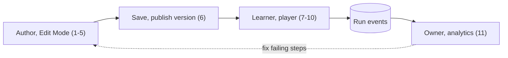

# Product

> **Phase 1 status (Foundation, complete).** No product feature described here exists yet. Only the foundation runs today: the API serves health checks (`GET /health` readiness with a PostgreSQL probe, `GET /health/live` liveness; `apps/api/src/modules/health/`), the dashboard shows a live "System status" card, and the extension popup shows API status and can ping the content script on the local dashboard (`http://localhost:5173` and the preview server `http://localhost:4173`), the only pages where it runs in Phase 1. The database schema is intentionally empty. Each capability below is labeled with its phase; see the [roadmap](roadmap.md).

## Vision

People learn business software inside the software itself. ContextLayer is a Digital Adoption Platform (DAP): an author opens a web application the organization already uses, points at its real buttons and fields and writes an instruction for each; learners later follow those steps in the live application, one highlighted element at a time, and the organization sees where people finish and where they get stuck. The target application is never modified.

## The problem

- **Training cost.** CRMs, ERPs and internal tools are learned from slide decks, demos, shadowing or trial and error. Every new hire, process change and UI update repeats the cost, often paid by experienced colleagues.
- **Context switching.** Instructions live in a wiki, an LMS or a video while the work happens in another tab; the learner must map text onto the screen.
- **Documentation drift.** Screenshots and procedures go stale when the application changes, and nothing tells their owner until a confused user or a support ticket does.
- **Why existing approaches fall short.** Static documentation drifts and is read out of context; vendor onboarding covers generic flows, not the customer's processes; a guidance SDK must be embedded in the application, which customers rarely can do in third-party SaaS.

## Why in-app guidance, and why an extension

In-app guidance removes the mapping step: each instruction is anchored to the element it describes. It also makes drift measurable: when a step's element can no longer be found, ContextLayer records `target_not_found` instead of silently showing stale advice.

| Delivery option                | Works on third-party SaaS | Target-app changes  | Main cost                                                    |
| ------------------------------ | ------------------------- | ------------------- | ------------------------------------------------------------ |
| Docs, videos, LMS              | Yes                       | None                | Context switching; drift is invisible                        |
| SDK or snippet in the app      | Rarely                    | Code or tag manager | Needs the application owner's cooperation                    |
| **Browser extension (chosen)** | **Yes**                   | **None**            | Install per browser; Chrome only; markup not designed for us |

These costs are accepted deliberately: enterprise policy can force-install the extension and allow or block hosts ([Chrome Enterprise help](https://support.google.com/chrome/a/answer/9867568)); other browsers are a non-goal; fragile targeting (R-04 in [technical risks](technical-risks.md)) is addressed by multi-signal target descriptors ([ADR 0014](adr/0014-element-targeting-strategy.md), Proposed). Platform choice: [ADR 0007](adr/0007-chrome-manifest-v3-extension.md).

## Users and personas

Phase 1 has no real users; these personas are hypotheses, not research results. Roles are the Phase 2 workspace roles; the permission matrix is an open question.

| Persona                        | Proposed role       | Goals                                                                                       | Surfaces                         |
| ------------------------------ | ------------------- | ------------------------------------------------------------------------------------------- | -------------------------------- |
| Guide author (workspace admin) | `admin` or `editor` | Build guides without developer help; know quickly when a step breaks; fix one step, not all | Side panel, Edit Mode, dashboard |
| Learner (end user)             | `member`            | Finish real tasks in the real application; guidance that never blocks it                    | In-page player                   |
| Workspace owner                | `owner`             | Faster onboarding; completion and drop-off per step; membership control                     | Dashboard (members, analytics)   |

## Core concepts

| Term              | Meaning                                                                                                                                                           | Status                                                        |
| ----------------- | ----------------------------------------------------------------------------------------------------------------------------------------------------------------- | ------------------------------------------------------------- |
| Workspace         | Tenant boundary; every tenant-owned row carries `workspace_id`.                                                                                                   | Planned (Phase 2)                                             |
| Member            | A user in a workspace with one role: `owner`, `admin`, `editor` or `member`.                                                                                      | Planned (Phase 2)                                             |
| Application       | A target web app, identified by its origins (e.g. `https://crm.example.com`); determines where the extension requests access.                                     | Planned (Phase 3)                                             |
| Guide             | Ordered steps for one application; `draft`, `published` or `archived`; a start URL pattern.                                                                       | Planned (Phase 3)                                             |
| Step              | Position, title, body (restricted rich text, never HTML), target descriptor, optional URL pattern, placement.                                                     | Planned (Phase 3)                                             |
| Target descriptor | Versioned JSON of signals captured at pick time (test attributes, role and accessible name, text, CSS path, ancestors, URL pattern), used to re-find the element. | Proposed ([ADR 0014](adr/0014-element-targeting-strategy.md)) |
| Guide version     | Immutable snapshot of a guide and its steps, frozen at publish; learners see only versions, never drafts.                                                         | Planned (Phase 3)                                             |
| Run               | One learner's attempt at one guide version: `in_progress`, `completed` or `abandoned`.                                                                            | Planned (Phase 7)                                             |
| Event             | Append-only run record (`run_started`, `step_viewed`, `step_completed`, `target_not_found`, `run_completed`, `run_abandoned`), deduplicated by a client id.       | Planned (Phase 7)                                             |
| Edit Mode         | Authoring state: picking elements on the page, typing in the side panel (unobservable by the host page).                                                          | Planned (Phase 5)                                             |
| Player            | In-page runtime that finds published guides for the URL, resolves targets, highlights them and shows instructions.                                                | Planned (Phase 6)                                             |

## Key journeys

The product loop has eleven steps, numbered continuously across three journeys.

### (a) Author builds a guide in Edit Mode

Precondition: the application is registered (Phase 3); the author's extension is connected, with site access to its origin (Phase 4).

1. Open the target application and the ContextLayer side panel. (Phase 5)
2. Enter Edit Mode for a new or draft guide. (Phase 5)
3. Click the element the step is about; ContextLayer intercepts the click so the application does not act on it. (Phase 5)
4. ContextLayer captures a target descriptor and warns when the target is weak (no unique test attribute, stable id, or role plus accessible name). (Phase 5)
5. Type the title and instructions in the side panel; repeat 3–5, reorder, preview. (Phase 5)
6. Save the draft through the service worker to the API; publishing freezes an immutable version. (API Phase 3, extension Phase 5)

### (b) Learner follows a guide

7. The learner opens the same application; the extension fetches published guides matching the URL. (Phase 6)
8. The learner starts a guide; a run begins (`run_started`). (Phases 6–7)
9. The player resolves each step's target, waiting for late-rendered content and in-app navigation. On an ambiguous or missing match it never guesses: it shows the step unanchored and records `target_not_found`. (Phases 6–7)
10. The player highlights the element and shows a popover with Previous / Next / Finish; Finish completes the run, closing early abandons it. (Phases 6–7)

### (c) Owner reviews completion

11. The owner reviews per-version analytics in the dashboard: runs, completion rate, per-step drop-off, target-not-found rate. A failing step goes back to the author; the fix ships as a new version. (Phase 7)

## MVP scope

| Capability                                                                                     | Phase                 |
| ---------------------------------------------------------------------------------------------- | --------------------- |
| Monorepo, tooling, health checks, extension skeleton, tests                                    | Implemented (Phase 1) |
| Registration, login, sessions; workspaces and members                                          | Planned (Phase 2)     |
| Applications; guide CRUD with ordered steps; publish to versions                               | Planned (Phase 3)     |
| Extension connected to a workspace; per-application site access                                | Planned (Phase 4)     |
| Edit Mode: element picking, target capture, instructions, save                                 | Planned (Phase 5)     |
| Guide detection for the current site; playback (highlight, popover, Previous / Next / Finish)  | Planned (Phase 6)     |
| Events (start, progress, completion, abandonment, target not found); basic dashboard analytics | Planned (Phase 7)     |
| Production packaging and distribution                                                          | Planned (Phase 8)     |

## Non-goals

Out of MVP scope, to keep the core loop small enough to build and defend:

- **AI features**: the core loop must work and be measured first.
- **Selector auto-healing**: the player scores several signals at runtime but never rewrites a stored target; broken steps are reported and re-picked. Silent repair could anchor a step to the wrong element.
- **Advanced roles and permissions**: four fixed roles, no custom roles or per-guide access lists.
- **Third-party integrations** (identity providers, LMS, chat, data warehouses).
- **Firefox, Safari, mobile apps**: one browser keeps the platform surface testable.
- **Microservices**: one deployable API ([ADR 0002](adr/0002-modular-monolith-backend.md)).
- **Acting for the user** (auto-click, form filling): guides are data a person follows; a remote command language would also conflict with Chrome's remotely hosted code policy, which covers interpreters of fetched commands ([Chrome docs](https://developer.chrome.com/docs/extensions/develop/migrate/remote-hosted-code)).

## Success metrics

No targets until a baseline exists. Definitions are Proposed; measurable from Phase 7 unless noted.

| Metric                  | Definition                                                  | Measurement                                                                                                                                                          |
| ----------------------- | ----------------------------------------------------------- | -------------------------------------------------------------------------------------------------------------------------------------------------------------------- |
| Guide completion rate   | Completed ÷ started runs, per guide version and period      | `guide_runs.status`; open runs excluded until they end                                                                                                               |
| Abandonment step        | Where abandoned runs stop                                   | Distribution of `last_step_position` for abandoned runs; per-step funnel of `step_viewed`                                                                            |
| Target-not-found rate   | `target_not_found` ÷ step resolutions, per step and version | `guide_events`; a jump after an application release signals drift                                                                                                    |
| Time to proficiency     | Time until a learner does the task unaided                  | Not observable (the application is not recorded). Proxy: days and runs until a learner stops starting a guide they completed; a true value needs a customer baseline |
| Authoring time per step | Active time from picking an element to saving the step      | Side-panel timing (Phase 5); needs authoring telemetry (the proposed events table covers runs only) or a scripted benchmark                                          |

Run events are reported by a content script inside pages ContextLayer does not control: page scripts can manipulate the DOM the player observes, and a compromised renderer can forge content-script messages. Analytics are therefore best-effort; Phase 7 ingestion (Planned) verifies guide and step ids against the grant's workspace, and progress counts only `isTrusted` events (R-11, R-17).

## Product constraints

- **Local-first**: everything runs on one machine with Docker Compose and pnpm, without cloud accounts or paid services ([ADR 0008](adr/0008-local-first-development.md)); cloud hosting is optional ([deployment](deployment.md)).
- **Chrome only**: Manifest V3, minimum Chrome 120 today, at least 140 once extension sign-in lands ([ADR 0015](adr/0015-authentication-strategy.md), Proposed).
- **No source changes to target applications**: a team may add a `data-contextlayer-id` attribute for sturdier targeting, but no guide may depend on it.
- **Least privilege on sites**: access is requested per application origin at runtime, and users or policy can withhold it anytime, so "no access" is a normal player state (R-03; [Chrome Web Store help](https://support.google.com/chrome_webstore/answer/2664769)).
- **Privacy, record only what a step needs**: no session replay, keystroke logging or page snapshots. Descriptors hold only signals about the picked element, with Proposed limits (capped strings, redacted emails and long digit runs, URL patterns instead of raw URLs). Events carry ids, positions and timestamps, never page text. A Chrome Web Store release falls under the Limited Use policy, which since 2026-08-01 requires collected data to be strictly necessary to the single purpose and prominently disclosed ([Chrome blog](https://developer.chrome.com/blog/cws-policy-updates-2026)).
- **Guide content is untrusted**: rendered with DOM text APIs, never as HTML, because it runs inside customers' applications with the learner's session (R-11, [ADR 0013](adr/0013-shadow-dom-ui-isolation.md)).

## Open product questions

1. **Do learners need accounts?** The proposed model ties runs and extension grants to a user; managed configuration or pseudonymous runs would cut friction but change privacy and analytics.
2. **How are guides offered?** Launcher, auto-start or dashboard link; are unfinished guides re-offered?
3. **When is a run abandoned?** Explicit close only, or also inactivity or leaving the application? This moves the completion rate.
4. **Default for a missing target**: unanchored, skip or end (ADR 0014 allows a per-step policy).
5. **Advance on action?** Advancing when the learner uses the target mirrors real work; a Next button is simpler.
6. **Multi-page guides**: run state across full page loads, in the first player release or later?
7. **Role permissions**: can `editor` publish? Can `member` see aggregates?
8. **Republish mid-run**: the run keeps its version; tell the learner?
9. **Localization** of guide text and of text-based targeting signals.
10. **Distribution and retention**: enterprise force-install or Web Store listing; how long events are kept.

Related: [architecture](architecture.md), [technical risks](technical-risks.md), [data model](data-model.md), [API](api.md), [roadmap](roadmap.md), [ADR index](adr/README.md).
