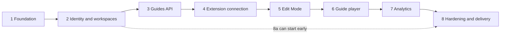

# Roadmap

Status on 2026-10-06: **Phases 1–5 and milestone 6a are done; 6b, 6c and Phases 7–8 are Planned.** A phase closes when its exit criteria pass, its demo works and the verification is recorded in this roadmap and in the commit messages. Details: [product](product.md), [architecture](architecture.md), [technical risks](technical-risks.md), [data model](data-model.md), [API](api.md) and the [ADR index](adr/README.md).

## Why this order

- Identity (2) precedes guides (3): every guide row is tenant-owned (`workspace_id`), and retrofitting tenancy is how data leaks happen (R-17).
- Backend phases (2, 3) settle data and auth before the browser phases (4–6), which carry most of the risk register.
- The extension is connected (4) before Edit Mode (5) because authoring needs an authenticated save path and granted site access.
- The player (6) follows the builder so it is tested against descriptors captured from real pages; analytics (7) follows the player because events come from runs.

| Phase | Name                      | Status  | Milestones                                      |
| ----- | ------------------------- | ------- | ----------------------------------------------- |
| 1     | Foundation                | Done    | none                                            |
| 2     | Identity and workspaces   | Done    | 2a API + CI, 2b dashboard                       |
| 3     | Guides API and management | Done    | 3a API, 3b dashboard                            |
| 4     | Extension connection      | Done    | 4a spike, 4b API, 4c connection, 4d site access |
| 5     | Edit Mode (guide builder) | Done    | none                                            |
| 6     | Guide player              | 6a Done | 6a playback, 6b dynamic pages, 6c shadow/frames |
| 7     | Analytics                 | Planned | none                                            |
| 8     | Hardening and delivery    | Planned | 8a packaging, 8b security/ops, 8c distribution  |

## Phase 1 — Foundation

**Done (Implemented, Phase 1).** Goal: prove every communication path (API → PostgreSQL, dashboard → API, popup and content script → service worker → API) and record the decisions before any product feature exists.

Delivered:

- [x] Requirements, risk register R-01–R-19, architecture, data-model and API proposals, ADRs 0001–0015.
- [x] pnpm 12.9.1 monorepo (3 apps, 3 packages) with a version catalog and shared tsconfig/ESLint presets.
- [x] `packages/shared`: zod `HealthReport` and `ApiError` contracts with a source-first export condition ([ADR 0011](adr/0011-source-first-workspace-packages.md)).
- [x] `apps/api`: composition root `src/app.ts`, validated env, pino with redaction, pg Pool + Drizzle (empty schema), `GET /health` (200/503 from a database probe) and `GET /health/live`, `ApiError` envelope, graceful shutdown.
- [x] `compose.yaml`: PostgreSQL 18 on a loopback-only port with a healthcheck.
- [x] `apps/dashboard`: "System status" card through the same-origin `/api` proxy.
- [x] `apps/extension`: service worker as the only API caller, closed-shadow-root content script, Vue popup, zod message protocol, `host_permissions` pinned to the API origin.
- [x] `packages/ui`: `StatusBadge` and Tailwind v4 theme tokens.

Verification (at commit `21fa0ae`): `pnpm typecheck` and `pnpm lint` pass in all 6 projects; `pnpm test` runs 56 tests in 11 files; `pnpm test:e2e` passes dashboard 5/5 (axe: 0 violations) and extension 6/6 (including the hostile-page fixture) in Playwright's bundled Chromium 153; `/health` returned 200, 503 after `docker compose stop postgres`, then 200 again; the production build started with JSON logs and shut down cleanly on SIGTERM; `drizzle-kit check/generate/migrate` ran against PostgreSQL 18.6.

Out of scope: accounts, guides, picker, player, analytics, tables, CI, production images.

Carried forward: no CI (Phase 2); API tests use a fake database (Phase 2); `content.js` is ~89 kB (~26 kB gzip), mostly zod (Phase 5 budget); content script limited to the local dashboard origins `localhost:5173` and `localhost:4173` (replaced by per-site registration in Phase 4).

Risks addressed (mitigation started): every risk whose [register](technical-risks.md#register) row lists 1 (baseline): R-01, R-02, R-03, R-05, R-09, R-10, R-11, R-12, R-13, R-14, R-15, R-16, R-17, R-18, R-19.

## Phase 2 — Identity and workspaces

**Done (Implemented, Phase 2).** Goal: a person registers, signs in, creates a workspace and adds members, behind sessions and CSRF protection later phases can trust.

2a — API and CI:

- [x] First migration `0000_identity`: `users`, `sessions`, `workspaces`, `workspace_members` (`uuidv7()` keys, roles as text + check, explicit constraint names).
- [x] `auth` module: `POST /v1/auth/register`, `/login`, `/logout`, `GET /v1/auth/session`; argon2id (`@node-rs/argon2`); opaque session token stored only as a SHA-256 hash; 30 min idle and 8 h absolute expiry; revocation on logout and on a new login; HttpOnly + Secure + SameSite=Strict cookie (`__Host-cl_session` in production).
- [x] CSRF guard on unsafe methods against the `DASHBOARD_ORIGIN` allow-list (dev: `http://localhost:5173` and `http://localhost:4173`; never compared with Host); `text/plain` bodies refused; `@fastify/rate-limit` on login (IP + email) and register (IP).
- [x] `workspaces` module with roles `owner | admin | editor | member`, member management and last-owner protection; non-members get 404.
- [x] Integration tests against a separate PostgreSQL database (`contextlayer_test`), including a tenant-isolation matrix; GitHub Actions running install, format, typecheck, lint, migrations, `drizzle-kit check`, unit + integration tests, build and both e2e suites.

2b — Dashboard:

- [x] vue-router with session guards and safe post-login redirects; sign-in and registration screens; first-workspace onboarding; workspace switcher; overview and member management pages; `/status` for the system status.
- [x] Component and unit tests for the forms, session state, route guards, API errors and workspace switching; Playwright flow with axe on every screen.

Changed from the plan:

- **No seed script.** Registering takes seconds and the e2e test creates its own account; a seeded demo password would be one more credential to keep out of production.
- **Registration creates no workspace.** The dashboard asks for the first workspace's name (onboarding) instead of inventing one.
- **No `workspaces.slug` or `users.email_verified_at`.** Nothing in this phase uses them ([data model 8](data-model.md#8-the-phase-2-first-migration)).
- **No global rate limit.** Only the public auth routes are limited; every other route requires a session.

Verification (at commit `e2e4816`): `pnpm format:check`, `pnpm typecheck` and `pnpm lint` pass; `pnpm test` runs 175 tests in 23 files, 51 of them API integration tests on PostgreSQL 18.6; `pnpm test:e2e` passes dashboard 8/8 (axe: 0 violations on the status, sign-in, registration, onboarding, overview and members screens) and extension 6/6; the migration applies to an empty database and `drizzle-kit check` is clean. A smoke run of the built API confirmed the cookie flags, 403 for a foreign `Origin`, 415 for `text/plain`, 401 after logout and after revoking the session in the database, argon2id hashes and 32-byte token hashes in the tables, 429 with `retry-after` after 10 login attempts, and no password or cookie value in the logs. CI runs the same checks on the pull request to `main`.

Out of scope (unchanged): email delivery (verification, reset), invitations, SSO, custom roles, extension auth, "log out everywhere" UI.

Carried forward: rate-limit store in memory (one API process; shared store in Phase 8); [ADR 0015](adr/0015-authentication-strategy.md) cookie behaviour verified in Chromium only (Firefox and Safari untested); expired and revoked session rows are never deleted (cleanup job, [data model open question 6](data-model.md#9-open-questions)); `content.js` size unchanged (Phase 5 budget).

Risks addressed: R-13 (dashboard half), R-17 (workspace membership), R-18 (CI gate). ADRs: [ADR 0015](adr/0015-authentication-strategy.md) Accepted for the dashboard after its spike items 2–3; [ADR 0005](adr/0005-drizzle-orm.md) held up with the first real migration (a `customType` for `bytea`, `uuidv7()` defaults, explicit constraint names).

## Phase 3 — Guides API and management

**Done (Implemented, Phase 3).** Goal: guides become tenant-owned data with ordered draft steps and immutable published versions, managed from the dashboard.

3a — API:

- [x] Migrations `0001_content` (generated) and `0002_content_constraints` (custom): `applications`, `guides`, `guide_steps`, `guide_versions`.
  - Origins are checked by a database CHECK.
  - The composite foreign key `guides (workspace_id, application_id)` stops a guide from using another workspace's application.
  - Step positions are unique per guide, `DEFERRABLE INITIALLY DEFERRED`.
  - Triggers make versions immutable: no update except clearing the publisher when their account is deleted, and no delete (`0003_protect_published_versions`, added after the Phase 3 review).
  - RESTRICT protects history.
- [x] `applications` module: list, create, read, update and delete (409 while guides exist). Origins must be exact (scheme, host, port) and are stored normalized.
- [x] `guides` module:
  - Draft CRUD; DELETE archives, with a restore.
  - `PUT …/steps` replaces the ordered list atomically, keeping step ids.
  - `POST …/publish` freezes the draft into the next immutable version ([ADR 0016](adr/0016-immutable-published-guide-versions.md)).
  - `GET …/versions[/:n]` lists and reads versions.
- [x] `TargetDescriptor` v1 and the restricted rich-text body as zod schemas in `packages/shared` (versioned, unknown versions and keys rejected, strings, arrays and node counts capped).
- [x] Cursor pagination (opaque, newest first by UUIDv7 id). Roles:
  - any member reads applications;
  - `admin` and above manage them;
  - `editor` and above read, write and publish guides;
  - members get 403 on guides, non-members 404.

3b — Dashboard:

- [x] Applications tab: list, register, edit, delete; origins validated line by line.
- [x] Application page with its guides (status, latest version, unpublished changes, archived filter).
- [x] Guide editor: details; steps added, removed, edited and moved with buttons; save with conflict handling; publish; version history.
- [x] Read-only version page.
- [x] `vue/no-v-html` is an error, and instructions render through text nodes only.

Changed from the plan:

- **`guide_steps.target` is nullable.** Phase 3 creates steps before Edit Mode can capture elements (Phase 5). A placeholder descriptor would be fabricated data that the player would later try to resolve. `null` means "not captured yet" and also allows unanchored steps ([data model](data-model.md) open question 3, resolved).
- **`guides.revision` and `guide_versions.guide_revision`** were added. They drive "unpublished changes", optimistic concurrency (`expectedRevision`, 409) and idempotent publishing ([data model](data-model.md) open question 7, resolved).
- **Lists are ordered by UUIDv7 id (newest first)**, not by `updated_at`: an immutable key cannot skip or repeat rows while guides are edited during paging.
- **Guide routes are flat:** `/v1/workspaces/:workspaceId/guides?applicationId=…`, as in [API](api.md).
- **Not yet built:** the GIN index on `applications.origins` arrived with the extension's origin lookup (Phase 4, migration `0005`).
- **Editors can publish:** answers [product](product.md) open question 7 for now.
- **Rich text is edited as plain text:** blank lines make paragraphs, `- ` lines make lists. Formatting the editor cannot express is kept and shown read-only.

Verification (at commit `8c9afbb`):

- `pnpm format:check`, `pnpm typecheck` and `pnpm lint` pass.
- `pnpm test` runs 356 tests in 37 files:
  - 69 shared contract tests;
  - 128 API integration tests on PostgreSQL 18.6, including a 7-actor × 11-operation isolation matrix, a forced mid-transaction failure that leaves the previous order intact, and five racing publishes that create exactly one version;
  - 90 dashboard tests.
- `pnpm test:e2e` passes dashboard 9/9 (application → guide → 3 steps → v1 → edit → v2 → v1 unchanged, another tenant gets 404; axe: 0 violations) and extension 6/6.
- Migrations apply to an empty database and `drizzle-kit check` is clean.

Out of scope (unchanged): target capture (Phase 5), playback (Phase 6), WYSIWYG editing, audience targeting, rollback to an older version.

Risks addressed: R-04 (versioned descriptor contract), R-11 (content validated on write, rendered as text), R-17 (content isolation matrix). ADRs: [ADR 0014](adr/0014-element-targeting-strategy.md) storage shape Accepted; new [ADR 0016](adr/0016-immutable-published-guide-versions.md).

## Phase 4 — Extension connection

**Done (Implemented, Phase 4).** Goal: the extension holds its own revocable tokens for one workspace and runs only on application origins the user turned on and Chrome granted.

4a — Spike:

- [x] Throwaway extension in Playwright's Chromium 153.0.8010.12: worker request headers, `externally_connectable` senders, storage access levels and their persistence, worker termination mid-request, match patterns, the permission prompt under automation, `chrome://extensions` toggles, dynamic scripts across reloads and restarts. Results in [ADR 0015](adr/0015-authentication-strategy.md) (now Accepted) and [ADR 0017](adr/0017-per-application-site-access.md). Chrome 120 (`minimum_chrome_version`) was not tested.

4b — API:

- [x] Migrations `0004_extension_connections` (grants, one-time codes, refresh and access tokens: SHA-256 hashes only, S256 only, `client_id` shape, revocation pairs; codes and grants cascade with the membership) and `0005_applications_origins_index` (GIN on `applications.origins`).
- [x] `extension` module: `POST codes` and `GET`/`DELETE connections` (dashboard cookie + CSRF guard), `POST token` (code + PKCE verifier, or refresh token; exempt from the CSRF guard), `POST revoke`, `GET session`, `GET applications`, `GET guides?origin=` and `GET guides/:id` (bearer only). Per-IP rate limits on codes and tokens. The route table is in [ADR 0015](adr/0015-authentication-strategy.md).
- [x] Strict refresh rotation with reuse detection and no grace window; a reused refresh token or a replayed code revokes the grant, and the revocation commits although the request fails. Grants last at most 30 days; rotation never extends them.
- [x] Discovery: the workspace comes from the grant; only the latest published version of non-archived guides, read from the immutable snapshot; members may read; two workspaces registering the same origin never see each other's guides.

4c — Connection:

- [x] Stable extension id from a committed development public key; production builds pass `EXTENSION_PUBLIC_KEY` and `EXTENSION_ID` (checked against each other).
- [x] Service worker: PKCE attempt in `storage.session` before the dashboard opens; the handoff is accepted only from the top frame of the dashboard tab it opened, on the exact dashboard origin, with the matching `state`, once; single-flight refresh, one retry, no loops; network errors keep the credentials; late refresh answers are dropped; refresh token in `storage.local` only after `setAccessLevel(TRUSTED_CONTEXTS)`.
- [x] Dashboard `/extension/connect` (login keeps the link, explicit workspace choice, confirmation, success only after the extension confirms) and "Connected browsers" (list, revoke with confirmation, revocation reasons).
- [x] Popup: disconnected, connecting, connected, API unreachable, API access withheld, connection ended; connect, switch workspace, cancel, disconnect (reports when the server could not confirm); the connection's applications with their origins, each On or Off in this browser.

4d — Site access ([ADR 0017](adr/0017-per-application-site-access.md)):

- [x] `optional_host_permissions` requested from the popup click for the exact origin, only for registered applications; no static content scripts any more.
- [x] Popup site card: unsupported page, not registered, available, Chrome access removed, active with published guides (no play button).
- [x] Idempotent reconciliation of dynamic content scripts with deterministic ids, injection into open tabs, `page.deactivate` teardown, re-registration on install, update and browser start; no polling.
- [x] Content script inert until the worker accepts `page.hello` from Chrome's sender fields; one copy per world; orphans stop themselves.

Changed from the plan:

- **No grace window on refresh-token reuse.** Strict detection instead; a refresh answer lost after the server rotated ends the connection and the user connects again ([ADR 0015](adr/0015-authentication-strategy.md)).
- **One dashboard origin per build** in `externally_connectable` (`EXTENSION_DASHBOARD_URL`); the e2e build points at the preview server instead of listing `:4173` in every development build.
- **A committed development key** instead of one generated per developer: every clone and CI run gets the same id, and no private key is needed.
- **`GET /v1/extension/guides?origin=`** (exact origin) instead of `?url=`: matching a guide's start path against the page URL belongs to the player (Phase 6).
- **Withheld API access is detected and explained** in the popup; the CORS fallback for the extension origin stays Proposed.
- **End-to-end tests run on their own database** (`contextlayer_e2e`, created, migrated and emptied by `apps/api/scripts/e2e-server.ts`, API on :3100) with every server started by Playwright and no traces (they would record credentials). The extension suite uses an e2e build that pre-grants one stand-in customer site, because Chrome's permission prompt cannot be answered under automation; the prompt is a manual check ([ADR 0017](adr/0017-per-application-site-access.md)).

Verification (at commit `bc3183a`):

- `pnpm format:check`, `pnpm typecheck`, `pnpm lint` and `pnpm build` pass.
- `pnpm test` runs 503 tests in 53 files:
  - 73 shared contract tests;
  - 178 API integration tests on PostgreSQL 18, including code expiry and replay, PKCE mismatch, strict rotation with racing refreshes, revocation reasons, per-route authentication (a bearer never falls back to a cookie, a cookie route refuses any `Authorization`), and published guides isolated between two workspaces that register the same origin;
  - 86 extension tests (handoff sender matrix, connection manager, refresh, site access with a fake Chrome) and 108 dashboard tests.
- `pnpm test:e2e` passes dashboard 12/12 and extension 22/22 in Playwright's Chromium 153.0.8010.12, on the dedicated `contextlayer_e2e` database; the extension suite also passed `--repeat-each=3` (66/66). axe: 0 violations on the popup and the connect page.
- Migrations `0000`–`0005` apply to an empty database (throwaway, dropped afterwards) and `drizzle-kit check` is clean.
- Manual check of Chrome's own permission prompt: run by JJ in Google Chrome 153.0.8010.52 on macOS with the regular build, after the review fixes below (Allow on `http://localhost:8081`: the site was On with its guide after the popup closed; Deny on `http://127.0.0.1:8082`: the site stayed Off). Details and limits in [ADR 0017](adr/0017-per-application-site-access.md); the automated suites do not cover Chrome's prompt.

Review fixes (after `5ed6613`, PR #3 review):

- **Late connection answers.** A code exchange still in flight could install its connection after Disconnect or Cancel, a newer attempt could be overwritten by an older exchange, two simultaneous messages could exchange one code twice, an older connection's late 401 could clear a newer one, and Disconnect waited for a refresh before clearing anything. Fixed with an explicit life cycle (two generations, transitions that never wait for the network; [ADR 0015](adr/0015-authentication-strategy.md)); an exchange that loses is never installed and its grant is revoked, best effort.
- **"Turn on" outlived by the popup.** The popup waited for Chrome's answer before telling the worker, so closing it during the prompt could leave the origin granted but off. The worker now holds a pending request (connection, exact origin, tab, 3 minutes) and completes it when Chrome grants the origin, including on `permissions.onAdded`; a grant without a request turns nothing on ([ADR 0017](adr/0017-per-application-site-access.md)).
- Verification: `pnpm test` 524 tests in 54 files (extension 107, ten of the new life-cycle tests failed before the fix); `pnpm test:e2e` dashboard 12/12 and extension 25/25 (`--repeat-each=3`: 75/75). JJ then ran the manual check of Chrome's own prompt (Allow and Deny, see above).

Out of scope: Edit Mode (Phase 5), playback (Phase 6), `launchWebAuthFlow`, other browsers, "log out everywhere".

Risks addressed: R-01 (state in storage, worker restarts tested), R-02 (open tabs and orphans), R-03 (per-origin optional grants, withheld access), R-12 (bearer tokens, fixed endpoints, no proxy), R-13 (handoff, storage, rotation). ADRs: [ADR 0015](adr/0015-authentication-strategy.md) Accepted; new [ADR 0017](adr/0017-per-application-site-access.md); [ADR 0007](adr/0007-chrome-manifest-v3-extension.md) and [ADR 0012](adr/0012-service-worker-api-gateway.md) updated.

## Phase 5 — Edit Mode (guide builder)

**Done (Implemented, Phase 5).** Goal: an editor picks elements on a granted application and saves a draft whose targets carry enough signals to be found again.

- [x] Side panel for the guide, its steps, titles and instructions, so the host page cannot observe typing ([ADR 0018](adr/0018-side-panel-edit-mode.md)): opened from the popup's **Edit Mode** button on an active site, bound to its tab; application choice when several share the origin; open or create a guide; add, edit, reorder and delete steps; select, reselect and remove a target; inline confirmations; Exit.
- [x] Picker in the content script: hover highlight with a tag/role label, click capture without executing the element, Escape and a 2-minute limit to cancel, Tab and Enter from the keyboard, promotion to the interactive ancestor, page-dispatched events ignored, our own UI skipped, full cleanup.
- [x] Descriptor capture per [ADR 0014](adr/0014-element-targeting-strategy.md) (test attributes, filtered ids and classes, own bounded role and accessible name, labels, text, stable classes, anchors, container, anchored CSS path, counted locators, capture metadata), with privacy filters and stable / found-by-name / weak categories and their reasons, reviewed before use.
- [x] Single-step preview on the element selected on the page (text only, close button, marked as a draft); saves through the service worker with the revision the edits started from, which accepts Edit Mode requests only from the side panel and captures only under its own request ids.
- [x] Recoverable copy of unsaved steps in `storage.session`, conflict handling, and checking a save whose answer was lost.
- [x] Content-script size budget enforced by the build (hand-written guards instead of zod in the content script); zod `jitless` in every extension page and the worker.
- [x] `pnpm demo:site`: a fictitious application on 127.0.0.1:4400 (and under a strict CSP) to try Edit Mode.
- [x] Authoring endpoints for the extension, bearer only ([API 3.5](api.md#35-phase-5-guide-authoring-from-the-extension)).

Changed from the plan:

- **A small authoring API for the extension** (`/v1/extension/authoring/…`) instead of letting the extension call workspace routes: workspace routes never accept a bearer token, and the facade reuses the guides service, so revisions and isolation are the dashboard's.
- **Shadow DOM and iframes are refused, not captured.** The plan left them out of scope; the picker now says so for the element instead of storing a wrong target. `framePath` and `shadowPath` are always empty.
- **No XPath locators.** In the light DOM they would repeat the CSS path; the schema still accepts them ([ADR 0014](adr/0014-element-targeting-strategy.md)).
- **Generated ids** are kept only as flagged hints (`generated: true`), and record-like ids (UUIDs, 4+ digits) are not stored at all.
- **A captured target waits for review** ("Use this element") instead of being applied at once.
- **No forced reload on `runtime.onUpdateAvailable`**, which would lose the author's work; unsaved steps are kept in the browser session instead ([R-02](technical-risks.md)).

Verification (on the final Phase 5 code, branch `JJ`):

- `pnpm format:check`, `pnpm typecheck`, `pnpm lint` and `pnpm build` pass; the build reports `content.js` at 26 267 bytes minified (10 098 gzip) of a 65 536-byte budget.
- `pnpm test` runs 691 tests in 63 files: 73 shared, 3 ui, 55 API unit, 189 API integration on PostgreSQL 18 (11 new for the authoring endpoints: editor loop as the dashboard sees it, reorder keeps ids, stale revision 409, member and demoted editor 403 on every route, no cookie fallback, other tenant and other application 404, foreign step 404, archived 409, invalid descriptor 400, rollback on a failure halfway, published version unchanged), 108 dashboard and 263 extension (capture on jsdom pages, picker, the worker session with controlled promises, the side panel's draft, save, conflict and lost-answer logic).
- `pnpm test:e2e` passes dashboard 12/12 and extension 36/36 in Playwright's Chromium 153, on the dedicated `contextlayer_e2e` database; a tab-switch scenario added afterwards brings the extension suite to 37/37. The 11 Edit Mode scenarios passed `--repeat-each=2` (22/22; the first 10 also `--repeat-each=3`, 30/30). axe: 0 violations on the side panel with a target under review.
- `drizzle-kit check` is clean; Phase 5 adds no migration.
- Found by CI: in one run on GitHub's Linux runners the hidden side panel's page was closed when another tab came to the front, which the macOS spike had not shown (a later Linux run, which logs the behaviour, kept it: not consistent); the tab-switch scenario now checks the guarantees that hold either way (nothing happens in the other tab, the panel stays enabled for its own tab only, and a closed panel leaves nothing on the page and offers the unsaved step back), and [ADR 0018](adr/0018-side-panel-edit-mode.md) records the difference.
- Found by the e2e suite and fixed: the demo page first used a random id suffix that is sometimes made only of letters, which the generated-id heuristic cannot tell from a word (now documented in ADR 0014); the demo uses a React-style `:r…:` id.

Not covered by automation (manual checks for JJ): Edit Mode in Google Chrome with the regular build on `pnpm demo:site`; opening the panel with the toolbar icon click (the e2e opens the popup with `chrome.action.openPopup`); closing the panel with Chrome's own close button in Chrome 142+ and older (`sidePanel.onClosed` versus `pagehide`); Chrome 120; a real customer application.

Review fixes (after `4f81962`, PR #4 review):

- **Editable content through auxiliary paths.** The text extractor checked form controls and editable regions only below its root, so the heading before a target, a label or an `aria-labelledby` reference inside an editable region, or a container named by an editable heading could put text a user typed into the descriptor. The root now goes through the same checks, editability is inherited as browsers do (including `plaintext-only`, `false` islands, `inherit` and design mode), and nodes inside an editable region are not read at all ([ADR 0014](adr/0014-element-targeting-strategy.md)).
- **Order of the last copy and the close.** On `pagehide` the panel queued its last copy behind any copy still waiting for an answer and sent the detach at once, so the worker could end the session first and refuse the last copy; a new edit also kept showing the previous copy as kept. The close now carries the unconfirmed copy in the same message, kept and ended in one transition; copies are versioned per panel; writes and clears run inside life-cycle transitions with the ownership check ([ADR 0018](adr/0018-side-panel-edit-mode.md)).
- Verification: the new tests were run against the code of `4f81962` first and failed for the expected reason:
  - capture: 7 tests, the private text reached the descriptor;
  - worker: 5 tests:
    - a copy reappeared after Disconnect;
    - an old clear deleted a later session's copy;
    - an older write replaced a newer one;
    - the closing copy was lost;
    - a page that never answers held the session up;
  - panel: 2 tests, "kept" was shown for a newer edit;
  - panel-to-worker integration: 2 tests, the copy offered back was an older version, or none.

  Tests added after the fix and only run with it:
  - three more integration cases (native close first, Disconnect, Exit);
  - a save that leaves later edits (checked failing by removing that one change);
  - two e2e scenarios.

- Verification (final review-fix code):
  - `pnpm test`: 718 tests in 64 files (extension 290);
  - `pnpm test:e2e`: dashboard 12/12 and extension 39/39, including a demo page with a fictitious editable note whose text never reaches the saved descriptor, and an edit typed right before the real side panel closed that is offered back;
  - `content.js` is 26 805 bytes;
  - `drizzle-kit check` is clean; no migration.

Out of scope (unchanged): picking inside shadow roots and iframes (6c), playback and the resolver (6), hand-edited selectors, Previous/Next/Finish, analytics, screenshots.

Risks addressed: R-04 (capture), R-07 (refusal instead of wrong targets), R-10 (strict CSP verified, `jitless`), R-11 (authoring in the side panel, bound captures), R-15 (budget). ADRs: [ADR 0014](adr/0014-element-targeting-strategy.md) capture Accepted (resolution still Proposed); [ADR 0013](adr/0013-shadow-dom-ui-isolation.md) updated with the picker and preview; new [ADR 0018](adr/0018-side-panel-edit-mode.md); [ADR 0006](adr/0006-vue-3-frontend-framework.md): the side panel uses Vue, the in-page UI stays framework-free.

## Phase 6 — Guide player

**6a Done (Implemented, Phase 6a); 6b and 6c Planned.** Depends on Phases 4 and 5. Goal: an end user is walked through a published guide, or sees an explicit reason why a step cannot be shown.

- [x] 6a: playback of published guides with static resolution in the page's light DOM.
  - **Discovery:** the popup lists the published guides for the tab's origin (API) whose start page matches the tab's URL (URLPattern, in the worker; no start page means any page of the origin), each with **Play**.
  - **Start:** the worker fetches the version the popup listed, checks the site, the guide's application and the start page again, and sends the first step to the page; the popup closes.
  - **Run state:** at most one run per tab, in `chrome.storage.session` by tab id (run id, tab, origin, document, guide and version with its snapshot, step index, generation), never in PostgreSQL; two tabs play two guides independently. A run survives the worker stopping. A tab's run ends on Finish, Close, a new document in that tab, that tab closing, Edit Mode on that tab or a new Play on that tab; the runs of a site end when it is turned off or its access is withdrawn; every run ends on Disconnect and on a revocation.
  - **Messages:** the page asks for Previous / Next / Finish / Close with the run id and generation it shows; anything from another tab, frame, document or origin, or about an ended run, changes nothing, and a late answer never brings a guide back: a run's hide reaches its page after its show, the page refuses a show for a run it was told to hide, and an older or ended start never reports success or replaces a newer run.
  - **Revocation:** Previous and Next first check the connection with the existing bearer request (`GET /v1/extension/session`, as the popup's status does); a connection the server refuses ends every run it had and removes each guide from its page. An unreachable API is not taken for a revocation.
  - **Resolution** ([ADR 0014](adr/0014-element-targeting-strategy.md)): outcomes `resolved`, `ambiguous`, `not-found`, `wrong-page`, plus `unsupported` for frame and shadow paths; candidates by capture's own definitions, at most 50; visibility filter; ADR weights; vetoes; an identity rule; identical candidates never told apart by position; two-frame stability (a target that never holds still is not anchored); occlusion as a warning.
  - **Player UI** ([ADR 0013](adr/0013-shadow-dom-ui-isolation.md)): highlight and a card with the guide, progress, title, instructions, Previous, Next or Finish and Close. Unanchored steps follow the descriptor's `onAmbiguous` / `onNotFound` (unanchored with a hint, skip or end). Scrolling only when the target is out of view.
  - **Accessibility:** a labelled non-modal dialog, a polite live region, native buttons, no focus trap, focus taken only when the page has none, Escape only from inside the card, no animation, instant scrolling under reduced motion.
  - **Never acts:** the player does not click, type or submit; clicks and keys in the card stay in it and forged events are ignored.
  - **Edit Mode:** Edit Mode opening on a tab ends its guide; a guide does not start while Edit Mode is open on the tab, and the page refuses to show one over a selection or preview.
- [ ] 6b: MutationObserver waits (per root, throttled, ~10 s timeout); re-resolution when a target disconnects; SPA navigation via the Navigation API; multi-page guides (today a new document ends the run); bfcache; targets inside host modals; threshold calibration on real applications.
- [ ] 6c: open and closed shadow roots (`chrome.dom.openOrClosedShadowRoot`) and iframes; cross-origin frames need their own host permission.

Out of scope: auto-healing (stored descriptors are never rewritten), branching guides, sending events (Phase 7).

Exit criteria:

- Playwright fixture corpus (generated ids, late rendering, `pushState`, bfcache, `showModal`, shadow roots, iframes): every step ends in its expected outcome; ambiguous fixtures are never auto-selected. 6a: met for the static light-DOM cases; the rest belongs to 6b and 6c.
- Service worker stopped mid-guide → the run resumes at the same step. 6a: met.
- 0 axe violations on the player; a keyboard-only run completes. 6a: met.
- Demo: author, publish, play on the fixture app. 6a: met (e2e, and manual steps below).

Changed from the plan (6a):

- **No Floating UI.** The card needs two behaviours, flip and shift inside the viewport, written as a small pure module (`src/content/player/position.ts`) with its own tests, instead of a dependency in every page ([ADR 0013](adr/0013-shadow-dom-ui-isolation.md)).
- **The start page is matched in the extension.** The published guide list carries the published version's `startUrlPattern` ([API 3.4](api.md#34-phase-4-extension-connection-and-published-guides)); the API still filters by exact origin only.
- **Revocation found at the next step.** A loaded guide needs no API call to move, so the worker asks the API whether the connection stands on Previous and Next (no polling, no push channel, no new permission).
- **An identity rule in resolution.** A best score above `minScore` is not enough: the candidate must match by what says which element it is, and candidates that match equally are never separated by their position ([ADR 0014](adr/0014-element-targeting-strategy.md)).
- **No `webNavigation` or other new permission**, and no migration.

Verification (6a, branch `JJ`):

- `pnpm format:check`, `pnpm typecheck`, `pnpm lint` and `pnpm build` pass; `content.js` is 45 277 bytes minified (16 078 gzip) of the 65 536-byte budget, up from 26 805 at the end of Phase 5.
- `pnpm test`: 826 tests in 70 files: 73 shared, 3 ui, 55 API unit, 191 API integration (the start page of the published version in guide summaries), 108 dashboard, 396 extension. The extension's new tests cover:
  - the resolver on a corpus of 16 cases (test id, stable and generated ids, role and name, label, text, positional-only, hidden and inert copies, not found, two equal candidates, wrong page, no target, below the viewport, removed, moved) plus scoring, vetoes, thresholds, the identity rule, the 50-candidate cap and diagnostics without page text;
  - URL patterns, placement, the worker's run (start checks, generations, stale requests, races with Disconnect, reload and Edit Mode, a restarted worker), the router, message readers against the zod schemas, the card (outcomes, policies, keyboard, focus, forged events, nothing reaching the page) and the popup's Play.
- `pnpm test:e2e`: dashboard 12/12 and extension 45/45 in Playwright's Chromium 153. The 6 player scenarios also passed `--repeat-each=2` (12/12), the first five `--repeat-each=3` (15/15):
  - a guide authored in the real Edit Mode, published through the API and played from the real popup: each step highlights its element, Next and Previous, the worker stopped mid-guide, Finish leaves nothing, the page receives no click and no input;
  - an ambiguous target never highlighted and a removed one shown on its own;
  - keyboard only, the card as a named dialog in the accessibility tree, axe with 0 violations on the card's markup and styles;
  - only guides for the page are listed; Edit Mode and the player never overlap;
  - a reload or Disconnect ends the guide and leaves nothing on the page;
  - the demo page under a strict CSP with Trusted Types: highlight and card styled, 0 violations, with an inline-style control.
- `drizzle-kit check` is clean; 6a adds no migration and no manifest permission.

Review fixes (PR #5 review, after `153ab9d`):

- `a793a37` **One run per tab.** The first version kept a single run for the whole browser (a Play in tab B replaced tab A's guide). Runs are now stored by tab (`cl.players`, each entry validated on its own) and every action affects only its own tab; a site turned off ends the runs on that origin; Disconnect ends them all. The worker sends a run's show from inside the transition that stores it and every hide from inside the transition that ends or replaces it; a start whose run was ended or replaced while its page answered reports STALE, and an older start that loads slowly never replaces a newer one.
- `97d1770` **Revocation during playback.** Previous and Next check the connection with `GET /v1/extension/session` through the auth module (single refresh, strict rotation); a refused connection ends every run it had and tells each page; an unreachable or failing API is not a revocation.
- `f5bc2a6` **Hide before show.** The page ignored a hide for a run it was not showing yet, so a show arriving after it could draw an ended guide; a hide now marks the run as ended on the page (bounded to the 20 most recent), and a later show for it draws nothing.
- `e7bb393` **Unstable targets.** A target whose box never held still across two frames within the bounded checks was anchored anyway; it is now `not-found` with reason `unstable` under the descriptor's policy ([ADR 0014](adr/0014-element-targeting-strategy.md)).
- `050f193` e2e: two guides in two tabs; a revocation from Connected browsers ends the guide at the next step (with every other extension page closed, so only the player's check can find it; the scenario fails with that check removed).
- The new unit tests were checked by removing each fix in turn: the matching tests failed (per-tab storage: 7; superseded start: 1; check after the page's answer: 3; revocation check: 2; unreachable taken for a revocation: 1; page tombstone: 3; anchoring an unstable target: 1).
- Verification (final review-fix code):
  - `pnpm test`: 848 tests in 70 files (extension 418);
  - `pnpm test:e2e`: dashboard 12/12 and extension 47/47; the 8 player scenarios `--repeat-each=3` 24/24. During the first such repetition the reload scenario failed once and its output was not kept; it was not reproduced in about 110 later runs, and the scenario now waits for the new document's script and a known tab before checking that the run is gone;
  - CI found a race in an e2e helper, not in the player. CI run 37528170031 on `5045ca0` passed only after a retry, and run 37529804635 on `9e12bf8` failed all three attempts. In the main player scenario, `expect.poll` over the helper that reads the card threw "Could not compute box model": the helper saw the highlight drawn, then measured it after the player had hidden it for the next step (as it does while a new target settles). `poll` does not retry an exception. The Previous / Next session check made that window more frequent on CI. `9e12bf8` first misread the error as coming from the click helper; that helper now also waits for a button's box. The fix is in the reading helper, which takes a highlight it can no longer measure as not drawn;
  - `content.js` is 45 304 bytes minified (16 093 gzip) of the unchanged 65 536-byte budget;
  - `drizzle-kit check` is clean; no migration and no new permission.

Not covered by automation (manual checks for JJ): playing "Crear un cliente" in Google Chrome with the regular build on `pnpm demo:site`, opening the popup with the toolbar icon, in two tabs at once, and revoking the connection from Connected browsers mid-guide; a screen reader (VoiceOver) reading the card; Chrome 120; a real customer application.

Risks: R-01, R-04–R-11, R-15, R-16. ADRs: [ADR 0014](adr/0014-element-targeting-strategy.md) resolution Accepted for static light-DOM resolution (6a), thresholds still starting values to calibrate in 6b; [ADR 0013](adr/0013-shadow-dom-ui-isolation.md) updated with the player (host modals still 6b); new ADR in 6b: SPA navigation detection (Navigation API vs `webNavigation` and its "Read your browsing history" warning).

## Phase 7 — Analytics

**Planned (Phase 7).** Depends on Phase 6. Goal: owners see starts, completion, drop-off per step and targets not found.

- [ ] `guide_runs` and append-only `guide_events`.
- [ ] Extension queue in `chrome.storage.local`, flushed in batches by `chrome.alarms` (re-created on update) or the next event.
- [ ] `POST /v1/analytics/events` (unique `clientEventId` makes retries harmless) and the per-guide analytics endpoint.
- [ ] Abandonment = explicit dismissal or an inactivity window (Proposed); dashboard charts per published version.

Out of scope: real-time views, exports, BI integrations, partitioning before volume requires it.

Exit criteria: a batch posted twice stores each event once; events recorded while the API is down arrive after restart; aggregates over a seeded dataset match expected numbers; a Playwright run abandoned at step 2 appears on the dashboard as one start, no completion, drop-off at step 2.

Risks: R-01, R-12, R-17. ADRs: revisit 0002 (ingestion is the first extraction candidate, only on measured load) and [ADR 0004](adr/0004-postgresql-primary-database.md) (partitioning); new ADR: aggregation on read vs rollup tables.

## Phase 8 — Hardening and delivery

**Planned (Phase 8).** Depends on Phases 2–7; 8a can start after Phase 2. Goal: anyone can deploy ContextLayer on any provider and distribute the extension to a company.

- [ ] 8a: API Dockerfile, static dashboard behind a reverse proxy routing `/api/*`, migrations as a one-off job ([deployment](deployment.md)).
- [ ] 8b: threat model, CSP review, dependency audit, content-script budget in CI, metrics and tracing, backups.
- [ ] 8c: per-environment extension builds; unlisted Chrome Web Store item or enterprise policy (`ExtensionInstallForcelist`, self-hosted update manifest).

Out of scope: multi-region, high availability, provider-specific code.

Exit criteria: the e2e suite passes against the production-shape stack; `pnpm audit` has no unresolved high or critical findings; a backup restores into an empty database and `/health` returns 200; an extension force-installed by policy reaches that stack.

Risks: R-10, R-11, R-14, R-15, R-18, R-19. ADRs: revisit [ADR 0008](adr/0008-local-first-development.md) and 0007; new ADRs: observability, distribution channel.

## Working agreements

- Small, reviewed commits, each green on its own; pull requests to `main` once CI exists.
- One ADR per significant decision; Proposed becomes Accepted only after implementation or a spike; replaced ADRs are superseded, not rewritten.
- Each commit message says what was verified, or "not run" and why.
- No feature without tests: unit tests for logic, Playwright for every cross-context path.
- Docs change with the code, in the same commit (endpoints, tables, permissions, phase status).

## Deferred ideas (outside the MVP)

| Idea                                     | Why deferred                                                                                          | Revisit when                                     |
| ---------------------------------------- | ----------------------------------------------------------------------------------------------------- | ------------------------------------------------ |
| AI-assisted authoring                    | MVP non-goal; a hosted model conflicts with local-first.                                              | Real guides and a stable targeting corpus exist. |
| Selector auto-healing                    | Silently rewriting descriptors hides failures; Phase 6 reports instead of guessing.                   | `target_not_found` data shows fixable patterns.  |
| Firefox and Safari                       | Separate platforms and stores; `storage.setAccessLevel` is session-only in Safari, absent in Firefox. | Chrome users need another browser.               |
| Integrations (SSO, Slack, LMS, webhooks) | No users yet; each adds auth surface.                                                                 | A concrete adopter needs one.                    |
| Advanced roles                           | Four fixed roles cover the personas.                                                                  | Separation of duties exceeds them.               |
