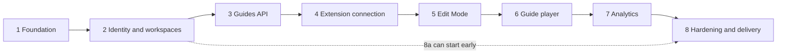

# Roadmap

Status on 2026-10-04: **Phases 1 and 2 are done; Phases 3–8 are Planned.** A phase closes when its exit criteria pass, its demo works and the verification is recorded in this roadmap and in the commit messages. Details: [product](product.md), [architecture](architecture.md), [technical risks](technical-risks.md), [data model](data-model.md), [API](api.md) and the [ADR index](adr/README.md).

## Why this order

- Identity (2) precedes guides (3): every guide row is tenant-owned (`workspace_id`), and retrofitting tenancy is how data leaks happen (R-17).
- Backend phases (2, 3) settle data and auth before the browser phases (4–6), which carry most of the risk register.
- The extension is connected (4) before Edit Mode (5) because authoring needs an authenticated save path and granted site access.
- The player (6) follows the builder so it is tested against descriptors captured from real pages; analytics (7) follows the player because events come from runs.

| Phase | Name                      | Status  | Milestones                                      |
| ----- | ------------------------- | ------- | ----------------------------------------------- |
| 1     | Foundation                | Done    | none                                            |
| 2     | Identity and workspaces   | Done    | 2a API + CI, 2b dashboard                       |
| 3     | Guides API and management | Planned | 3a API, 3b dashboard                            |
| 4     | Extension connection      | Planned | 4a auth handoff, 4b site access                 |
| 5     | Edit Mode (guide builder) | Planned | none                                            |
| 6     | Guide player              | Planned | 6a playback, 6b dynamic pages, 6c shadow/frames |
| 7     | Analytics                 | Planned | none                                            |
| 8     | Hardening and delivery    | Planned | 8a packaging, 8b security/ops, 8c distribution  |

## Phase 1 — Foundation

**Done (Implemented, Phase 1).** Goal: prove every communication path (API → PostgreSQL, dashboard → API, popup and content script → service worker → API) and record the decisions before any product feature exists.

Delivered:

- [x] Requirements, risk register R-01–R-19, architecture, data-model and API proposals, ADRs 0001–0015.
- [x] pnpm 12.9.1 monorepo (3 apps, 3 packages) with a version catalog and shared tsconfig/ESLint presets.
- [x] `packages/shared`: zod `HealthReport` and `ApiError` contracts with a source-first export condition ([ADR 0011](adr/0011-source-first-workspace-packages.md)).
- [x] `apps/api`: composition root `src/app.ts`, validated env, pino with redaction, pg Pool + Drizzle (empty schema), `GET /health` (200/503 from a database probe) and `GET /health/live`, `ApiError` envelope, graceful shutdown.
- [x] `compose.yaml`: PostgreSQL 18 on a loopback-only port with a healthcheck.
- [x] `apps/dashboard`: "System status" card through the same-origin `/api` proxy.
- [x] `apps/extension`: service worker as the only API caller, closed-shadow-root content script, Vue popup, zod message protocol, `host_permissions` pinned to the API origin.
- [x] `packages/ui`: `StatusBadge` and Tailwind v4 theme tokens.

Verification (at commit `21fa0ae`): `pnpm typecheck` and `pnpm lint` pass in all 6 projects; `pnpm test` runs 56 tests in 11 files; `pnpm test:e2e` passes dashboard 5/5 (axe: 0 violations) and extension 6/6 (including the hostile-page fixture) in Playwright's bundled Chromium 153; `/health` returned 200, 503 after `docker compose stop postgres`, then 200 again; the production build started with JSON logs and shut down cleanly on SIGTERM; `drizzle-kit check/generate/migrate` ran against PostgreSQL 18.6.

Out of scope: accounts, guides, picker, player, analytics, tables, CI, production images.

Carried forward: no CI (Phase 2); API tests use a fake database (Phase 2); `content.js` is ~89 kB (~26 kB gzip), mostly zod (Phase 5 budget); content script limited to the local dashboard origins `localhost:5173` and `localhost:4173` (customer origins in Phase 4).

Risks addressed (mitigation started): every risk whose [register](technical-risks.md#register) row lists 1 (baseline): R-01, R-02, R-03, R-05, R-09, R-10, R-11, R-12, R-13, R-14, R-15, R-16, R-17, R-18, R-19.

## Phase 2 — Identity and workspaces

**Done (Implemented, Phase 2).** Goal: a person registers, signs in, creates a workspace and adds members, behind sessions and CSRF protection later phases can trust.

2a — API and CI:

- [x] First migration `0000_identity`: `users`, `sessions`, `workspaces`, `workspace_members` (`uuidv7()` keys, roles as text + check, explicit constraint names).
- [x] `auth` module: `POST /v1/auth/register`, `/login`, `/logout`, `GET /v1/auth/session`; argon2id (`@node-rs/argon2`); opaque session token stored only as a SHA-256 hash; 30 min idle and 8 h absolute expiry; revocation on logout and on a new login; HttpOnly + Secure + SameSite=Strict cookie (`__Host-cl_session` in production).
- [x] CSRF guard on unsafe methods against the `DASHBOARD_ORIGIN` allow-list (dev: `http://localhost:5173` and `http://localhost:4173`; never compared with Host); `text/plain` bodies refused; `@fastify/rate-limit` on login (IP + email) and register (IP).
- [x] `workspaces` module with roles `owner | admin | editor | member`, member management and last-owner protection; non-members get 404.
- [x] Integration tests against a separate PostgreSQL database (`contextlayer_test`), including a tenant-isolation matrix; GitHub Actions running install, format, typecheck, lint, migrations, `drizzle-kit check`, unit + integration tests, build and both e2e suites.

2b — Dashboard:

- [x] vue-router with session guards and safe post-login redirects; sign-in and registration screens; first-workspace onboarding; workspace switcher; overview and member management pages; `/status` for the system status.
- [x] Component and unit tests for the forms, session state, route guards, API errors and workspace switching; Playwright flow with axe on every screen.

Changed from the plan:

- **No seed script.** Registering takes seconds and the e2e test creates its own account; a seeded demo password would be one more credential to keep out of production.
- **Registration creates no workspace.** The dashboard asks for the first workspace's name (onboarding) instead of inventing one.
- **No `workspaces.slug` or `users.email_verified_at`.** Nothing in this phase uses them ([data model 8](data-model.md#8-the-phase-2-first-migration)).
- **No global rate limit.** Only the public auth routes are limited; every other route requires a session.

Verification (at commit `e2e4816`): `pnpm format:check`, `pnpm typecheck` and `pnpm lint` pass; `pnpm test` runs 175 tests in 23 files, 51 of them API integration tests on PostgreSQL 18.6; `pnpm test:e2e` passes dashboard 8/8 (axe: 0 violations on the status, sign-in, registration, onboarding, overview and members screens) and extension 6/6; the migration applies to an empty database and `drizzle-kit check` is clean. A smoke run of the built API confirmed the cookie flags, 403 for a foreign `Origin`, 415 for `text/plain`, 401 after logout and after revoking the session in the database, argon2id hashes and 32-byte token hashes in the tables, 429 with `retry-after` after 10 login attempts, and no password or cookie value in the logs. CI runs the same checks on the pull request to `main`.

Out of scope (unchanged): email delivery (verification, reset), invitations, SSO, custom roles, extension auth, "log out everywhere" UI.

Carried forward: rate-limit store in memory (one API process; shared store in Phase 8); [ADR 0015](adr/0015-authentication-strategy.md) cookie behaviour verified in Chromium only (Firefox and Safari untested); expired and revoked session rows are never deleted (cleanup job, [data model open question 6](data-model.md#9-open-questions)); `content.js` size unchanged (Phase 5 budget).

Risks addressed: R-13 (dashboard half), R-17 (workspace membership), R-18 (CI gate). ADRs: [ADR 0015](adr/0015-authentication-strategy.md) Accepted for the dashboard after its spike items 2–3; [ADR 0005](adr/0005-drizzle-orm.md) held up with the first real migration (a `customType` for `bytea`, `uuidv7()` defaults, explicit constraint names).

## Phase 3 — Guides API and management

**Planned (Phase 3).** Depends on Phase 2. Goal: guides become tenant-owned data with ordered draft steps and immutable published versions, managed from the dashboard.

3a — API:

- [ ] Migration: `applications`, `guides`, `guide_steps`, `guide_versions`.
- [ ] `applications` module; `origins` validated as exact origins (scheme, host, port).
- [ ] `guides` module: CRUD; `PUT .../steps` replaces the ordered list in one transaction (deferrable unique position); `POST .../publish` freezes guide + steps into a snapshot.
- [ ] `TargetDescriptor` v1 and the restricted rich-text body as zod schemas in `packages/shared` (versioned, unknown versions rejected, lengths capped).
- [ ] Cursor pagination; role checks as in [API](api.md#4-modules-and-planned-endpoints) (Proposed: `member` reads applications; `editor` and above read and write guides; `admin` and above manage applications; learners receive published versions through the extension, Phase 4).

3b — Dashboard:

- [ ] Application and guide lists, guide detail, metadata and step-text editing, publish; `vue/no-v-html` raised from `warn` (already on through `flat/recommended`) to `error`, so `pnpm lint` fails on it.

Out of scope: target capture (Phase 5), playback (Phase 6), WYSIWYG editing, audience targeting.

Exit criteria:

- Contract tests validate every `/v1` request and response against `packages/shared`.
- Isolation matrix: for every route, a member of workspace A gets 404 on workspace B's IDs.
- Reordering is atomic: a failed `PUT .../steps` keeps the old order.
- Publishing twice yields versions 1 and 2; later draft edits leave both snapshots unchanged.
- Playwright: create application → create guide → edit steps → publish.

Risks: R-04 (versioned descriptor contract), R-11 (content validated on write), R-17. ADRs: accept the storage shape in [ADR 0014](adr/0014-element-targeting-strategy.md); revisit [ADR 0002](adr/0002-modular-monolith-backend.md) as modules multiply; new ADR: mutable drafts with immutable published snapshots.

## Phase 4 — Extension connection

**Planned (Phase 4).** Depends on Phases 2 and 3. Goal: the extension holds its own revocable tokens for one workspace and runs only on application origins the user granted.

4a — Auth handoff:

- [ ] Time-boxed spike, then ADR 0015 → Accepted.
- [ ] Manifest `key` generated locally with openssl (private key never committed) for a stable extension id; `externally_connectable` pinned to the dashboard origin; the service worker checks `sender.origin` and `state`.
- [ ] One-time code + PKCE: `POST /v1/extension/codes`, `/token`, `/revoke`; grant and token tables.
- [ ] Access token in `chrome.storage.session`; rotating refresh token in `chrome.storage.local` restricted to trusted contexts ([`setAccessLevel`](https://developer.chrome.com/docs/extensions/reference/api/storage#method-StorageArea-setAccessLevel), documented for every storage area since Chrome 102, so `minimum_chrome_version` stays at 120); reuse detection with a grace window.
- [ ] Dashboard "Connected browsers" page with revoke; workspace selection.

4b — Site access and lifecycle:

- [ ] `optional_host_permissions` requested in a user gesture; `chrome.scripting.registerContentScripts` driven by the service worker's `permissions.onAdded`, because [the popup can close when Chrome shows the prompt](https://issues.chromium.org/issues/40721470).
- [ ] On install and update: re-register dynamic scripts ([an update wipes them](https://github.com/chromium/chromium/blob/main/extensions/browser/user_script_manager.cc)) and inject into open tabs; orphaned scripts remove their UI.
- [ ] [Withheld access to the API origin removes the service worker's CORS bypass](https://github.com/chromium/chromium/blob/main/extensions/common/cors_util.cc): CORS allow-list for the pinned extension origin or a re-request (Proposed).
- [ ] `GET /v1/extension/guides?url=`.

Out of scope: Edit Mode, playback, `launchWebAuthFlow`, other browsers.

Exit criteria:

- Playwright: connect from the dashboard → popup shows the workspace; revoke → next API call gets 401 and the popup shows "disconnected".
- API tests: codes are single-use and expire; a wrong PKCE verifier fails; refresh reuse outside the grace window revokes the grant.
- Service worker stopped [through CDP](https://developer.chrome.com/docs/extensions/how-to/test/test-serviceworker-termination-with-puppeteer) (`Target.closeTarget` on the worker target, as in the linked guide; `ServiceWorker.stopAllWorkers` also works) → still signed in.
- A content script on a granted origin cannot read `chrome.storage.local`.
- Granting an origin injects into an already-open tab; reloading the extension leaves no orphaned UI.

Risks: R-01, R-02, R-03, R-12, R-13, R-14. ADRs: 0015 (above); revisit [ADR 0007](adr/0007-chrome-manifest-v3-extension.md) and [ADR 0012](adr/0012-service-worker-api-gateway.md) (`sender.origin`, `sender.tab`, frame checks); new ADR: per-application site access.

## Phase 5 — Edit Mode (guide builder)

**Planned (Phase 5).** Depends on Phases 3 and 4. Goal: an admin picks elements on a granted application and saves a draft whose targets carry enough signals to be found again.

- [ ] Side panel for step list, titles and instructions, so the host page cannot observe typing.
- [ ] Picker in the content script: hover highlight, click capture, Esc to cancel, promotion to the interactive ancestor.
- [ ] Descriptor capture per ADR 0014 (test attributes, filtered ids, role + accessible name, labels, text, structural path, match counts) with a "weak target" warning.
- [ ] Single-step preview; save through the service worker, which accepts privileged commands only from extension pages.
- [ ] Content-script size budget enforced by a build test (`zod/mini` or hand-written guards); zod `jitless` mode, since the MV3 CSP blocks its `new Function` probe.

Out of scope: picking inside shadow roots and iframes (6c), full playback, hand-edited selectors.

Exit criteria:

- Capture unit tests: generated ids (React `useId`, CSS Modules, CSS-in-JS hashes) are never used.
- Playwright: pick three elements, save, reload → the API returns three steps with v1 descriptors; a positional-only fixture shows the warning.
- A strict-CSP fixture (`style-src 'self'`) renders the picker; a forged `window.postMessage` has no effect.
- The build fails when `content.js` exceeds the budget.

Risks: R-04, R-09, R-10, R-11, R-15. ADRs: capture part of 0014 → Accepted; revisit [ADR 0013](adr/0013-shadow-dom-ui-isolation.md) (shadow-safe Tailwind vs plain CSS) and [ADR 0006](adr/0006-vue-3-frontend-framework.md); new ADR: side panel as authoring surface.

## Phase 6 — Guide player

**Planned (Phase 6).** Depends on Phases 4 and 5. Goal: an end user is walked through a published guide, or sees an explicit reason why a step cannot be shown.

- [ ] 6a: discovery for the current URL; resolution (candidates → weighted score → veto → minimum score and margin → visibility) with outcomes `resolved | ambiguous | not-found | wrong-page`, never guessing; highlight + popover (Floating UI) with Previous/Next/Finish; run state in `chrome.storage.session` keyed by tab id + run id; accessibility baseline (`role="dialog"`, `aria-live`, keyboard, reduced motion).
- [ ] 6b: MutationObserver waits (per root, throttled, ~10 s timeout); SPA navigation via the Navigation API; multi-page guides; bfcache; targets inside host modals.
- [ ] 6c: open and closed shadow roots (`chrome.dom.openOrClosedShadowRoot`) and iframes; cross-origin frames need their own host permission.

Out of scope: auto-healing (stored descriptors are never rewritten), branching guides, sending events (Phase 7).

Exit criteria:

- Playwright fixture corpus (generated ids, late rendering, `pushState`, bfcache, `showModal`, shadow roots, iframes): every step ends in its expected outcome; ambiguous fixtures are never auto-selected.
- Service worker stopped mid-guide → the run resumes at the same step.
- 0 axe violations on the player; a keyboard-only run completes.
- Demo: author, publish, play on the fixture app.

Risks: R-01, R-04–R-11, R-15, R-16. ADRs: calibrate 0014's thresholds; revisit 0013 (host modals, top layer); new ADR: SPA navigation detection (Navigation API vs `webNavigation` and its "Read your browsing history" warning).

## Phase 7 — Analytics

**Planned (Phase 7).** Depends on Phase 6. Goal: owners see starts, completion, drop-off per step and targets not found.

- [ ] `guide_runs` and append-only `guide_events`.
- [ ] Extension queue in `chrome.storage.local`, flushed in batches by `chrome.alarms` (re-created on update) or the next event.
- [ ] `POST /v1/analytics/events` (unique `clientEventId` makes retries harmless) and the per-guide analytics endpoint.
- [ ] Abandonment = explicit dismissal or an inactivity window (Proposed); dashboard charts per published version.

Out of scope: real-time views, exports, BI integrations, partitioning before volume requires it.

Exit criteria: a batch posted twice stores each event once; events recorded while the API is down arrive after restart; aggregates over a seeded dataset match expected numbers; a Playwright run abandoned at step 2 appears on the dashboard as one start, no completion, drop-off at step 2.

Risks: R-01, R-12, R-17. ADRs: revisit 0002 (ingestion is the first extraction candidate, only on measured load) and [ADR 0004](adr/0004-postgresql-primary-database.md) (partitioning); new ADR: aggregation on read vs rollup tables.

## Phase 8 — Hardening and delivery

**Planned (Phase 8).** Depends on Phases 2–7; 8a can start after Phase 2. Goal: anyone can deploy ContextLayer on any provider and distribute the extension to a company.

- [ ] 8a: API Dockerfile, static dashboard behind a reverse proxy routing `/api/*`, migrations as a one-off job ([deployment](deployment.md)).
- [ ] 8b: threat model, CSP review, dependency audit, content-script budget in CI, metrics and tracing, backups.
- [ ] 8c: per-environment extension builds; unlisted Chrome Web Store item or enterprise policy (`ExtensionInstallForcelist`, self-hosted update manifest).

Out of scope: multi-region, high availability, provider-specific code.

Exit criteria: the e2e suite passes against the production-shape stack; `pnpm audit` has no unresolved high or critical findings; a backup restores into an empty database and `/health` returns 200; an extension force-installed by policy reaches that stack.

Risks: R-10, R-11, R-14, R-15, R-18, R-19. ADRs: revisit [ADR 0008](adr/0008-local-first-development.md) and 0007; new ADRs: observability, distribution channel.

## Working agreements

- Small, reviewed commits, each green on its own; pull requests to `main` once CI exists.
- One ADR per significant decision; Proposed becomes Accepted only after implementation or a spike; replaced ADRs are superseded, not rewritten.
- Each commit message says what was verified, or "not run" and why.
- No feature without tests: unit tests for logic, Playwright for every cross-context path.
- Docs change with the code, in the same commit (endpoints, tables, permissions, phase status).

## Deferred ideas (outside the MVP)

| Idea                                     | Why deferred                                                                                          | Revisit when                                     |
| ---------------------------------------- | ----------------------------------------------------------------------------------------------------- | ------------------------------------------------ |
| AI-assisted authoring                    | MVP non-goal; a hosted model conflicts with local-first.                                              | Real guides and a stable targeting corpus exist. |
| Selector auto-healing                    | Silently rewriting descriptors hides failures; Phase 6 reports instead of guessing.                   | `target_not_found` data shows fixable patterns.  |
| Firefox and Safari                       | Separate platforms and stores; `storage.setAccessLevel` is session-only in Safari, absent in Firefox. | Chrome users need another browser.               |
| Integrations (SSO, Slack, LMS, webhooks) | No users yet; each adds auth surface.                                                                 | A concrete adopter needs one.                    |
| Advanced roles                           | Four fixed roles cover the personas.                                                                  | Separation of duties exceeds them.               |
