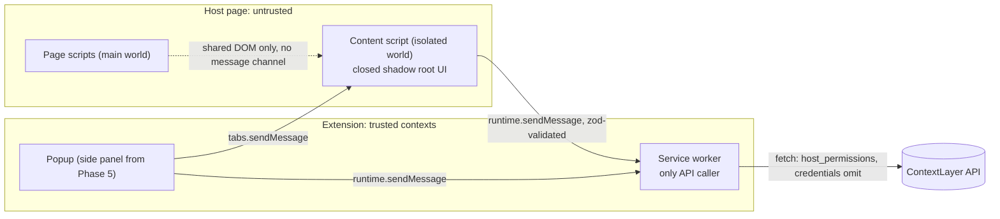

# Technical risks

Status on 2026-10-04: Phase 1 (Foundation) is done. This register lists ContextLayer's technical risks, what Phase 1 already does about each and what later phases must do; [architecture](architecture.md), the [roadmap](roadmap.md) and the [ADRs](adr/README.md) cite these IDs. Chrome facts were checked on 2026-10-04 (Chrome 154 stable); facts resting on Chromium source or third-party reports are marked "medium confidence".

## Method

- **Likelihood (1–3):** 1 = rare on the business apps ContextLayer targets; 2 = plausible on some apps or settings; 3 = expected on most apps or every install.
- **Impact (1–3):** 1 = developer friction; 2 = a step or feature degrades visibly; 3 = ContextLayer stops working on a site, or a security, privacy or tenant boundary breaks.
- **Addressed in phase:** [roadmap](roadmap.md) phases that deliver the mitigation; "1 (baseline)" means Phase 1 ships part of it.
- **Status:** `open` (main mitigation not built), `mitigated-in-phase-1` (today's code handles the risk for today's features and is tested), `accepted` (residual risk taken knowingly and monitored).
- Mitigations are labelled **Implemented (Phase 1)**, **Planned (Phase N)** or **Proposed** (not decided).

## Trust boundaries

The host page is untrusted, and so is the renderer running the content script inside it: a compromised page can forge content-script messages. Only the service worker reaches the API, and from Phase 4 only it holds tokens ([ADR 0012](adr/0012-service-worker-api-gateway.md)).

## Register

| ID   | Risk                                                                                                             | Likelihood | Impact | Addressed in phase       | Status               |
| ---- | ---------------------------------------------------------------------------------------------------------------- | ---------- | ------ | ------------------------ | -------------------- |
| R-01 | MV3 service-worker termination and lost in-memory state                                                          | 3          | 2      | 1 (baseline), 4, 7       | mitigated-in-phase-1 |
| R-02 | Content scripts not injected into already-open tabs; orphaned scripts after update                               | 3          | 2      | 1 (baseline), 4          | mitigated-in-phase-4 |
| R-03 | Host permissions: install warnings, user-withheld site access, enterprise policies                               | 3          | 3      | 1 (baseline), 4, 8       | mitigated-in-phase-4 |
| R-04 | Fragile element targeting (dynamic classes/ids, re-renders, A/B variants)                                        | 3          | 3      | 5, 6                     | open                 |
| R-05 | SPA navigation without reloads                                                                                   | 3          | 2      | 1 (baseline), 6          | open                 |
| R-06 | Dynamic DOM / late rendering / virtualized lists (MutationObserver cost)                                         | 3          | 2      | 6, 8                     | open                 |
| R-07 | Shadow DOM targets (open/closed)                                                                                 | 2          | 2      | 5, 6                     | open                 |
| R-08 | iframes and cross-origin frames                                                                                  | 2          | 2      | 6                        | open                 |
| R-09 | CSS isolation and style conflicts (inheritance, rem, z-index, stacking, fonts, Tailwind @property)               | 3          | 2      | 1 (baseline), 5, 6       | open                 |
| R-10 | Page CSP / Trusted Types affecting injected UI                                                                   | 2          | 2      | 1 (baseline), 5, 6       | open                 |
| R-11 | Security of injected UI (stored XSS via guide content, clickjacking/spoofing by host page, forged page messages) | 2          | 3      | 1 (baseline), 3, 4, 5, 6 | open                 |
| R-12 | Extension ↔ backend communication (CORS, Local Network Access, offline/timeouts, idempotency)                    | 2          | 2      | 1 (baseline), 4, 7       | mitigated-in-phase-1 |
| R-13 | Authentication and token storage in the extension                                                                | 2          | 3      | 1 (baseline), 2, 4       | mitigated-in-phase-4 |
| R-14 | Chrome platform churn (2-week release cadence, API rollouts)                                                     | 2          | 2      | 1 (baseline), 2, 8       | accepted             |
| R-15 | Content-script bundle size/performance on every page                                                             | 2          | 2      | 1 (baseline), 5, 8       | open                 |
| R-16 | Accessibility of injected UI (focus, screen readers, reduced motion)                                             | 2          | 2      | 1 (baseline), 6          | open                 |
| R-17 | Multi-tenant data isolation                                                                                      | 2          | 3      | 1 (baseline), 2, 3, 7    | open                 |
| R-18 | Toolchain pre-1.0 / fast-moving dependencies (Drizzle 0.x, pnpm 12, TS 6 vs 7)                                   | 3          | 1      | 1 (baseline), 2, 8       | accepted             |
| R-19 | Chrome Web Store / enterprise distribution policies                                                              | 2          | 2      | 1 (baseline), 7, 8       | open                 |

## Risk details

### R-01 Service-worker termination and lost in-memory state

- **Scenario:** a learner reads step 3 for 40 s and Chrome stops the idle worker; run state kept in a module variable is lost and the guide restarts.
- **Facts:** the worker stops after 30 s idle, after 5 min on one event, or when a `fetch()` response takes over 30 s; timers die with it ([lifecycle](https://developer.chrome.com/docs/extensions/develop/concepts/service-workers/lifecycle)). Promise-returning `onMessage` listeners only began a gradual rollout in Chrome 148 ([messaging](https://developer.chrome.com/docs/extensions/develop/concepts/messaging)).
- **Mitigation:** Implemented (Phase 1): `apps/extension/src/background/index.ts` registers listeners at top level, keeps no state in globals, replies with `return true` + `sendResponse` and uses static imports only; `api-client.ts` times out after 5 s. Implemented (Phase 4): tokens, the PKCE attempt, enabled sites and authorized pages live in `chrome.storage` ([ADR 0015](adr/0015-authentication-strategy.md)); listeners for install, start, permissions and external messages are registered at top level. Planned (Phase 6): run state keyed by tab id + run id (`documentId` changes on every full navigation). Planned (Phase 7): event queue in `storage.local`, flushed by `chrome.alarms` (30 s minimum period), idempotent event ids (R-12).
- **Verification:** Phase 4 e2e stops the worker with CDP `Target.closeTarget` ([documented method](https://developer.chrome.com/docs/extensions/how-to/test/test-serviceworker-termination-with-puppeteer)) and checks that the connection and enabled sites survive, and separately an extension reload and a browser restart (`apps/extension/e2e/{connection,site}.spec.ts`). The spike measured that a fetch in flight when the worker stops is lost (consequence for token rotation in ADR 0015). Planned (Phase 6): stop it mid-guide and assert the run resumes.

### R-02 Content scripts missing in open tabs; orphaned scripts after update

- **Scenario:** ContextLayer is installed or updated with the CRM open: nothing runs until reload, and the old script keeps running, disconnected.
- **Facts:** manifest content scripts are not injected into tabs open at install, update or reload; the orphan's extension API calls throw "Extension context invalidated" ([content scripts](https://developer.chrome.com/docs/extensions/develop/concepts/content-scripts)). Updates also wipe dynamically registered scripts and alarms ([Chromium `state_store.cc`](https://github.com/chromium/chromium/blob/main/extensions/browser/state_store.cc)). "Receiving end does not exist" means no listener in the target. An open side panel delays updates ([update lifecycle](https://developer.chrome.com/docs/extensions/develop/concepts/extensions-update-lifecycle)).
- **Mitigation:** Implemented (Phase 1): `src/messaging/background-client.ts` maps an invalidated context to `INTERNAL_ERROR`; `src/popup/active-tab.ts` treats a missing receiver as `NOT_AVAILABLE`; the content script registers its listener before touching the DOM and keeps a UI host only while a toast is visible, so an orphan leaves nothing behind. Implemented (Phase 4, [ADR 0017](adr/0017-per-application-site-access.md)): on `runtime.onInstalled` and `onStartup` the worker re-registers enabled sites and injects into their open tabs; a guard makes a second copy in the same world a no-op; an orphan checks `chrome.runtime.id` on `visibilitychange`/`pageshow` and stops; a new copy removes UI hosts an orphan left. Planned (Phase 5): on `runtime.onUpdateAvailable`, save the draft and reload.
- **Verification:** Phase 4 e2e (`apps/extension/e2e/site.spec.ts`): turning a site on injects into tabs already open; a second injection leaves one live instance; after an extension reload the new copy runs and the orphan stops when the page is shown again.

### R-03 Host permissions

- **Scenario:** an `<all_urls>` grant shows the strongest install warning and IT refuses it; or a user sets site access to "on click", withholding both the CRM grant and the API grant.
- **Facts:** `host_permissions` warn at install, and an update adding a warning disables the extension until accepted; `optional_host_permissions` are requested at runtime inside a user gesture ([declare permissions](https://developer.chrome.com/docs/extensions/develop/concepts/declare-permissions)). Users can withhold any grant; `permissions.addHostAccessRequest` (Chrome 133+) asks again. A pattern without a port matches every port ([match patterns](https://developer.chrome.com/docs/extensions/develop/concepts/match-patterns)), and content-script `matches` grant host access too (verified with `chrome.permissions.getAll()`). Enterprise policy can force-install and allow or block hosts ([ExtensionSettings](https://support.google.com/chrome/a/answer/9867568)).
- **Mitigation:** Implemented (Phase 1): host access pinned to the exact API origin. Implemented (Phase 4, [ADR 0017](adr/0017-per-application-site-access.md)): no static content scripts; `optional_host_permissions` requested from the popup click for one exact origin (port pinned) and only for registered applications; the worker reconciles registrations on `permissions.onAdded`/`onRemoved`, install and start; withheld access to the API origin is detected with `permissions.contains` and explained in the popup. Since the Phase 4 review, "Turn on" is a pending request held by the worker, so it completes even if the popup closes while Chrome's prompt is open, and a grant nobody asked for turns nothing on. Planned (Phase 8): enterprise force-install.
- **Verification:** `apps/extension/test/build/manifest.test.ts` asserts the grants; `test/site-access.test.ts` covers every state with a fake Chrome; the e2e suite turns a site on and off and withdraws and restores access through the real `chrome://extensions` toggle. Chrome's own prompt was not automated in this harness; JJ checked Allow and Deny by hand in Chrome 153 (ADR 0017).

### R-04 Fragile element targeting

- **Scenario:** a step targets `#save-7f3a9c21`; a deploy regenerates the id, or an A/B variant shows two "Save" buttons and the wrong one is highlighted, which is worse than none.
- **Facts:** generated ids change across framework versions (React `useId`: `:r1:`, `«r1»`, `_r_1_` in 19.0–19.2) and CSS-in-JS hashes class names. Playwright's selector generator ranks test ids first and nth-based paths last ([source](https://github.com/microsoft/playwright/blob/main/packages/injected/src/selectorGenerator.ts)); weighted multi-attribute matching (Similo) failed 72 of 598 relocations versus 146 for the multi-locator voting baseline (Leotta et al.'s LML) ([paper](https://arxiv.org/abs/2208.00677)); Appcues refuses non-unique selectors ([docs](https://docs.appcues.com/dev-troubleshooting/css-selectors)).
- **Mitigation:** Implemented (Phase 3): the TargetDescriptor v1 contract and its storage (`packages/shared/src/target-descriptor.ts`, `guide_steps.target`), strict and size-bounded, unknown versions rejected. Proposed ([ADR 0014](adr/0014-element-targeting-strategy.md)): a versioned `TargetDescriptor` in `guide_steps.target` ([data model](data-model.md)) with test attributes, filtered ids, role + accessible name, text, structural path, anchors, frame and shadow paths. Resolution scores candidates, vetoes contradictions, requires a minimum score and gap to the runner-up, and records `resolved`, `ambiguous`, `not-found` or `wrong-page` instead of guessing. Planned (Phase 5): capture with generated-id filters, weak-target warnings and redaction of emails and digit runs. Planned (Phase 6): resolver.
- **Verification:** Planned: a fixture corpus (regenerated ids, hashed classes, duplicates, variants) with expected outcomes, used to calibrate the starting thresholds (score 0.65, gap 0.15).

### R-05 SPA navigation without reloads

- **Scenario:** a click on "Invoices" changes the URL through `history.pushState`; there is no page load and step 2 stays anchored to the previous view.
- **Facts:** the Navigation API (Chrome 102, Baseline January 2026) fires `navigate` for links, traversals and `pushState`/`replaceState`, and works from an isolated-world content script with no permission ([Navigation API](https://developer.chrome.com/docs/web-platform/navigation-api)). Patching `pushState` from the isolated world misses the page's calls (each world has its own JS wrappers); `webNavigation` would add a history warning. Since Chrome 123, entering the back/forward cache closes extension ports ([bfcache](https://developer.chrome.com/blog/bfcache-extension-messaging-changes)).
- **Mitigation:** Implemented (Phase 1): the UI host lives on `document.documentElement`, not `<body>`, and is re-created if removed (`src/content/overlay.ts`). Planned (Phase 6): on `currententrychange` (fallback: polling `location.href`) abort resolution, re-check the step's URL pattern, resolve again; reconnect on `pageshow`; run state outside the document (R-01).
- **Verification:** Planned: an SPA fixture (`pushState`, `replaceState`, hash, back/forward) with a multi-view guide.

### R-06 Dynamic DOM, late rendering and virtualized lists

- **Scenario:** the target row appears 3 s after an XHR, a re-render replaces the anchored button, or a virtualized table renders only visible rows. A document-wide observer that re-resolves on every mutation burns CPU.
- **Facts:** mutation records reach observers only on the node's inclusive ancestors, so a document-level `subtree` observer misses shadow roots ([DOM spec](https://dom.spec.whatwg.org/#queueing-a-mutation-record)). `checkVisibility()` does not mean in-viewport; Playwright requires visible, stable over two frames, receiving events and enabled ([actionability](https://playwright.dev/docs/actionability)).
- **Mitigation:** Proposed (ADR 0014), Planned (Phase 6): one `MutationObserver` per shadow root on the path plus the narrowest container, at most one resolution attempt per ~150 ms, 10 s timeout, an `AbortController` per step, disconnect on success, step change or navigation; `isConnected` checks with a 1–2 s re-resolve grace; a scroll hint for virtualized rows. Planned (Phase 8): performance budget.
- **Verification:** Planned: delayed-render, node-replacement and virtualized-list fixtures; a performance trace on a mutation-heavy page.

### R-07 Shadow DOM targets

- **Scenario:** the button sits in a web component's closed shadow root; `querySelector` finds nothing and the admin's click reports the host.
- **Facts:** selectors do not cross shadow boundaries, events retarget to the host, and `composedPath()` stops at a closed host. `chrome.dom.openOrClosedShadowRoot()` (Chrome 88+, no permission) exposes open and closed roots to content scripts ([chrome.dom](https://developer.chrome.com/docs/extensions/reference/api/dom)). XPath does not pierce shadow roots ([Playwright](https://playwright.dev/docs/locators)).
- **Mitigation:** Planned (Phase 5): the picker descends with `openOrClosedShadowRoot` + `shadowRoot.elementFromPoint` (medium confidence, untested) and stores a `shadowPath` with each hop's mode; XPath only for light DOM. Planned (Phase 6): the resolver walks and observes each root (R-06).
- **Verification:** Phase 1 e2e covers ContextLayer's own closed root. Planned: open, closed and nested fixtures, asserted through highlight geometry (Playwright cannot pierce closed roots).

### R-08 iframes and cross-origin frames

- **Scenario:** an ERP form lives in an iframe from `forms.erp.example`; the top-frame script cannot read it, and without a grant for that origin nothing runs inside.
- **Facts:** content scripts are injected per frame by URL match (`all_frames` off by default); a cross-origin frame needs a grant for its own origin, `activeTab` covers only the top origin, and `about:blank`/`srcdoc` frames need `match_about_blank` or `match_origin_as_fallback` ([manifest](https://developer.chrome.com/docs/extensions/reference/manifest/content-scripts)). Frames coordinate through the worker with `tabs.sendMessage` and `frameId`/`documentId` ([tabs](https://developer.chrome.com/docs/extensions/reference/api/tabs#method-sendMessage)). `window.postMessage` is unsafe: page listeners see every message, and page-sent events are `isTrusted: true` (tested in Chrome 154).
- **Mitigation:** Planned (Phase 6): same-origin frames via `allFrames`, a `framePath` of URL pattern + iframe name/title/src, UI rendered inside the target frame, frame-targeted messages. Proposed: cross-origin frames added to an application's `origins` for the Phase 4 grant flow.
- **Verification:** Planned: same-origin, cross-origin (second localhost port) and `srcdoc` fixtures.

### R-09 CSS isolation and style conflicts

- **Scenario:** the host app sets `html { font-size: 10px }`, a global colour reset and a sticky header at `z-index: 99999`; the card shrinks, inherits colours or hides under the header.
- **Facts:** `rem` follows the document root even in shadow trees; `all` does not reset custom properties or `direction`. Page rules matching the host beat a plain `:host` rule; only `!important` wins ([CSS Cascade 5](https://drafts.csswg.org/css-cascade-5/#cascade-context)). `@property` and `@font-face` are ignored in shadow roots, so Tailwind 4 shadow and ring utilities compute to `none` (measured in Chromium 153; [tailwindcss#15005](https://github.com/tailwindlabs/tailwindcss/issues/15005)). The Popover API top layer escapes z-index and overflow, but a page's `showModal()` makes everything outside the dialog inert, popovers included ([whatwg/html#10811](https://github.com/whatwg/html/issues/10811)).
- **Mitigation:** Implemented (Phase 1, `src/content/overlay.ts`, [ADR 0013](adr/0013-shadow-dom-ui-isolation.md)): a `
` host on `documentElement`, closed shadow root, `:host { all: initial !important }`, constructable stylesheet, px units, system fonts, `popover="manual"`. Planned (Phase 5/6): explicit `direction` and variables on `:host`; a build transform turning Tailwind `@property` into declarations and `rem` into px (hoisting `@property` into the page could clash with the host's own Tailwind); moving the host into a modal dialog that contains the target.
- **Verification:** Phase 1 e2e asserts the closed root. Planned: a hostile-CSS fixture (root font size, resets, RTL, `showModal`) asserting computed styles, not only screenshots.

### R-10 Page CSP and Trusted Types

- **Scenario:** a bank app sends `style-src 'self'; require-trusted-types-for 'script'`; UI injected through `<style>` or `innerHTML` from the page's world would break.
- **Facts (medium confidence, Chromium source):** a `<style>` added from the isolated world is checked against the isolated world's CSP; constructable stylesheets and `element.style` are not CSP-gated; Trusted Types are not enforced in isolated worlds; none of this holds in the MAIN world ([`style_element.cc`](https://github.com/chromium/chromium/blob/main/third_party/blink/renderer/core/css/style_element.cc), [Trusted Types wiki](https://github.com/w3c/trusted-types/wiki/Effects-of-deploying-Trusted-Types-on-browser-extension-developers)). Remote fonts or images in injected CSS can be blocked. MV3 forbids `unsafe-eval` in extension pages and remotely hosted code, including interpreters of fetched commands ([MV3 requirements](https://developer.chrome.com/docs/webstore/program-policies/mv3-requirements)).
- **Mitigation:** Implemented (Phase 1): isolated world only; styles via `adoptedStyleSheets`; text via `textContent`; no remote assets; no `web_accessible_resources`; precompiled Vue templates. Gap: zod 4 probes `new Function` unless `z.config({ jitless: true })` is set, and `content.js` contains the probe. Planned (Phase 5): set `jitless` in every extension entry point.
- **Verification:** Planned: a strict-CSP fixture (`default-src 'self'; require-trusted-types-for 'script'`) asserting the UI renders with no `securitypolicyviolation` event.

### R-11 Security of injected UI

- **Scenario:** an editor saves `` as instructions and the player renders HTML: script runs in the customer's origin with the learner's session. Or the page imitates the card to phish, clicks "Next" by script, or posts a forged "start guide" message.
- **Facts:** event-handler attributes created by a content script compile in the page's MAIN world ([Chromium source](https://github.com/chromium/chromium/blob/main/third_party/blink/renderer/bindings/core/v8/js_event_handler_for_content_attribute.h)). A closed shadow root isolates style, not security: UI events are composed and the page can overlay or imitate the card. `click()` and `dispatchEvent()` give `isTrusted: false`; page `postMessage` events do not. Content-script messages may be attacker-crafted ([stay secure](https://developer.chrome.com/docs/extensions/develop/security-privacy/stay-secure)).
- **Mitigation:** Implemented (Phase 1, commit `13844ac`): `textContent` only; no page ↔ content-script channel, no MAIN-world code; a built-in `
` host, because a page that predefines a custom-element tag can reach a closed root through `ElementInternals`; no version attribute; host mounted only while visible. `src/background/handle-message.ts` classifies senders (extension page by its own origin, content script by tab) and allow-lists request types per context. Implemented (Phase 3): restricted rich-text AST with https-only links, validated on write (`packages/shared/src/rich-text.ts`), rendered in the dashboard with text nodes only, `vue/no-v-html` as an error. Planned: content scripts limited to guides for `sender.origin` and analytics (Phase 4); authoring in the side panel, away from page keystroke listeners (Phase 5); progress only from `isTrusted` events (Phase 6).
- **Verification:** Phase 1 unit tests for sender classification; e2e on a page that patches `attachShadow` and predefines `contextlayer-root`. Phase 3: contract tests reject HTML blocks, extra keys (`onclick`), `javascript:` and `http:` links and control characters; a component test renders `<script>` text as text. Planned: the same in the injected player; scripted "Next" clicks do not advance.

### R-12 Extension ↔ backend communication

- **Scenario:** a content script on `https://crm.example.com` calls `http://localhost:3000` itself: it needs open CORS and triggers a Local Network Access prompt in the CRM's name. Or the API stalls, the worker dies, and a retry stores an event twice.
- **Facts:** content-script fetches act for the page origin under CORS; the worker and extension pages bypass CORS for `host_permissions` origins ([network requests](https://developer.chrome.com/docs/extensions/develop/concepts/network-requests)). Since Chrome 142, public pages reaching local addresses prompt, and non-secure ones are blocked ([LNA](https://developer.chrome.com/blog/local-network-access)); extension contexts with host permissions are reported exempt from Chrome 144 (medium confidence). Withheld site access removes the CORS bypass. Measured in the Phase 4 spike: worker POSTs send `Origin: chrome-extension://<id>` and `Sec-Fetch-Site: none`, GETs no `Origin`.
- **Mitigation:** Implemented (Phase 1, ADR 0012): `src/background/api-client.ts` is the only API caller (`credentials: 'omit'`, 5 s timeout, shared-schema validation, 503 accepted), and `src/background/handle-message.ts` maps its failures to `API_UNREACHABLE`. The dashboard uses same-origin `/api`, so the API has no CORS. Implemented (Phase 4): bearer tokens (R-13), one message type per capability (no open proxy), `redirect: 'error'`, requests only to paths on the API origin, withheld-access detection. Proposed: CORS for the pinned `chrome-extension://<id>` origin as a fallback. Planned (Phase 7): persistent queue, batches keyed by `clientEventId` ([API](api.md)).
- **Verification:** Phase 1 e2e (popup and content script → SW → API) and failure-mapping unit tests. Planned: a resubmitted batch stores each event once.

### R-13 Authentication and token storage

- **Scenario:** a refresh token in `chrome.storage.local` is read through a compromised content script. Or the worker dies between server-side rotation and saving the new token; the replay trips reuse detection and signs the user out.
- **Facts:** `storage.session` is in memory and trusted-contexts-only by default; `storage.local` is readable by content scripts unless `setAccessLevel({ accessLevel: 'TRUSTED_CONTEXTS' })` is called, which Chrome's reference documents for every storage area, `local` included (`AccessLevel` since Chrome 102; [storage](https://developer.chrome.com/docs/extensions/reference/api/storage#method-StorageArea-setAccessLevel)). Extension requests get same-site cookie treatment only while third-party cookies are allowed ([cookies](https://developer.chrome.com/docs/extensions/develop/concepts/storage-and-cookies)). Public clients must use PKCE, and their refresh tokens must be either sender-constrained (for example DPoP, RFC 9449) or rotated with reuse detection. ContextLayer picks rotation because DPoP adds key management to a service worker that can stop at any time, and keeps DPoP as later hardening ([RFC 9700](https://www.rfc-editor.org/rfc/rfc9700.html)).
- **Mitigation:** Implemented (Phase 1): the extension omits cookies; the API logger redacts `authorization`, `cookie` and `set-cookie` (`apps/api/src/logger.ts`). Implemented (Phase 2, [ADR 0015](adr/0015-authentication-strategy.md) Accepted for the dashboard): dashboard sessions in HttpOnly, Secure, SameSite=Strict cookies (token stored only as a SHA-256 hash, argon2id passwords, idle and absolute expiry, revocation) with an Origin/Fetch-Metadata CSRF guard and auth rate limits; database errors are logged without their bound values. Implemented (Phase 4, ADR 0015 Accepted): one-time code + PKCE handoff through `externally_connectable` (exact dashboard origin, top frame, the attempt's tab, `state`, single use), access token in `storage.session`, refresh token in `storage.local` restricted to trusted contexts (the spike showed the restriction persists across worker and browser restarts), strict rotation with reuse detection and no grace window. The scenario above (worker dies between rotation and save) now ends the connection on purpose; the user connects again. After the Phase 4 review, an explicit life cycle (ADR 0015) also stops late answers from installing, overwriting or clearing a connection the user disconnected, cancelled or replaced meanwhile.
- **Verification:** Implemented (Phase 2): integration tests for cookie flags, stored hashes, expiry, revocation, session fixation, CSRF and rate limits; an e2e check that the session is invisible to page scripts and web storage. Implemented (Phase 4): integration tests for code expiry and replay, PKCE mismatch, rotation, reuse, concurrent refreshes and revocation; unit tests for single flight, no 401 loops and late answers; e2e: a content script cannot read `storage.local` or `storage.session`, the connect flow with the stable id, a lost refresh answer ending the connection.

### R-14 Chrome platform churn

- **Scenario:** a release changes an API for part of the users, or automation stops loading the extension.
- **Facts:** Chrome ships every two weeks since Chrome 153 ([schedule](https://chromiumdash.appspot.com/fetch_milestone_schedule?offset=-4&n=6)); features roll out gradually (Promise-returning `onMessage`, Chrome 148); branded Chrome ignores `--load-extension` since Chrome 137 ([Playwright](https://playwright.dev/docs/chrome-extensions)).
- **Mitigation:** Implemented (Phase 1): stable APIs only, explicit `minimum_chrome_version` (120), e2e on Playwright's bundled Chromium (`channel: 'chromium'` in `apps/extension/e2e/fixtures.ts`). Implemented (Phase 2): extension e2e in CI. Planned: raise the minimum only when a specific API requires it, recording that API and its version. Accepted: residual churn, tracked through Chrome release notes.
- **Verification:** CI e2e on every Playwright upgrade, which brings a newer Chromium.

### R-15 Content-script bundle size and per-page cost

- **Scenario:** once customer domains are enabled, `content.js` is parsed on every page load of those apps, even without a matching guide.
- **Facts:** the Phase 1 `content.js` is 89 kB minified (about 26 kB gzip), mostly zod. A measured variant with Vue, one SFC and zod reached 139.6 kB (46 kB gzip); Tailwind added about 21 kB.
- **Mitigation:** Implemented (Phase 1): size measured and recorded as tech debt in this register; framework-free in-page UI; no DOM work at load. Planned (Phase 5): `zod/mini` or hand-written guards in the content script; Vue in-page only where a feature needs it ([ADR 0006](adr/0006-vue-3-frontend-framework.md)). Planned (Phase 8): a size budget enforced in CI.
- **Verification:** Planned: CI fails above the budget; page-load traces with and without the extension.

### R-16 Accessibility of injected UI

- **Scenario:** a screen-reader user never hears the step text because focus stays in the page, or the card covers the focused target.
- **Facts:** ARIA id references cannot cross shadow boundaries; showing a popover does not move focus; WCAG 2.4.11 (AA) requires the focused component not to be entirely hidden by author-created content, and 2.4.12 (AAA) not even partly ([understanding 2.4.11](https://www.w3.org/WAI/WCAG22/Understanding/focus-not-obscured-minimum.html)).
- **Mitigation:** Implemented (Phase 1): the toast has `role="status"`. Planned (Phase 6): a non-modal `role="dialog"` card labelled by the step title, an `aria-live="polite"` announcer, no focus stealing, a `chrome.commands` shortcut into the card, Esc with focus restore, `prefers-reduced-motion`, placement that never covers the target. Proposed: an open shadow root in e2e builds so axe can audit it.
- **Verification:** Planned: keyboard-only and axe e2e on a player fixture.

### R-17 Multi-tenant data isolation

- **Scenario:** an editor in workspace A swaps a guide id in a request and reads workspace B's guide, or forged analytics pollute another workspace.
- **Facts:** tables queried by tenant carry `workspace_id`, and child tables (`guide_steps`, `guide_versions`, token tables) are reached only through a tenant-checked parent ([data model 3.8](data-model.md#38-tenant-isolation)); extension guide lookup is scoped to the grant's workspace ([API](api.md)); content-script analytics can be forged for any guide shown on that origin.
- **Mitigation:** Implemented (Phase 1): the module convention (routes → service → repository, [ADR 0002](adr/0002-modular-monolith-backend.md)) that gives each module one place for tenant checks; the `health` module needs no repository. Implemented (Phase 2): membership-based authorization in the `workspaces` service; non-members get the same 404 as a missing workspace; roles checked under a workspace row lock. Implemented (Phase 3): every content query is scoped by `workspace_id` (steps and versions only through a guide of the workspace); a composite foreign key keeps a guide's application in the same workspace; cross-tenant ids return the same 404 as missing ones. Planned (Phase 7): ingestion verifies guide and step ids against the grant's workspace. Proposed: PostgreSQL row-level security as defence in depth.
- **Verification:** Implemented (Phase 2): a tenant-isolation matrix (owner, member, other tenant, no membership, anonymous × read, list members, add, change role, remove) and a check that a foreign workspace answers exactly like a missing one. Implemented (Phase 3): a matrix over every content route (owner, admin, editor, member, other tenant, no membership, anonymous × 11 operations), a check that another workspace's ids inside your own workspace's URLs answer exactly like random ids, a database test of the composite foreign key, and an e2e check that another tenant gets 404 for a guide URL.

### R-18 Pre-1.0 and fast-moving toolchain

- **Scenario:** `pnpm add -D typescript` pulls TypeScript 7, which typed linting cannot run on; Drizzle 1.0 changes APIs; a package published today fails install.
- **Facts:** `typescript@latest` is 7.0.2 while typescript-eslint 8.71 supports `<6.1.0`; Drizzle ORM 1.0 is a release candidate; pnpm 12 rejects versions younger than 24 h (an exact pin of a too-new version is instead added to `minimumReleaseAgeExclude` unless `minimumReleaseAgeStrict` is set) and unreviewed build scripts ([pnpm settings](https://pnpm.io/settings)).
- **Mitigation:** Implemented (Phase 1): versions pinned in the `catalog:` of `pnpm-workspace.yaml` (`typescript: ~6.0.3`), committed lockfile, `allowBuilds` limited to esbuild, `minimumReleaseAgeStrict: true` (a too-young version fails the install instead of being excluded silently), quirks recorded in the ADRs and commit messages. Implemented (Phase 2): CI gate (every check on each pull request). Accepted: upgrade cost, paid deliberately.
- **Verification:** `pnpm typecheck`, `pnpm lint`, `pnpm test` and `pnpm test:e2e` on every upgrade.

### R-19 Chrome Web Store and enterprise distribution

- **Scenario:** a store review rejects ContextLayer for broad permissions or undisclosed data collection, or a company cannot install it outside the store.
- **Facts:** since 2026-08-01 collected data must be strictly necessary for the single purpose and prominently disclosed ([policy update](https://developer.chrome.com/blog/cws-policy-updates-2026)); on Windows and macOS, off-store installs work only through enterprise policy ([install docs](https://developer.chrome.com/docs/extensions/how-to/distribute/install-extensions)).
- **Mitigation:** Implemented (Phase 1): no `permissions`, no `web_accessible_resources`, no remote code ([ADR 0007](adr/0007-chrome-manifest-v3-extension.md)). Planned (Phase 7): in-product disclosure of analytics events. Planned (Phase 8): unlisted or private listing, or `ExtensionInstallForcelist` with a self-hosted update manifest ([deployment](deployment.md)).
- **Verification:** Planned (Phase 8): pre-submission checklist (permission justifications, data disclosure).

## Coverage

| Topic                                          | Risks                         |
| ---------------------------------------------- | ----------------------------- |
| Manifest V3                                    | R-01, R-14, R-19              |
| Content scripts                                | R-02, R-10, R-15              |
| Background service workers                     | R-01, R-12                    |
| Communication between extension components     | R-01, R-02, R-08, R-11        |
| Chrome permissions                             | R-03                          |
| DOM element targeting                          | R-04, R-07                    |
| SPAs                                           | R-05                          |
| Navigation without reload                      | R-05                          |
| MutationObserver                               | R-06, R-07                    |
| Shadow DOM                                     | R-07 (targets), R-09 (own UI) |
| iframes                                        | R-08                          |
| Cross-origin restrictions                      | R-08, R-12                    |
| CSS isolation                                  | R-09                          |
| Conflicts between site styles and ContextLayer | R-09                          |
| Extension ↔ backend communication              | R-12                          |
| Authentication                                 | R-13                          |
| Token storage                                  | R-13                          |
| Security of injecting UI into external pages   | R-11, R-10                    |
| Content Security Policy                        | R-10                          |
| Pages whose DOM changes dynamically            | R-06, R-04, R-05              |
